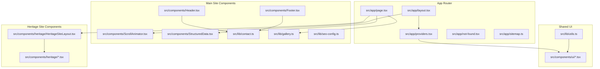
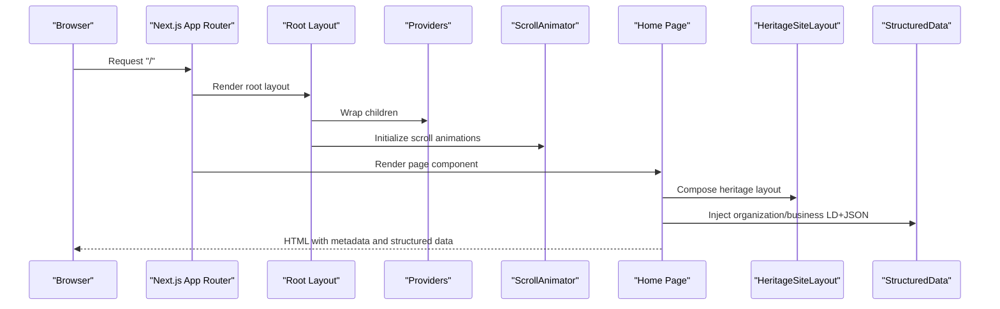
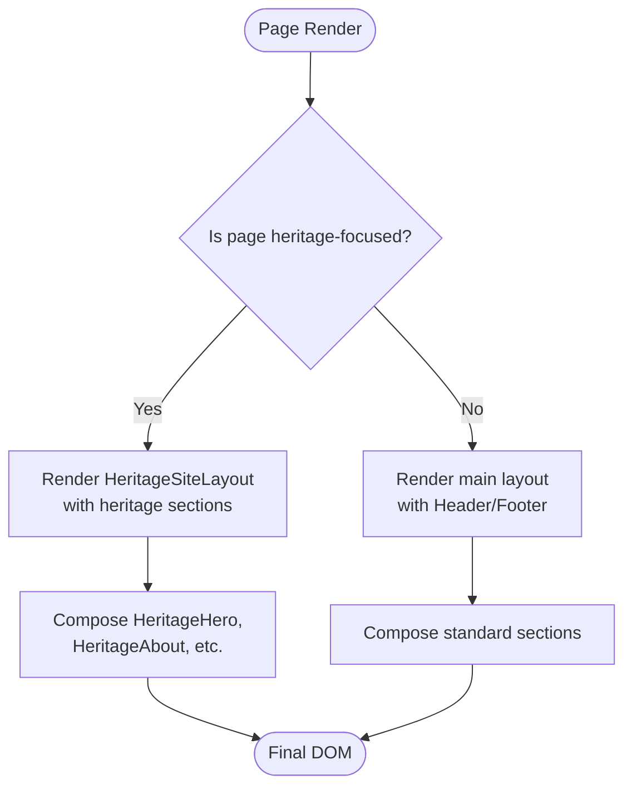
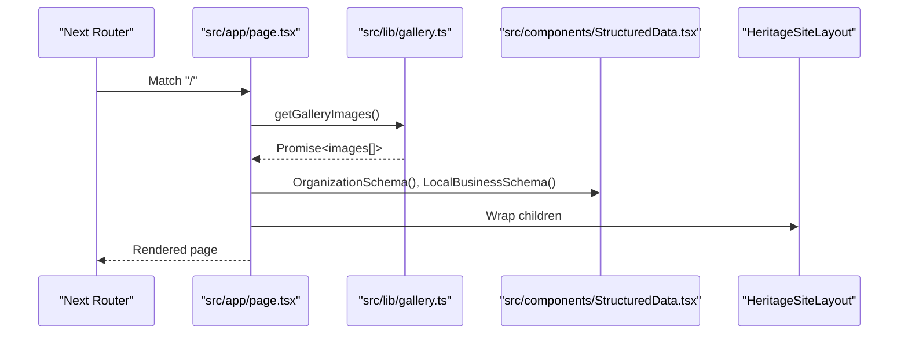
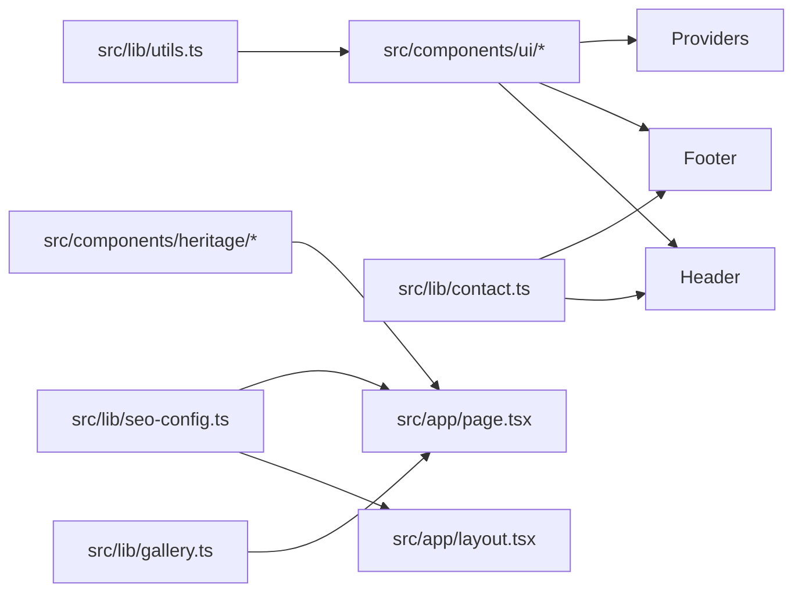
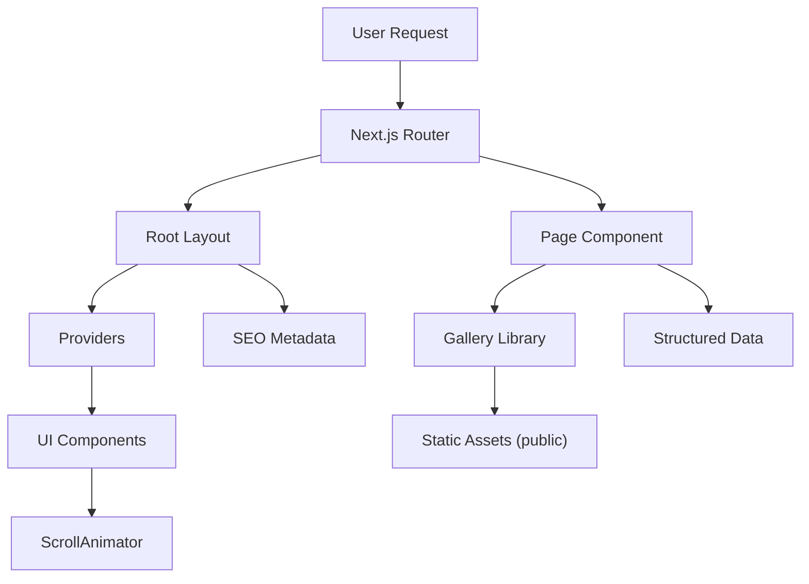
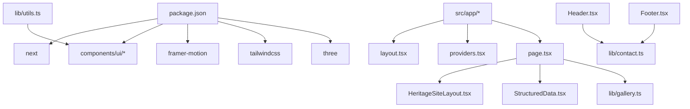

# Architecture Overview

<cite>
**Referenced Files in This Document**
- [package.json](file://package.json)
- [next.config.mjs](file://next.config.mjs)
- [tailwind.config.ts](file://tailwind.config.ts)
- [src/app/layout.tsx](file://src/app/layout.tsx)
- [src/app/page.tsx](file://src/app/page.tsx)
- [src/app/providers.tsx](file://src/app/providers.tsx)
- [src/components/Header.tsx](file://src/components/Header.tsx)
- [src/components/Footer.tsx](file://src/components/Footer.tsx)
- [src/components/ScrollAnimator.tsx](file://src/components/ScrollAnimator.tsx)
- [src/components/StructuredData.tsx](file://src/components/StructuredData.tsx)
- [src/lib/utils.ts](file://src/lib/utils.ts)
- [src/lib/contact.ts](file://src/lib/contact.ts)
- [src/lib/gallery.ts](file://src/lib/gallery.ts)
- [src/lib/seo-config.ts](file://src/lib/seo-config.ts)
- [src/components/heritage/HeritageSiteLayout.tsx](file://src/components/heritage/HeritageSiteLayout.tsx)
</cite>

## Table of Contents
1. [Introduction](#introduction)
2. [Project Structure](#project-structure)
3. [Core Components](#core-components)
4. [Architecture Overview](#architecture-overview)
5. [Detailed Component Analysis](#detailed-component-analysis)
6. [Dependency Analysis](#dependency-analysis)
7. [Performance Considerations](#performance-considerations)
8. [Troubleshooting Guide](#troubleshooting-guide)
9. [Conclusion](#conclusion)

## Introduction
This document describes the architecture of the CVN Ponkunnam website built with Next.js 14. It explains the file-based routing model, dual-layout system (main site vs heritage site), component organization patterns, data flow architecture, styling approach with Tailwind CSS, and utility functions. It also covers system boundaries, component interactions, SEO implementation, responsive design, and the separation between main website components and heritage-specific components.

## Project Structure
The application follows Next.js App Router conventions with a strict file hierarchy under src/app. The root layout defines global metadata, viewport, and providers. The homepage composes a heritage-focused layout and page-specific components. Shared UI primitives live under src/components/ui, while reusable page-level components are grouped under src/components. Heritage-specific components are organized under src/components/heritage. Utility libraries under src/lib encapsulate SEO configuration, contact links, gallery image resolution, and shared helpers.

**Diagram sources**
- [src/app/layout.tsx:1-120](file://src/app/layout.tsx#L1-L120)
- [src/app/providers.tsx:1-17](file://src/app/providers.tsx#L1-L17)
- [src/app/page.tsx:1-51](file://src/app/page.tsx#L1-L51)
- [src/components/Header.tsx:1-376](file://src/components/Header.tsx#L1-L376)
- [src/components/Footer.tsx:1-92](file://src/components/Footer.tsx#L1-L92)
- [src/components/ScrollAnimator.tsx:1-65](file://src/components/ScrollAnimator.tsx#L1-L65)
- [src/components/StructuredData.tsx:1-240](file://src/components/StructuredData.tsx#L1-L240)
- [src/lib/utils.ts:1-7](file://src/lib/utils.ts#L1-L7)
- [src/lib/contact.ts:1-29](file://src/lib/contact.ts#L1-L29)
- [src/lib/gallery.ts:1-73](file://src/lib/gallery.ts#L1-L73)
- [src/lib/seo-config.ts:1-205](file://src/lib/seo-config.ts#L1-L205)
- [src/components/heritage/HeritageSiteLayout.tsx:1-15](file://src/components/heritage/HeritageSiteLayout.tsx#L1-L15)

**Section sources**
- [src/app/layout.tsx:1-120](file://src/app/layout.tsx#L1-L120)
- [src/app/page.tsx:1-51](file://src/app/page.tsx#L1-L51)
- [src/app/providers.tsx:1-17](file://src/app/providers.tsx#L1-L17)
- [src/components/heritage/HeritageSiteLayout.tsx:1-15](file://src/components/heritage/HeritageSiteLayout.tsx#L1-L15)

## Core Components
- Root layout and metadata: Defines global viewport, metadata, canonical URL, Open Graph, Twitter, robots directives, and verification tokens. Wraps children with Providers and ScrollAnimator.
- Providers: Initializes UI providers (tooltips, toasts) and renders toast components globally.
- ScrollAnimator: Implements intersection observer-driven reveal animations with reduced-motion support.
- Header: Responsive navigation with desktop and mobile menus, active link detection, and scroll-aware styling.
- Footer: Policy links, service links, and contact CTAs with social icons.
- StructuredData: Renders JSON-LD schemas for organization, local business, breadcrumbs, courses, and FAQs.
- Utilities: cn helper merges Tailwind classes safely.
- Contact library: Builds tel and WhatsApp links and preformatted enrollment messages.
- Gallery library: Reads static gallery images from public assets and caches results.
- SEO configuration: Centralized SEO constants and helpers for generating metadata and keywords.

**Section sources**
- [src/app/layout.tsx:1-120](file://src/app/layout.tsx#L1-L120)
- [src/app/providers.tsx:1-17](file://src/app/providers.tsx#L1-L17)
- [src/components/ScrollAnimator.tsx:1-65](file://src/components/ScrollAnimator.tsx#L1-L65)
- [src/components/Header.tsx:1-376](file://src/components/Header.tsx#L1-L376)
- [src/components/Footer.tsx:1-92](file://src/components/Footer.tsx#L1-L92)
- [src/components/StructuredData.tsx:1-240](file://src/components/StructuredData.tsx#L1-L240)
- [src/lib/utils.ts:1-7](file://src/lib/utils.ts#L1-L7)
- [src/lib/contact.ts:1-29](file://src/lib/contact.ts#L1-L29)
- [src/lib/gallery.ts:1-73](file://src/lib/gallery.ts#L1-L73)
- [src/lib/seo-config.ts:1-205](file://src/lib/seo-config.ts#L1-L205)

## Architecture Overview
The application uses Next.js App Router with a dual-layout system:
- Main site layout: Used by most pages under src/app and composed via shared components (Header, Footer, Providers).
- Heritage site layout: A specialized layout under src/components/heritage that wraps heritage-specific page sections.

Routing is file-based. The homepage imports the heritage layout and composes heritage sections. Providers wrap the app to enable UI primitives and notifications. SEO metadata is centralized in both the root layout and the homepage, with additional structured data injected per page.

**Diagram sources**
- [src/app/layout.tsx:1-120](file://src/app/layout.tsx#L1-L120)
- [src/app/providers.tsx:1-17](file://src/app/providers.tsx#L1-L17)
- [src/components/ScrollAnimator.tsx:1-65](file://src/components/ScrollAnimator.tsx#L1-L65)
- [src/app/page.tsx:1-51](file://src/app/page.tsx#L1-L51)
- [src/components/heritage/HeritageSiteLayout.tsx:1-15](file://src/components/heritage/HeritageSiteLayout.tsx#L1-L15)
- [src/components/StructuredData.tsx:1-240](file://src/components/StructuredData.tsx#L1-L240)

## Detailed Component Analysis

### Dual-Layout System: Main Site vs Heritage Site
- Main site layout: Defined by shared components (Header, Footer) and providers. Suitable for standard informational pages.
- Heritage site layout: A dedicated wrapper under src/components/heritage that applies heritage-themed styling and includes sticky contact buttons. The homepage composes this layout and heritage sections.

**Section sources**
- [src/app/page.tsx:1-51](file://src/app/page.tsx#L1-L51)
- [src/components/heritage/HeritageSiteLayout.tsx:1-15](file://src/components/heritage/HeritageSiteLayout.tsx#L1-L15)

### File-Based Routing and Control Flow
- The homepage is defined by src/app/page.tsx. It imports the heritage layout and multiple heritage components, fetches gallery images asynchronously, and injects structured data.
- The root layout (src/app/layout.tsx) sets global metadata, viewport, and providers, ensuring consistent SEO and UI behavior across routes.

**Diagram sources**
- [src/app/page.tsx:1-51](file://src/app/page.tsx#L1-L51)
- [src/lib/gallery.ts:1-73](file://src/lib/gallery.ts#L1-L73)
- [src/components/StructuredData.tsx:1-240](file://src/components/StructuredData.tsx#L1-L240)
- [src/components/heritage/HeritageSiteLayout.tsx:1-15](file://src/components/heritage/HeritageSiteLayout.tsx#L1-L15)

**Section sources**
- [src/app/page.tsx:1-51](file://src/app/page.tsx#L1-L51)
- [src/lib/gallery.ts:1-73](file://src/lib/gallery.ts#L1-L73)

### Component Organization Patterns
- Shared UI primitives: Under src/components/ui, these are thin wrappers around Radix UI and shadcn/ui components, enabling consistent styling and behavior.
- Main site components: Header, Footer, ScrollAnimator, ContactForm, Services, Testimonials, etc., are used across standard pages.
- Heritage components: Specialized components under src/components/heritage provide heritage branding, navigation, hero, gallery, testimonials, and layout.
- Utilities: cn helper centralizes Tailwind class merging; contact and gallery libraries encapsulate cross-cutting concerns.

**Diagram sources**
- [src/lib/utils.ts:1-7](file://src/lib/utils.ts#L1-L7)
- [src/lib/contact.ts:1-29](file://src/lib/contact.ts#L1-L29)
- [src/lib/gallery.ts:1-73](file://src/lib/gallery.ts#L1-L73)
- [src/lib/seo-config.ts:1-205](file://src/lib/seo-config.ts#L1-L205)
- [src/components/Header.tsx:1-376](file://src/components/Header.tsx#L1-L376)
- [src/components/Footer.tsx:1-92](file://src/components/Footer.tsx#L1-L92)
- [src/app/page.tsx:1-51](file://src/app/page.tsx#L1-L51)
- [src/components/heritage/HeritageSiteLayout.tsx:1-15](file://src/components/heritage/HeritageSiteLayout.tsx#L1-L15)

**Section sources**
- [src/lib/utils.ts:1-7](file://src/lib/utils.ts#L1-L7)
- [src/lib/contact.ts:1-29](file://src/lib/contact.ts#L1-L29)
- [src/lib/gallery.ts:1-73](file://src/lib/gallery.ts#L1-L73)
- [src/lib/seo-config.ts:1-205](file://src/lib/seo-config.ts#L1-L205)
- [src/components/Header.tsx:1-376](file://src/components/Header.tsx#L1-L376)
- [src/components/Footer.tsx:1-92](file://src/components/Footer.tsx#L1-L92)
- [src/components/heritage/HeritageSiteLayout.tsx:1-15](file://src/components/heritage/HeritageSiteLayout.tsx#L1-L15)

### Data Flow Architecture
- Static asset data: Gallery images are resolved from the public directory at runtime using the gallery library, cached via React cache.
- SEO metadata: Centralized in SEO configuration and root layout; overridden per-page when needed (e.g., homepage).
- Structured data: JSON-LD is injected per page to improve search visibility.
- UI state: Providers initialize tooltips and toast systems; ScrollAnimator manages intersection-based animations.

**Diagram sources**
- [src/app/layout.tsx:1-120](file://src/app/layout.tsx#L1-L120)
- [src/app/providers.tsx:1-17](file://src/app/providers.tsx#L1-L17)
- [src/app/page.tsx:1-51](file://src/app/page.tsx#L1-L51)
- [src/lib/gallery.ts:1-73](file://src/lib/gallery.ts#L1-L73)
- [src/components/StructuredData.tsx:1-240](file://src/components/StructuredData.tsx#L1-L240)
- [src/components/ScrollAnimator.tsx:1-65](file://src/components/ScrollAnimator.tsx#L1-L65)

**Section sources**
- [src/app/layout.tsx:1-120](file://src/app/layout.tsx#L1-L120)
- [src/app/page.tsx:1-51](file://src/app/page.tsx#L1-L51)
- [src/lib/gallery.ts:1-73](file://src/lib/gallery.ts#L1-L73)
- [src/components/StructuredData.tsx:1-240](file://src/components/StructuredData.tsx#L1-L240)
- [src/components/ScrollAnimator.tsx:1-65](file://src/components/ScrollAnimator.tsx#L1-L65)

### Technology Stack Integration
- Framework: Next.js 15 (as declared) with App Router.
- UI primitives: Radix UI and shadcn/ui components under src/components/ui.
- Styling: Tailwind CSS with custom theme, animations, and a cn helper for class merging.
- Animations: Framer Motion integrated via UI components and ScrollAnimator.
- Three.js: Optional 3D scenes present in components (e.g., KalariThreeScene).
- Icons: Lucide React.
- Notifications: Sonner and custom Toaster.
- Image optimization: Next/image with remote patterns and formats.
- Accessibility: Proper ARIA attributes and reduced-motion support.

**Section sources**
- [package.json:1-80](file://package.json#L1-L80)
- [tailwind.config.ts:1-119](file://tailwind.config.ts#L1-L119)
- [src/components/ScrollAnimator.tsx:1-65](file://src/components/ScrollAnimator.tsx#L1-L65)

## Dependency Analysis
The application exhibits low coupling between layers:
- Pages depend on layout and components but avoid tight coupling to libraries.
- Libraries encapsulate cross-cutting concerns (contact, gallery, SEO).
- UI components depend on shared utilities and Tailwind classes.

**Diagram sources**
- [package.json:1-80](file://package.json#L1-L80)
- [src/app/layout.tsx:1-120](file://src/app/layout.tsx#L1-L120)
- [src/app/providers.tsx:1-17](file://src/app/providers.tsx#L1-L17)
- [src/app/page.tsx:1-51](file://src/app/page.tsx#L1-L51)
- [src/components/heritage/HeritageSiteLayout.tsx:1-15](file://src/components/heritage/HeritageSiteLayout.tsx#L1-L15)
- [src/components/StructuredData.tsx:1-240](file://src/components/StructuredData.tsx#L1-L240)
- [src/lib/gallery.ts:1-73](file://src/lib/gallery.ts#L1-L73)
- [src/components/Header.tsx:1-376](file://src/components/Header.tsx#L1-L376)
- [src/components/Footer.tsx:1-92](file://src/components/Footer.tsx#L1-L92)
- [src/lib/contact.ts:1-29](file://src/lib/contact.ts#L1-L29)
- [src/lib/utils.ts:1-7](file://src/lib/utils.ts#L1-L7)

**Section sources**
- [package.json:1-80](file://package.json#L1-L80)
- [src/app/layout.tsx:1-120](file://src/app/layout.tsx#L1-L120)
- [src/app/providers.tsx:1-17](file://src/app/providers.tsx#L1-L17)
- [src/app/page.tsx:1-51](file://src/app/page.tsx#L1-L51)
- [src/lib/gallery.ts:1-73](file://src/lib/gallery.ts#L1-L73)
- [src/lib/contact.ts:1-29](file://src/lib/contact.ts#L1-L29)
- [src/lib/utils.ts:1-7](file://src/lib/utils.ts#L1-L7)

## Performance Considerations
- Image optimization: Remote image patterns and modern formats configured; deterministic module IDs enabled for caching.
- Compression: Gzip compression enabled.
- Security and headers: Prefetch control, frame options, content type options, referrer policy, and immutable asset caching for static assets.
- Animation performance: Reduced-motion detection and intersection observer-based reveals minimize layout thrash.
- Caching: React cache used for gallery image enumeration to avoid repeated filesystem reads.

Recommendations:
- Lazy-load non-critical components and images beyond the fold.
- Consider dynamic imports for heavy 3D scenes.
- Monitor bundle sizes and split vendor chunks if needed.

**Section sources**
- [next.config.mjs:1-73](file://next.config.mjs#L1-L73)
- [src/components/ScrollAnimator.tsx:1-65](file://src/components/ScrollAnimator.tsx#L1-L65)
- [src/lib/gallery.ts:1-73](file://src/lib/gallery.ts#L1-L73)

## Troubleshooting Guide
Common areas to inspect:
- Metadata and SEO: Verify canonical URL, Open Graph, and Twitter cards in the root layout and page overrides.
- Structured data: Ensure JSON-LD scripts render correctly and use valid schema types.
- Navigation: Confirm active link detection and mobile menu behavior in Header.
- Gallery images: Check filesystem permissions and image extensions; confirm cache invalidation after adding/removing images.
- Toasts and tooltips: Ensure Providers are wrapping the app tree.

Operational checks:
- Confirm NEXT_PUBLIC_SITE_URL is set for canonical URLs.
- Validate WhatsApp and tel links generated by contact utilities.
- Test reduced-motion mode to ensure animations behave as expected.

**Section sources**
- [src/app/layout.tsx:1-120](file://src/app/layout.tsx#L1-L120)
- [src/components/StructuredData.tsx:1-240](file://src/components/StructuredData.tsx#L1-L240)
- [src/components/Header.tsx:1-376](file://src/components/Header.tsx#L1-L376)
- [src/lib/gallery.ts:1-73](file://src/lib/gallery.ts#L1-L73)
- [src/lib/contact.ts:1-29](file://src/lib/contact.ts#L1-L29)
- [src/app/providers.tsx:1-17](file://src/app/providers.tsx#L1-L17)

## Conclusion
The CVN Ponkunnam website leverages Next.js 14’s App Router to deliver a structured, SEO-friendly, and visually cohesive experience. The dual-layout system cleanly separates heritage-focused pages from standard informational content. A centralized utility and library layer ensures maintainability and reusability. With thoughtful performance optimizations, accessibility features, and structured data injection, the architecture supports both current needs and future growth.