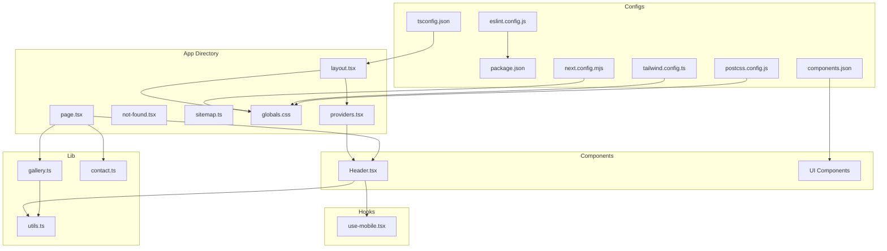
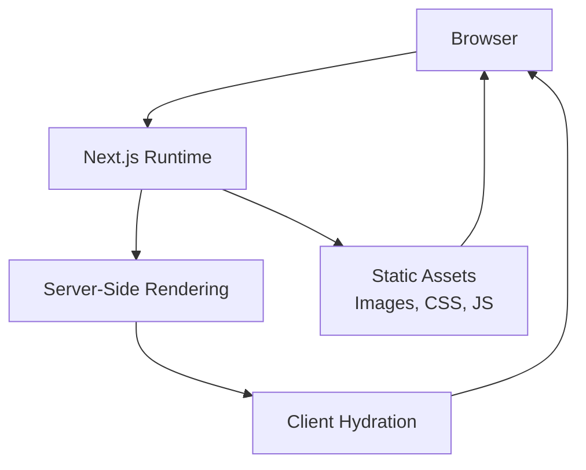
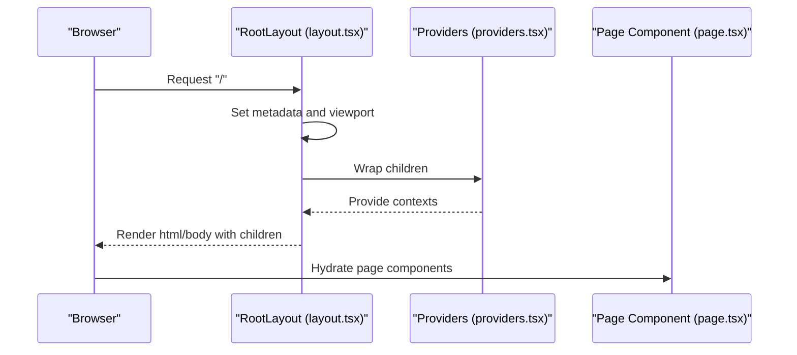
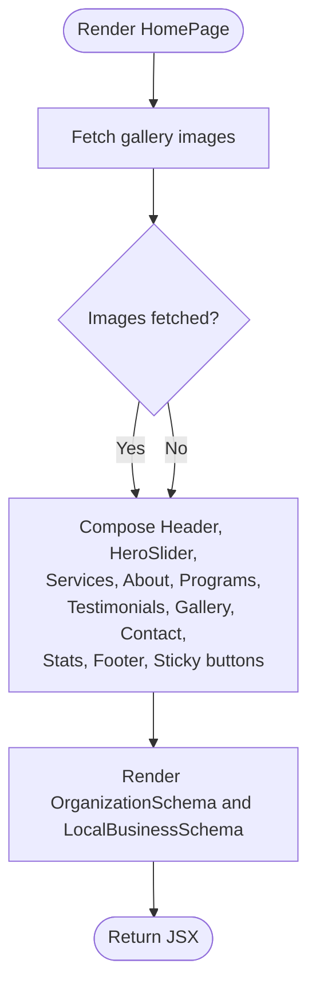
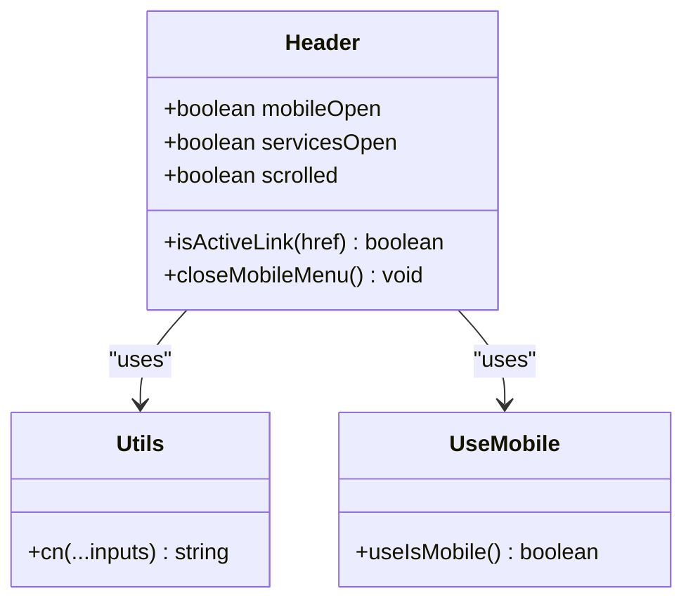
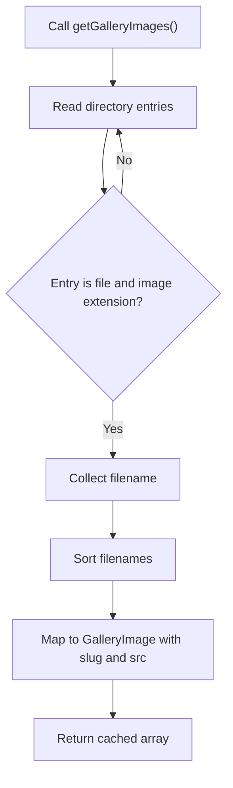
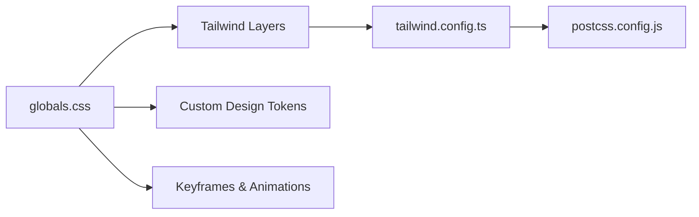
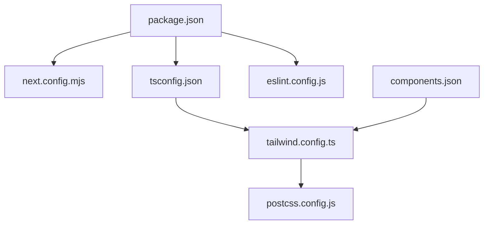

# Next.js Application Structure

<cite>
**Referenced Files in This Document**
- [package.json](file://package.json)
- [next.config.mjs](file://next.config.mjs)
- [tsconfig.json](file://tsconfig.json)
- [eslint.config.js](file://eslint.config.js)
- [tailwind.config.ts](file://tailwind.config.ts)
- [postcss.config.js](file://postcss.config.js)
- [src/app/layout.tsx](file://src/app/layout.tsx)
- [src/app/providers.tsx](file://src/app/providers.tsx)
- [src/app/page.tsx](file://src/app/page.tsx)
- [src/app/globals.css](file://src/app/globals.css)
- [src/app/not-found.tsx](file://src/app/not-found.tsx)
- [src/app/sitemap.ts](file://src/app/sitemap.ts)
- [src/components/Header.tsx](file://src/components/Header.tsx)
- [src/lib/utils.ts](file://src/lib/utils.ts)
- [src/lib/gallery.ts](file://src/lib/gallery.ts)
- [src/lib/contact.ts](file://src/lib/contact.ts)
- [src/hooks/use-mobile.tsx](file://src/hooks/use-mobile.tsx)
- [components.json](file://components.json)
</cite>

## Table of Contents
1. [Introduction](#introduction)
2. [Project Structure](#project-structure)
3. [Core Components](#core-components)
4. [Architecture Overview](#architecture-overview)
5. [Detailed Component Analysis](#detailed-component-analysis)
6. [Dependency Analysis](#dependency-analysis)
7. [Performance Considerations](#performance-considerations)
8. [Troubleshooting Guide](#troubleshooting-guide)
9. [Conclusion](#conclusion)
10. [Appendices](#appendices)

## Introduction
This document explains the Next.js 14 application structure for a cultural and wellness-focused website. It covers the file-based routing model under the app directory, the role of page.tsx and layout.tsx, providers.tsx context management, and global styling via Tailwind CSS. It also documents build configuration, TypeScript setup, and ESLint configuration. The document clarifies how server-side rendering, static generation, and client-side hydration work together, and outlines performance optimizations, image handling, and asset management strategies. Finally, it explains the project structure decisions and how they support the website’s functionality.

## Project Structure
The application follows Next.js 14’s app directory convention. Key areas:
- src/app: Contains route groups, pages, layouts, providers, and metadata generators (sitemap).
- src/components: Feature and UI components, organized by domain (e.g., heritage, ui).
- src/lib: Shared utilities, data helpers, and integrations.
- src/hooks: React hooks for cross-cutting concerns.
- Configuration files at repo root define build, linting, and styling.

**Diagram sources**
- [src/app/layout.tsx:1-120](file://src/app/layout.tsx#L1-L120)
- [src/app/providers.tsx:1-17](file://src/app/providers.tsx#L1-L17)
- [src/app/page.tsx:1-65](file://src/app/page.tsx#L1-L65)
- [src/app/globals.css:1-661](file://src/app/globals.css#L1-L661)
- [src/app/not-found.tsx:1-18](file://src/app/not-found.tsx#L1-L18)
- [src/app/sitemap.ts:1-59](file://src/app/sitemap.ts#L1-L59)
- [src/components/Header.tsx:1-376](file://src/components/Header.tsx#L1-L376)
- [src/lib/utils.ts:1-7](file://src/lib/utils.ts#L1-L7)
- [src/lib/gallery.ts:1-73](file://src/lib/gallery.ts#L1-L73)
- [src/lib/contact.ts:1-29](file://src/lib/contact.ts#L1-L29)
- [src/hooks/use-mobile.tsx:1-20](file://src/hooks/use-mobile.tsx#L1-L20)
- [next.config.mjs:1-64](file://next.config.mjs#L1-L64)
- [tsconfig.json:1-46](file://tsconfig.json#L1-L46)
- [eslint.config.js:1-24](file://eslint.config.js#L1-L24)
- [tailwind.config.ts:1-106](file://tailwind.config.ts#L1-L106)
- [postcss.config.js:1-7](file://postcss.config.js#L1-L7)
- [components.json:1-21](file://components.json#L1-L21)

**Section sources**
- [src/app/layout.tsx:1-120](file://src/app/layout.tsx#L1-L120)
- [src/app/providers.tsx:1-17](file://src/app/providers.tsx#L1-L17)
- [src/app/page.tsx:1-65](file://src/app/page.tsx#L1-L65)
- [src/app/globals.css:1-661](file://src/app/globals.css#L1-L661)
- [src/app/not-found.tsx:1-18](file://src/app/not-found.tsx#L1-L18)
- [src/app/sitemap.ts:1-59](file://src/app/sitemap.ts#L1-L59)
- [src/components/Header.tsx:1-376](file://src/components/Header.tsx#L1-L376)
- [src/lib/utils.ts:1-7](file://src/lib/utils.ts#L1-L7)
- [src/lib/gallery.ts:1-73](file://src/lib/gallery.ts#L1-L73)
- [src/lib/contact.ts:1-29](file://src/lib/contact.ts#L1-L29)
- [src/hooks/use-mobile.tsx:1-20](file://src/hooks/use-mobile.tsx#L1-L20)
- [next.config.mjs:1-64](file://next.config.mjs#L1-L64)
- [tsconfig.json:1-46](file://tsconfig.json#L1-L46)
- [eslint.config.js:1-24](file://eslint.config.js#L1-L24)
- [tailwind.config.ts:1-106](file://tailwind.config.ts#L1-L106)
- [postcss.config.js:1-7](file://postcss.config.js#L1-L7)
- [components.json:1-21](file://components.json#L1-L21)

## Core Components
- Root layout and metadata: Defines viewport, metadata, canonical URL, and Open Graph/Twitter settings. Wraps children with Providers and ScrollAnimator.
- Providers: Client-side context provider for toasts and tooltips.
- Home page: Asynchronous page that fetches gallery images and composes feature components.
- Global styles: Tailwind-based CSS with custom design tokens, animations, and responsive utilities.
- Not-found: Catch-all 404 page with styled messaging.
- Sitemap: Programmatic sitemap generator for SEO.

Key responsibilities:
- Routing: Next.js file-based routing resolves routes from the app directory.
- Rendering: Pages can be rendered server-side by default; asynchronous data fetching is supported at the root page.
- Styling: Tailwind layers and theme tokens unify design language.
- UX: Providers enable toast notifications and interactive tooltips.

**Section sources**
- [src/app/layout.tsx:1-120](file://src/app/layout.tsx#L1-L120)
- [src/app/providers.tsx:1-17](file://src/app/providers.tsx#L1-L17)
- [src/app/page.tsx:1-65](file://src/app/page.tsx#L1-L65)
- [src/app/globals.css:1-661](file://src/app/globals.css#L1-L661)
- [src/app/not-found.tsx:1-18](file://src/app/not-found.tsx#L1-L18)
- [src/app/sitemap.ts:1-59](file://src/app/sitemap.ts#L1-L59)

## Architecture Overview
The runtime architecture integrates Next.js rendering with client-side interactivity:
- Server-side rendering: Root layout and page render on the server.
- Static generation: Pages are statically generated by default; asynchronous data fetching is supported.
- Client-side hydration: Client directives activate interactive components and effects.
- Asset pipeline: Next.js handles image optimization and static asset caching.

[No sources needed since this diagram shows conceptual workflow, not actual code structure]

## Detailed Component Analysis

### Layout and Providers
Root layout defines global metadata, viewport, and HTML wrapper. Providers inject client-side contexts for toasts and tooltips. Together they establish the foundational shell for all pages.

**Diagram sources**
- [src/app/layout.tsx:1-120](file://src/app/layout.tsx#L1-L120)
- [src/app/providers.tsx:1-17](file://src/app/providers.tsx#L1-L17)
- [src/app/page.tsx:1-65](file://src/app/page.tsx#L1-L65)

**Section sources**
- [src/app/layout.tsx:1-120](file://src/app/layout.tsx#L1-L120)
- [src/app/providers.tsx:1-17](file://src/app/providers.tsx#L1-L17)

### Home Page Composition and Data Fetching
The home page orchestrates multiple feature components and performs asynchronous data fetching for gallery images. It also renders structured data components for SEO.

**Diagram sources**
- [src/app/page.tsx:1-65](file://src/app/page.tsx#L1-L65)
- [src/lib/gallery.ts:1-73](file://src/lib/gallery.ts#L1-L73)

**Section sources**
- [src/app/page.tsx:1-65](file://src/app/page.tsx#L1-L65)
- [src/lib/gallery.ts:1-73](file://src/lib/gallery.ts#L1-L73)

### Navigation and Responsive Behavior
The header component manages desktop and mobile navigation, active link highlighting, and scroll-aware styling. It uses a custom utility for class merging and a mobile detection hook.

**Diagram sources**
- [src/components/Header.tsx:1-376](file://src/components/Header.tsx#L1-L376)
- [src/lib/utils.ts:1-7](file://src/lib/utils.ts#L1-L7)
- [src/hooks/use-mobile.tsx:1-20](file://src/hooks/use-mobile.tsx#L1-L20)

**Section sources**
- [src/components/Header.tsx:1-376](file://src/components/Header.tsx#L1-L376)
- [src/lib/utils.ts:1-7](file://src/lib/utils.ts#L1-L7)
- [src/hooks/use-mobile.tsx:1-20](file://src/hooks/use-mobile.tsx#L1-L20)

### Gallery Image Resolution
The gallery library reads images from the public assets directory, filters by supported extensions, sorts filenames, and generates slugs and URLs. It leverages React’s caching mechanism for efficient data reuse.

**Diagram sources**
- [src/lib/gallery.ts:1-73](file://src/lib/gallery.ts#L1-L73)

**Section sources**
- [src/lib/gallery.ts:1-73](file://src/lib/gallery.ts#L1-L73)

### Global Styling and Theming
Global CSS integrates Tailwind layers, custom design tokens, typography, and animations. The Tailwind configuration extends colors, fonts, keyframes, and animations, while PostCSS applies Tailwind and autoprefixing.

**Diagram sources**
- [src/app/globals.css:1-661](file://src/app/globals.css#L1-L661)
- [tailwind.config.ts:1-106](file://tailwind.config.ts#L1-L106)
- [postcss.config.js:1-7](file://postcss.config.js#L1-L7)

**Section sources**
- [src/app/globals.css:1-661](file://src/app/globals.css#L1-L661)
- [tailwind.config.ts:1-106](file://tailwind.config.ts#L1-L106)
- [postcss.config.js:1-7](file://postcss.config.js#L1-L7)

### 404 Handling
The not-found route provides a styled fallback for unmatched paths, ensuring consistent UX when routes are missing.

**Section sources**
- [src/app/not-found.tsx:1-18](file://src/app/not-found.tsx#L1-L18)

### Sitemap Generation
The sitemap generator produces a prioritized list of routes for SEO, reflecting the site’s content hierarchy.

**Section sources**
- [src/app/sitemap.ts:1-59](file://src/app/sitemap.ts#L1-L59)

## Dependency Analysis
Build-time and development-time dependencies are declared in the package manifest. The configuration files define Next.js behavior, TypeScript compilation, ESLint rules, and Tailwind integration.

**Diagram sources**
- [package.json:1-79](file://package.json#L1-L79)
- [next.config.mjs:1-64](file://next.config.mjs#L1-L64)
- [tsconfig.json:1-46](file://tsconfig.json#L1-L46)
- [eslint.config.js:1-24](file://eslint.config.js#L1-L24)
- [tailwind.config.ts:1-106](file://tailwind.config.ts#L1-L106)
- [postcss.config.js:1-7](file://postcss.config.js#L1-L7)
- [components.json:1-21](file://components.json#L1-L21)

**Section sources**
- [package.json:1-79](file://package.json#L1-L79)
- [next.config.mjs:1-64](file://next.config.mjs#L1-L64)
- [tsconfig.json:1-46](file://tsconfig.json#L1-L46)
- [eslint.config.js:1-24](file://eslint.config.js#L1-L24)
- [tailwind.config.ts:1-106](file://tailwind.config.ts#L1-L106)
- [postcss.config.js:1-7](file://postcss.config.js#L1-L7)
- [components.json:1-21](file://components.json#L1-L21)

## Performance Considerations
- Image optimization: Next.js image optimization is configured with multiple formats, device sizes, image sizes, quality tiers, and cache TTL.
- Compression: Gzip compression is enabled via Next.js configuration.
- Headers: Security and performance headers are injected globally, including DNS prefetch, frame options, content type options, referrer policy, and immutable caching for assets.
- Webpack optimization: Deterministic module IDs improve long-term caching.
- CSS delivery: Tailwind layers and CSS-in-JS-free utilities minimize runtime overhead.
- Data fetching: React cache is used for gallery images to avoid redundant filesystem reads.
- Client hydration: Only interactive components are marked client; others render on the server to reduce bundle size.

Recommendations:
- Prefer static generation for content-heavy pages; use dynamic routes selectively.
- Lazy-load non-critical assets and components.
- Monitor image sizes and leverage automatic formats (AVIF/WebP) for performance.

**Section sources**
- [next.config.mjs:1-64](file://next.config.mjs#L1-L64)
- [src/lib/gallery.ts:1-73](file://src/lib/gallery.ts#L1-L73)

## Troubleshooting Guide
Common issues and checks:
- Missing assets: Verify image paths and ensure files exist in the public directory.
- Build errors: Confirm TypeScript strictness and plugin settings in tsconfig.
- Lint failures: Review ESLint configuration and ignore patterns.
- Tailwind utilities missing: Ensure content globs include app and components directories.
- Provider context not working: Confirm client directive usage in providers and downstream components.

**Section sources**
- [tsconfig.json:1-46](file://tsconfig.json#L1-L46)
- [eslint.config.js:1-24](file://eslint.config.js#L1-L24)
- [tailwind.config.ts:1-106](file://tailwind.config.ts#L1-L106)
- [src/app/providers.tsx:1-17](file://src/app/providers.tsx#L1-L17)

## Conclusion
The application leverages Next.js 14’s app directory to deliver a structured, scalable frontend. The root layout and providers establish a consistent shell, while global styling and utilities ensure a cohesive design system. Build and lint configurations enforce quality and performance. The combination of server-side rendering, static generation, and client-side hydration supports fast, accessible experiences across devices.

## Appendices

### File-Based Routing and Entry Points
- Route resolution: Each page.tsx inside the app directory corresponds to a route segment.
- Root page: The homepage is defined at src/app/page.tsx.
- Nested routes: Subfolders under src/app create nested routes (e.g., services, gallery).
- Catch-all: not-found.tsx handles unmatched paths.

**Section sources**
- [src/app/page.tsx:1-65](file://src/app/page.tsx#L1-L65)
- [src/app/not-found.tsx:1-18](file://src/app/not-found.tsx#L1-L18)

### TypeScript and ESLint Setup
- TypeScript compiler options: Strict null checks, bundler module resolution, JSX preservation, and path aliases.
- ESLint configuration: Recommended rules extended with TypeScript and React Hooks plugin; specific rule overrides applied.

**Section sources**
- [tsconfig.json:1-46](file://tsconfig.json#L1-L46)
- [eslint.config.js:1-24](file://eslint.config.js#L1-L24)

### Image Optimization and Asset Management
- Formats: AVIF and WebP are supported.
- Sizes: Device and image sizes configured for responsive loading.
- Quality: Multiple quality tiers for adaptive compression.
- Cache: Minimum cache TTL set for optimized assets.
- Headers: Immutable caching for assets directory.
- Static assets: Public directory serves static assets; galleries read from public assets.

**Section sources**
- [next.config.mjs:1-64](file://next.config.mjs#L1-L64)
- [src/lib/gallery.ts:1-73](file://src/lib/gallery.ts#L1-L73)

### Relationship Between Rendering Modes
- Server-side rendering: Root layout and page render on the server by default.
- Static generation: Pages are statically generated; asynchronous data fetching is supported at the root page.
- Client-side hydration: Client directives activate interactive components; non-interactive components render on the server.

**Section sources**
- [src/app/layout.tsx:1-120](file://src/app/layout.tsx#L1-L120)
- [src/app/page.tsx:1-65](file://src/app/page.tsx#L1-L65)