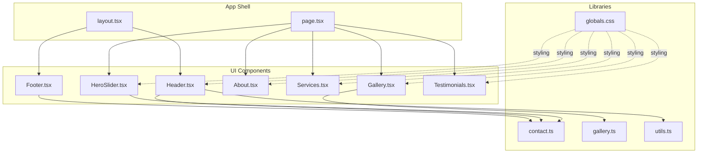
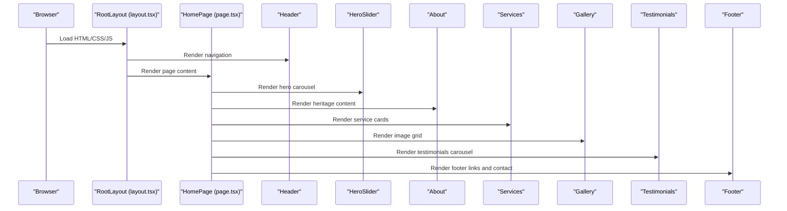
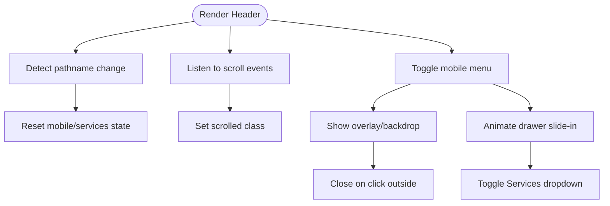
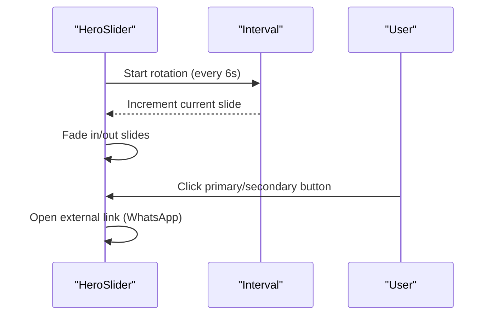
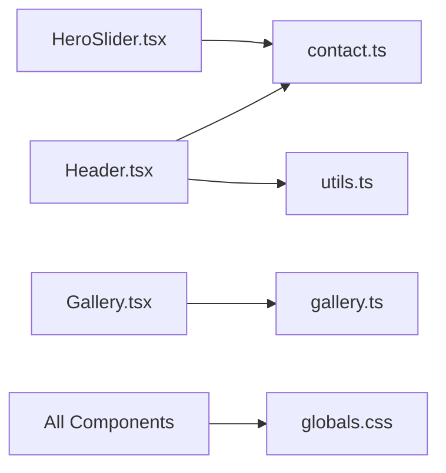

# Core Components

<cite>
**Referenced Files in This Document**
- [Header.tsx](file://cvnponkunnam/src/components/Header.tsx)
- [Footer.tsx](file://cvnponkunnam/src/components/Footer.tsx)
- [HeroSlider.tsx](file://cvnponkunnam/src/components/HeroSlider.tsx)
- [About.tsx](file://cvnponkunnam/src/components/About.tsx)
- [Services.tsx](file://cvnponkunnam/src/components/Services.tsx)
- [Gallery.tsx](file://cvnponkunnam/src/components/Gallery.tsx)
- [Testimonials.tsx](file://cvnponkunnam/src/components/Testimonials.tsx)
- [layout.tsx](file://cvnponkunnam/src/app/layout.tsx)
- [page.tsx](file://cvnponkunnam/src/app/page.tsx)
- [contact.ts](file://cvnponkunnam/src/lib/contact.ts)
- [gallery.ts](file://cvnponkunnam/src/lib/gallery.ts)
- [globals.css](file://cvnponkunnam/src/app/globals.css)
- [utils.ts](file://cvnponkunnam/src/lib/utils.ts)
</cite>

## Table of Contents
1. [Introduction](#introduction)
2. [Project Structure](#project-structure)
3. [Core Components](#core-components)
4. [Architecture Overview](#architecture-overview)
5. [Detailed Component Analysis](#detailed-component-analysis)
6. [Dependency Analysis](#dependency-analysis)
7. [Performance Considerations](#performance-considerations)
8. [Troubleshooting Guide](#troubleshooting-guide)
9. [Conclusion](#conclusion)
10. [Appendices](#appendices)

## Introduction
This document describes the core UI components that define the user experience for CVN Ponkunnam’s website. It focuses on the Header, Footer, HeroSlider, About, Services, Gallery, and Testimonials components. For each component, you will find:
- Purpose and role in the overall layout
- Props and customization options
- Styling and animation approaches
- Accessibility and responsive behavior
- Integration patterns and composition with other components
- Usage examples and best practices

## Project Structure
The components are organized under the components directory and integrated into Next.js pages and layouts. The global styling leverages Tailwind CSS and custom CSS utilities for animations and theming.

**Diagram sources**
- [layout.tsx:1-120](file://cvnponkunnam/src/app/layout.tsx#L1-L120)
- [page.tsx:1-51](file://cvnponkunnam/src/app/page.tsx#L1-L51)
- [Header.tsx:1-376](file://cvnponkunnam/src/components/Header.tsx#L1-L376)
- [Footer.tsx:1-92](file://cvnponkunnam/src/components/Footer.tsx#L1-L92)
- [HeroSlider.tsx:1-108](file://cvnponkunnam/src/components/HeroSlider.tsx#L1-L108)
- [About.tsx:1-251](file://cvnponkunnam/src/components/About.tsx#L1-L251)
- [Services.tsx:1-110](file://cvnponkunnam/src/components/Services.tsx#L1-L110)
- [Gallery.tsx:1-80](file://cvnponkunnam/src/components/Gallery.tsx#L1-L80)
- [Testimonials.tsx:1-174](file://cvnponkunnam/src/components/Testimonials.tsx#L1-L174)
- [contact.ts:1-29](file://cvnponkunnam/src/lib/contact.ts#L1-L29)
- [gallery.ts:1-73](file://cvnponkunnam/src/lib/gallery.ts#L1-L73)
- [utils.ts:1-7](file://cvnponkunnam/src/lib/utils.ts#L1-L7)
- [globals.css:1-685](file://cvnponkunnam/src/app/globals.css#L1-L685)

**Section sources**
- [layout.tsx:1-120](file://cvnponkunnam/src/app/layout.tsx#L1-L120)
- [page.tsx:1-51](file://cvnponkunnam/src/app/page.tsx#L1-L51)
- [globals.css:1-685](file://cvnponkunnam/src/app/globals.css#L1-L685)

## Core Components
This section summarizes each component’s responsibilities and how they fit into the overall experience.

- Header: Provides desktop and mobile navigation, active-state highlighting, and a call-to-action. Integrates with contact utilities and scroll-aware styling.
- Footer: Presents quick links, policy links, and social channels with accessible icons and labels.
- HeroSlider: Displays rotating hero imagery with layered text and call-to-action buttons, integrating with contact utilities for booking.
- About: Delivers heritage-focused content, stats, and optional “full” variant with deeper sections.
- Services: Highlights service offerings with animated cards and a decorative 3D scene.
- Gallery: Renders a responsive grid of images with modal preview and lazy-loading.
- Testimonials: Auto-rotating client feedback with manual controls and Google review badges.

**Section sources**
- [Header.tsx:1-376](file://cvnponkunnam/src/components/Header.tsx#L1-L376)
- [Footer.tsx:1-92](file://cvnponkunnam/src/components/Footer.tsx#L1-L92)
- [HeroSlider.tsx:1-108](file://cvnponkunnam/src/components/HeroSlider.tsx#L1-L108)
- [About.tsx:1-251](file://cvnponkunnam/src/components/About.tsx#L1-L251)
- [Services.tsx:1-110](file://cvnponkunnam/src/components/Services.tsx#L1-L110)
- [Gallery.tsx:1-80](file://cvnponkunnam/src/components/Gallery.tsx#L1-L80)
- [Testimonials.tsx:1-174](file://cvnponkunnam/src/components/Testimonials.tsx#L1-L174)

## Architecture Overview
The components are orchestrated by the Next.js app shell. The layout wraps the application with providers and a scroll animator. The homepage composes multiple sections to present a cohesive story.

**Diagram sources**
- [layout.tsx:1-120](file://cvnponkunnam/src/app/layout.tsx#L1-L120)
- [page.tsx:1-51](file://cvnponkunnam/src/app/page.tsx#L1-L51)
- [Header.tsx:1-376](file://cvnponkunnam/src/components/Header.tsx#L1-L376)
- [HeroSlider.tsx:1-108](file://cvnponkunnam/src/components/HeroSlider.tsx#L1-L108)
- [About.tsx:1-251](file://cvnponkunnam/src/components/About.tsx#L1-L251)
- [Services.tsx:1-110](file://cvnponkunnam/src/components/Services.tsx#L1-L110)
- [Gallery.tsx:1-80](file://cvnponkunnam/src/components/Gallery.tsx#L1-L80)
- [Testimonials.tsx:1-174](file://cvnponkunnam/src/components/Testimonials.tsx#L1-L174)
- [Footer.tsx:1-92](file://cvnponkunnam/src/components/Footer.tsx#L1-L92)

## Detailed Component Analysis

### Header
Purpose
- Fixed-position navigation bar with logo, desktop menu, and mobile drawer.
- Active link detection based on route path.
- Scroll-aware elevation and backdrop blur.
- Mobile menu with nested Services dropdown and overlay.

Props and customization
- No props accepted; navigation items are defined internally.
- Uses a utility class merging function for dynamic class composition.

Accessibility
- Proper aria attributes for menu toggles and overlays.
- Focus management during open/close.
- Semantic heading and landmark roles implied by structure.

Responsive behavior
- Desktop: horizontal nav with dropdowns.
- Mobile: slide-in drawer with staggered reveal and backdrop overlay.

Integration
- Links to internal routes and external contact links.
- Integrates with contact constants for phone and WhatsApp.

Usage example
- Place at the top of every page via the layout wrapper.

**Diagram sources**
- [Header.tsx:31-75](file://cvnponkunnam/src/components/Header.tsx#L31-L75)
- [Header.tsx:165-371](file://cvnponkunnam/src/components/Header.tsx#L165-L371)

**Section sources**
- [Header.tsx:1-376](file://cvnponkunnam/src/components/Header.tsx#L1-L376)
- [contact.ts:1-29](file://cvnponkunnam/src/lib/contact.ts#L1-L29)
- [utils.ts:1-7](file://cvnponkunnam/src/lib/utils.ts#L1-L7)

### Footer
Purpose
- Provides quick navigation, service links, policies, and contact/social channels.
- Uses semantic links and SVG icons with accessible labels.

Props and customization
- No props; links are static.

Accessibility
- Icons include aria-labels for assistive tech.
- Links use appropriate semantics and hover/focus states.

Responsive behavior
- Flex/wrap layout adapts to narrow screens.

Integration
- Links to internal pages and external contacts.

Usage example
- Place at the bottom of every page via the layout wrapper.

**Section sources**
- [Footer.tsx:1-92](file://cvnponkunnam/src/components/Footer.tsx#L1-L92)
- [contact.ts:1-29](file://cvnponkunnam/src/lib/contact.ts#L1-L29)

### HeroSlider
Purpose
- Rotating hero carousel with layered text and dual call-to-action buttons.
- Integrates with contact utilities to prefill WhatsApp messages.

Props and customization
- No props; slides are defined internally.

Accessibility
- Images lack alt text; consider adding descriptive alt attributes for WCAG level AA/AAA.

Responsive behavior
- Full viewport height on medium and above.
- Stacked content on small screens with fade transitions.

Integration
- Uses contact utilities for course enrollment links.
- Applies motion utilities for entrance animations.

Usage example
- Place at the top of the homepage to capture attention.

**Diagram sources**
- [HeroSlider.tsx:34-40](file://cvnponkunnam/src/components/HeroSlider.tsx#L34-L40)
- [HeroSlider.tsx:84-97](file://cvnponkunnam/src/components/HeroSlider.tsx#L84-L97)
- [contact.ts:8-28](file://cvnponkunnam/src/lib/contact.ts#L8-L28)

**Section sources**
- [HeroSlider.tsx:1-108](file://cvnponkunnam/src/components/HeroSlider.tsx#L1-L108)
- [contact.ts:1-29](file://cvnponkunnam/src/lib/contact.ts#L1-L29)

### About
Purpose
- Presents heritage narrative, statistics, and optional “full” variant with additional sections.

Props and customization
- variant: "home" | "full". Controls content density and sections shown.

Accessibility
- Uses semantic headings and lists.
- Motion utilities for entrance animations.

Responsive behavior
- Grid-based layout adapts across breakpoints.
- Background image with gradient overlays ensures readability.

Integration
- Uses Lucide icons and motion utilities.
- Optional “Read More” or “Contact Us” link depending on variant.

Usage example
- Place after HeroSlider on the homepage; use “full” variant on the About page.

**Section sources**
- [About.tsx:15-251](file://cvnponkunnam/src/components/About.tsx#L15-L251)

### Services
Purpose
- Showcases three core offerings with animated cards and decorative visuals.

Props and customization
- No props; service list is defined internally.

Accessibility
- Interactive cards with hover/focus states.
- Motion utilities for entrance animations.

Responsive behavior
- Responsive grid layout with hover effects.

Integration
- Uses a 3D scene component for background ambiance.
- Links to service-specific pages.

Usage example
- Place after About section to guide users to offerings.

**Section sources**
- [Services.tsx:1-110](file://cvnponkunnam/src/components/Services.tsx#L1-L110)

### Gallery
Purpose
- Displays a responsive grid of gallery images with modal preview.

Props and customization
- images: GalleryImage[]
- previewCount?: number (limits visible images)
- showViewAllLink?: boolean (toggles “View all” link)

Accessibility
- Buttons include aria-labels for individual images.
- Modal composition via controlled state.

Responsive behavior
- Grid adjusts columns based on viewport.
- Lazy loading applied to non-first images.

Integration
- Uses a gallery library to fetch images from the filesystem.
- Opens a modal component for expanded viewing.

Usage example
- Place after Services and before Testimonials.
- On homepage, limit previews to six images.

**Section sources**
- [Gallery.tsx:10-80](file://cvnponkunnam/src/components/Gallery.tsx#L10-L80)
- [gallery.ts:1-73](file://cvnponkunnam/src/lib/gallery.ts#L1-L73)

### Testimonials
Purpose
- Auto-rotating client testimonials with star ratings and navigation controls.

Props and customization
- No props; testimonials array is defined internally.

Accessibility
- Navigation buttons include aria-labels.
- Current testimonial updates with key-based rendering.

Responsive behavior
- Centered content with scalable typography.

Integration
- Includes Google review badges and a link to external reviews.

Usage example
- Place near the bottom to reinforce trust.

**Section sources**
- [Testimonials.tsx:1-174](file://cvnponkunnam/src/components/Testimonials.tsx#L1-L174)

## Dependency Analysis
Key relationships:
- Header depends on contact constants and a class merging utility.
- HeroSlider depends on contact utilities for booking links.
- Gallery depends on the gallery library for image discovery.
- Global CSS defines shared animations, typography, and component utilities.

**Diagram sources**
- [Header.tsx:1-376](file://cvnponkunnam/src/components/Header.tsx#L1-L376)
- [HeroSlider.tsx:1-108](file://cvnponkunnam/src/components/HeroSlider.tsx#L1-L108)
- [Gallery.tsx:1-80](file://cvnponkunnam/src/components/Gallery.tsx#L1-L80)
- [contact.ts:1-29](file://cvnponkunnam/src/lib/contact.ts#L1-L29)
- [gallery.ts:1-73](file://cvnponkunnam/src/lib/gallery.ts#L1-L73)
- [utils.ts:1-7](file://cvnponkunnam/src/lib/utils.ts#L1-L7)
- [globals.css:1-685](file://cvnponkunnam/src/app/globals.css#L1-L685)

**Section sources**
- [Header.tsx:1-376](file://cvnponkunnam/src/components/Header.tsx#L1-L376)
- [HeroSlider.tsx:1-108](file://cvnponkunnam/src/components/HeroSlider.tsx#L1-L108)
- [Gallery.tsx:1-80](file://cvnponkunnam/src/components/Gallery.tsx#L1-L80)
- [contact.ts:1-29](file://cvnponkunnam/src/lib/contact.ts#L1-L29)
- [gallery.ts:1-73](file://cvnponkunnam/src/lib/gallery.ts#L1-L73)
- [utils.ts:1-7](file://cvnponkunnam/src/lib/utils.ts#L1-L7)
- [globals.css:1-685](file://cvnponkunnam/src/app/globals.css#L1-L685)

## Performance Considerations
- HeroSlider and Gallery use lazy loading for non-first images to reduce initial payload.
- Header and Footer rely on minimal interactivity; keep DOM shallow for fast hydration.
- Services uses a 3D scene component; ensure it is optimized and only rendered where needed.
- Global animations can be reduced via prefers-reduced-motion media query.

[No sources needed since this section provides general guidance]

## Troubleshooting Guide
Common issues and resolutions:
- Navigation does not highlight active page: Verify pathname matching logic and ensure trailing slash handling is consistent.
- Mobile menu fails to close: Confirm event listeners and state resets on route changes.
- Gallery images not loading: Check filesystem permissions and image extensions filtering.
- HeroSlider not rotating: Ensure interval cleanup and that component remains mounted.
- Testimonials carousel stuck: Verify current index modulo and interval cleanup.

**Section sources**
- [Header.tsx:37-48](file://cvnponkunnam/src/components/Header.tsx#L37-L48)
- [HeroSlider.tsx:37-40](file://cvnponkunnam/src/components/HeroSlider.tsx#L37-L40)
- [Gallery.tsx:22-22](file://cvnponkunnam/src/components/Gallery.tsx#L22-L22)
- [Testimonials.tsx:57-60](file://cvnponkunnam/src/components/Testimonials.tsx#L57-L60)

## Conclusion
These core components collectively deliver a visually rich, accessible, and responsive experience for CVN Ponkunnam. Their modular design enables easy customization and consistent styling through shared utilities and animations.

[No sources needed since this section summarizes without analyzing specific files]

## Appendices

### Component Composition Patterns
- Layout-driven composition: The layout renders Header and Footer consistently across pages.
- Section-based storytelling: Home page composes HeroSlider, About, Services, Gallery, Testimonials, and Footer in sequence.
- Utility-driven styling: Shared animations and component utilities live in global CSS; class merging utility centralizes className composition.

**Section sources**
- [layout.tsx:99-119](file://cvnponkunnam/src/app/layout.tsx#L99-L119)
- [page.tsx:30-49](file://cvnponkunnam/src/app/page.tsx#L30-L49)
- [globals.css:146-590](file://cvnponkunnam/src/app/globals.css#L146-L590)
- [utils.ts:4-6](file://cvnponkunnam/src/lib/utils.ts#L4-L6)