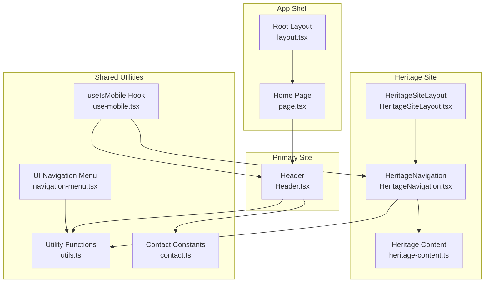
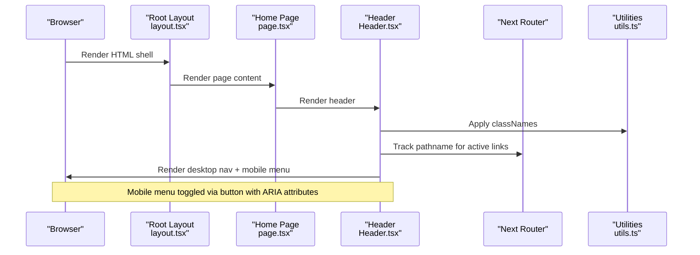
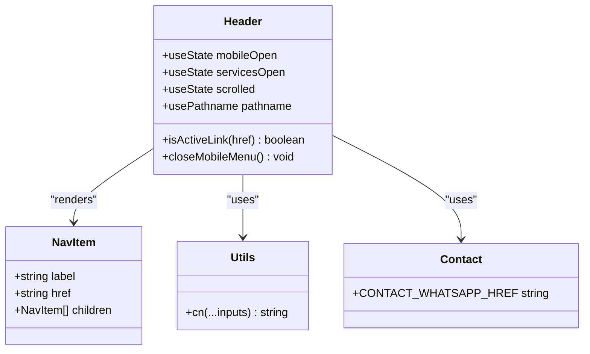
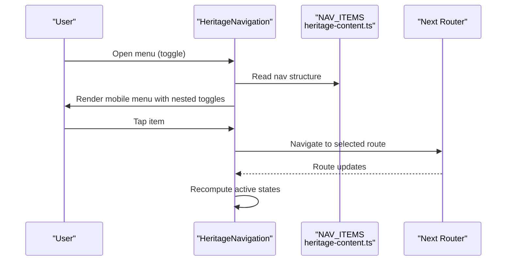
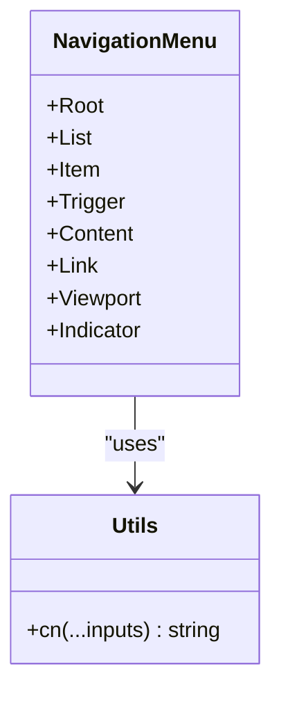
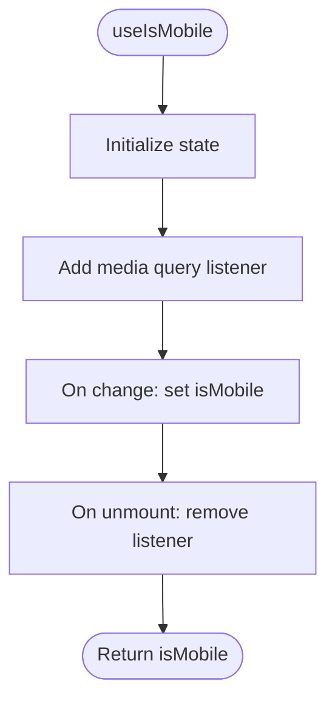
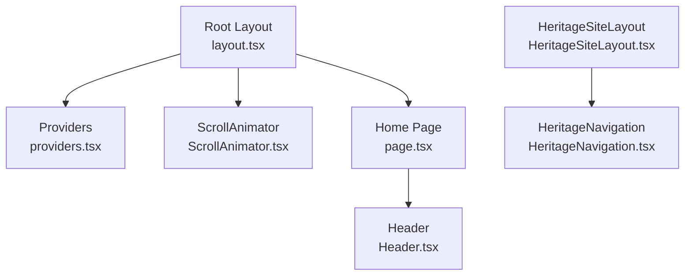
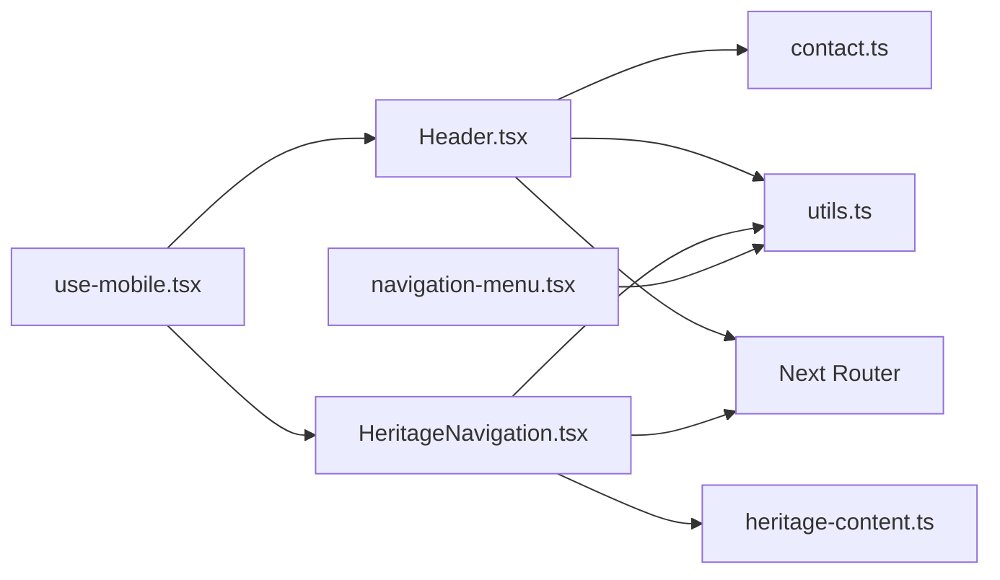

# Navigation and Header

<cite>
**Referenced Files in This Document**
- [Header.tsx](file://src/components/Header.tsx)
- [HeritageNavigation.tsx](file://cvnponkunnam/src/components/heritage/HeritageNavigation.tsx)
- [HeritageSiteLayout.tsx](file://cvnponkunnam/src/components/heritage/HeritageSiteLayout.tsx)
- [navigation-menu.tsx](file://src/components/ui/navigation-menu.tsx)
- [use-mobile.tsx](file://src/hooks/use-mobile.tsx)
- [layout.tsx](file://src/app/layout.tsx)
- [page.tsx](file://src/app/page.tsx)
- [utils.ts](file://src/lib/utils.ts)
- [contact.ts](file://src/lib/contact.ts)
- [heritage-content.ts](file://cvnponkunnam/src/lib/heritage-content.ts)
</cite>

## Table of Contents
1. [Introduction](#introduction)
2. [Project Structure](#project-structure)
3. [Core Components](#core-components)
4. [Architecture Overview](#architecture-overview)
5. [Detailed Component Analysis](#detailed-component-analysis)
6. [Dependency Analysis](#dependency-analysis)
7. [Performance Considerations](#performance-considerations)
8. [Troubleshooting Guide](#troubleshooting-guide)
9. [Conclusion](#conclusion)
10. [Appendices](#appendices)

## Introduction
This document explains the navigation and header components used across the site. It covers:
- The main Header component for the primary site, including navigation structure, logo placement, mobile responsiveness, and menu behavior
- The heritage-specific HeritageNavigation component used for cultural site navigation
- Component props, styling approaches, accessibility features, and integration with routing
- Examples of customizing navigation items, adding dropdown menus, and implementing mobile-friendly navigation patterns
- The layout wrapper component and how it manages page structure

## Project Structure
The navigation system spans several files:
- A primary Header component for the main site
- A heritage-themed navigation component for cultural pages
- Shared UI utilities and hooks for responsive behavior
- Layout wrappers that integrate navigation into page structure

**Diagram sources**
- [layout.tsx:99-119](file://src/app/layout.tsx#L99-L119)
- [page.tsx:38-62](file://src/app/page.tsx#L38-L62)
- [Header.tsx:31-373](file://src/components/Header.tsx#L31-L373)
- [HeritageNavigation.tsx:11-176](file://cvnponkunnam/src/components/heritage/HeritageNavigation.tsx#L11-L176)
- [HeritageSiteLayout.tsx:5-14](file://cvnponkunnam/src/components/heritage/HeritageSiteLayout.tsx#L5-L14)
- [navigation-menu.tsx:8-120](file://src/components/ui/navigation-menu.tsx#L8-L120)
- [use-mobile.tsx:5-19](file://src/hooks/use-mobile.tsx#L5-L19)
- [utils.ts:4-6](file://src/lib/utils.ts#L4-L6)
- [contact.ts:1-29](file://src/lib/contact.ts#L1-L29)
- [heritage-content.ts:13-33](file://cvnponkunnam/src/lib/heritage-content.ts#L13-L33)

**Section sources**
- [layout.tsx:99-119](file://src/app/layout.tsx#L99-L119)
- [page.tsx:38-62](file://src/app/page.tsx#L38-L62)
- [Header.tsx:31-373](file://src/components/Header.tsx#L31-L373)
- [HeritageNavigation.tsx:11-176](file://cvnponkunnam/src/components/heritage/HeritageNavigation.tsx#L11-L176)
- [HeritageSiteLayout.tsx:5-14](file://cvnponkunnam/src/components/heritage/HeritageSiteLayout.tsx#L5-L14)
- [navigation-menu.tsx:8-120](file://src/components/ui/navigation-menu.tsx#L8-L120)
- [use-mobile.tsx:5-19](file://src/hooks/use-mobile.tsx#L5-L19)
- [utils.ts:4-6](file://src/lib/utils.ts#L4-L6)
- [contact.ts:1-29](file://src/lib/contact.ts#L1-L29)
- [heritage-content.ts:13-33](file://cvnponkunnam/src/lib/heritage-content.ts#L13-L33)

## Core Components
- Header (primary site): Fixed-position desktop/mobile navigation with logo, service dropdowns, and a prominent CTA. Implements scroll-aware styling and mobile slide-out menu with animated transitions.
- HeritageNavigation (cultural site): Heritage-themed navigation with logo, dropdown menus, and a mobile menu tailored to cultural content.
- UI Navigation Menu: A reusable Radix-based navigation component for dropdowns and viewport animations.
- useIsMobile hook: Responsive breakpoint detection for mobile behavior.
- Layout wrappers: Root layout and heritage site layout integrate navigation into page structure.

Key capabilities:
- Active link highlighting via pathname comparison
- Scroll-aware header styling
- Accessible ARIA attributes and roles for mobile menus
- Tailwind-based styling with shared utility functions
- Integration with Next.js routing and image optimization

**Section sources**
- [Header.tsx:31-373](file://src/components/Header.tsx#L31-L373)
- [HeritageNavigation.tsx:11-176](file://cvnponkunnam/src/components/heritage/HeritageNavigation.tsx#L11-L176)
- [navigation-menu.tsx:8-120](file://src/components/ui/navigation-menu.tsx#L8-L120)
- [use-mobile.tsx:5-19](file://src/hooks/use-mobile.tsx#L5-L19)

## Architecture Overview
The navigation architecture separates concerns between the primary site and the heritage site, while sharing common utilities and responsive patterns.

**Diagram sources**
- [layout.tsx:99-119](file://src/app/layout.tsx#L99-L119)
- [page.tsx:38-62](file://src/app/page.tsx#L38-L62)
- [Header.tsx:31-373](file://src/components/Header.tsx#L31-L373)
- [utils.ts:4-6](file://src/lib/utils.ts#L4-L6)

## Detailed Component Analysis

### Header Component
The main Header component provides:
- Logo area with fixed aspect ratio and responsive sizing
- Desktop navigation with hover-triggered dropdowns for nested items
- Prominent CTA for WhatsApp contact
- Scroll-aware styling with backdrop blur and subtle shadows
- Mobile menu with staggered entrance animation and overlay
- Accessibility: ARIA roles, labels, and modal semantics for mobile menu

**Diagram sources**
- [Header.tsx:10-14](file://src/components/Header.tsx#L10-L14)
- [Header.tsx:31-80](file://src/components/Header.tsx#L31-L80)
- [utils.ts:4-6](file://src/lib/utils.ts#L4-L6)
- [contact.ts:6](file://src/lib/contact.ts#L6)

Key behaviors:
- Active link detection supports exact match for root and prefix match for nested routes
- Mobile menu closes on route change and prevents body scroll when open
- Desktop dropdowns show on hover with smooth transitions
- Mobile menu uses staggered animations per item for a polished feel

Customization examples:
- Add a new top-level item: Extend the navItems array with label, href, and optional children
- Add a nested service: Include children entries under the SERVICES item
- Change CTA: Update the external link and text in the desktop CTA area
- Adjust styling: Modify className strings applied to header, links, and dropdowns

Accessibility features:
- ARIA-expanded and aria-controls on toggle buttons
- Dialog role and aria-modal on mobile container
- Overlay click closes the menu
- Focus management via native anchor/tab behavior

Integration with routing:
- Uses Next.js usePathname to compute active states
- Links use Next.js Link for client-side navigation

**Section sources**
- [Header.tsx:16-29](file://src/components/Header.tsx#L16-L29)
- [Header.tsx:37-43](file://src/components/Header.tsx#L37-L43)
- [Header.tsx:45-75](file://src/components/Header.tsx#L45-L75)
- [Header.tsx:106-155](file://src/components/Header.tsx#L106-L155)
- [Header.tsx:228-356](file://src/components/Header.tsx#L228-L356)
- [Header.tsx:360-367](file://src/components/Header.tsx#L360-L367)
- [Header.tsx:182-198](file://src/components/Header.tsx#L182-L198)
- [Header.tsx:202-225](file://src/components/Header.tsx#L202-L225)

### HeritageNavigation Component
The heritage-specific navigation:
- Uses a heritage color palette and typography
- Renders logo and navigation items from a centralized content library
- Provides a mobile menu with accordion-style toggles for nested items
- Highlights active links based on pathname
- Applies backdrop blur and scroll-aware styling

**Diagram sources**
- [HeritageNavigation.tsx:11-176](file://cvnponkunnam/src/components/heritage/HeritageNavigation.tsx#L11-L176)
- [heritage-content.ts:13-33](file://cvnponkunnam/src/lib/heritage-content.ts#L13-L33)

Customization examples:
- Add a new top-level item: Append to NAV_ITEMS with label and href
- Add nested items: Include children entries under a parent item
- Change branding: Update logo src and alt text
- Adjust colors: Modify heritage-specific Tailwind classes

Accessibility features:
- ARIA-expanded and aria-label on toggle buttons
- Proper heading and landmark labeling
- Semantic list and link structures

**Section sources**
- [HeritageNavigation.tsx:39-176](file://cvnponkunnam/src/components/heritage/HeritageNavigation.tsx#L39-L176)
- [heritage-content.ts:13-33](file://cvnponkunnam/src/lib/heritage-content.ts#L13-L33)

### UI Navigation Menu (Dropdown Base)
A reusable dropdown component built with Radix UI primitives:
- Trigger with chevron indicator
- Animated viewport for dropdown content
- Indicator for active state
- Composable styles via class variants

**Diagram sources**
- [navigation-menu.tsx:8-120](file://src/components/ui/navigation-menu.tsx#L8-L120)
- [utils.ts:4-6](file://src/lib/utils.ts#L4-L6)

**Section sources**
- [navigation-menu.tsx:8-120](file://src/components/ui/navigation-menu.tsx#L8-L120)

### useIsMobile Hook
Provides responsive breakpoint detection for mobile behavior:
- Uses a media query listener to track width changes
- Returns a boolean indicating mobile viewport

**Diagram sources**
- [use-mobile.tsx:5-19](file://src/hooks/use-mobile.tsx#L5-L19)

**Section sources**
- [use-mobile.tsx:5-19](file://src/hooks/use-mobile.tsx#L5-L19)

### Layout Wrapper Component
The root layout integrates providers and the scroll animator, while the heritage layout wraps the page with the heritage navigation and footer.

**Diagram sources**
- [layout.tsx:99-119](file://src/app/layout.tsx#L99-L119)
- [page.tsx:38-62](file://src/app/page.tsx#L38-L62)
- [HeritageSiteLayout.tsx:5-14](file://cvnponkunnam/src/components/heritage/HeritageSiteLayout.tsx#L5-L14)

**Section sources**
- [layout.tsx:99-119](file://src/app/layout.tsx#L99-L119)
- [page.tsx:38-62](file://src/app/page.tsx#L38-L62)
- [HeritageSiteLayout.tsx:5-14](file://cvnponkunnam/src/components/heritage/HeritageSiteLayout.tsx#L5-L14)

## Dependency Analysis
- Header depends on:
  - Next.js router for pathname tracking
  - Contact constants for CTA link
  - Utility functions for class merging
- HeritageNavigation depends on:
  - Heritage content library for nav items
  - Next.js router for active state
  - Utility functions for class merging
- UI Navigation Menu depends on:
  - Radix UI primitives
  - Utility functions for class merging
- useIsMobile is standalone but commonly used by both navigations

**Diagram sources**
- [Header.tsx:31-373](file://src/components/Header.tsx#L31-L373)
- [HeritageNavigation.tsx:11-176](file://cvnponkunnam/src/components/heritage/HeritageNavigation.tsx#L11-L176)
- [navigation-menu.tsx:8-120](file://src/components/ui/navigation-menu.tsx#L8-L120)
- [use-mobile.tsx:5-19](file://src/hooks/use-mobile.tsx#L5-L19)
- [utils.ts:4-6](file://src/lib/utils.ts#L4-L6)
- [contact.ts:1-29](file://src/lib/contact.ts#L1-L29)
- [heritage-content.ts:13-33](file://cvnponkunnam/src/lib/heritage-content.ts#L13-L33)

**Section sources**
- [Header.tsx:31-373](file://src/components/Header.tsx#L31-L373)
- [HeritageNavigation.tsx:11-176](file://cvnponkunnam/src/components/heritage/HeritageNavigation.tsx#L11-L176)
- [navigation-menu.tsx:8-120](file://src/components/ui/navigation-menu.tsx#L8-L120)
- [use-mobile.tsx:5-19](file://src/hooks/use-mobile.tsx#L5-L19)
- [utils.ts:4-6](file://src/lib/utils.ts#L4-L6)
- [contact.ts:1-29](file://src/lib/contact.ts#L1-L29)
- [heritage-content.ts:13-33](file://cvnponkunnam/src/lib/heritage-content.ts#L13-L33)

## Performance Considerations
- Prefer static image optimization via Next.js Image for logos
- Keep dropdown content minimal to reduce reflows
- Use passive listeners for scroll events to avoid layout thrashing
- Avoid unnecessary re-renders by memoizing computed values derived from pathname
- Leverage CSS transforms for animations (as implemented) to minimize layout cost

## Troubleshooting Guide
Common issues and resolutions:
- Mobile menu not closing after navigation: Ensure pathname effect resets mobile state and that close handlers are attached to overlay and menu items
- Body scroll not restored: Verify cleanup effects reset overflow styles when the menu closes
- Active link highlighting incorrect: Confirm isActiveLink logic matches desired route patterns (root exact vs prefix for nested)
- Dropdowns not visible on desktop: Check hover-triggered visibility classes and ensure z-index stacking is correct
- Accessibility warnings: Confirm ARIA attributes are present and dynamic (expanded/collapsed states)

**Section sources**
- [Header.tsx:45-48](file://src/components/Header.tsx#L45-L48)
- [Header.tsx:50-61](file://src/components/Header.tsx#L50-L61)
- [Header.tsx:37-43](file://src/components/Header.tsx#L37-L43)
- [HeritageNavigation.tsx:17-27](file://cvnponkunnam/src/components/heritage/HeritageNavigation.tsx#L17-L27)
- [HeritageNavigation.tsx:30-34](file://cvnponkunnam/src/components/heritage/HeritageNavigation.tsx#L30-L34)

## Conclusion
The navigation system combines a robust primary Header with a heritage-themed alternative, both leveraging shared utilities and responsive patterns. They offer accessible, mobile-first experiences with clear active states, smooth animations, and easy customization through centralized content and styling utilities.

## Appendices

### Customizing Navigation Items
- Primary site: Extend the navItems array with label, href, and optional children entries
- Heritage site: Add or modify entries in NAV_ITEMS with label and href, optionally including children arrays

**Section sources**
- [Header.tsx:16-29](file://src/components/Header.tsx#L16-L29)
- [heritage-content.ts:13-33](file://cvnponkunnam/src/lib/heritage-content.ts#L13-L33)

### Adding Dropdown Menus
- Primary site: Include children entries under a parent item; desktop dropdowns render automatically
- Heritage site: Provide children arrays in NAV_ITEMS for items requiring nested navigation

**Section sources**
- [Header.tsx:109-142](file://src/components/Header.tsx#L109-L142)
- [HeritageNavigation.tsx:62-88](file://cvnponkunnam/src/components/heritage/HeritageNavigation.tsx#L62-L88)
- [heritage-content.ts:18-27](file://cvnponkunnam/src/lib/heritage-content.ts#L18-L27)

### Implementing Mobile-Friendly Patterns
- Primary site: Use the built-in mobile menu with overlay and staggered animations; ensure ARIA attributes and body scroll prevention
- Heritage site: Utilize the mobile accordion pattern for nested items; maintain consistent ARIA labeling

**Section sources**
- [Header.tsx:202-370](file://src/components/Header.tsx#L202-L370)
- [HeritageNavigation.tsx:126-173](file://cvnponkunnam/src/components/heritage/HeritageNavigation.tsx#L126-L173)

### Accessibility Checklist
- Toggle buttons include aria-expanded and aria-controls
- Mobile menu container has role="dialog" and aria-modal
- Overlay and menu items announce state changes
- Active links clearly indicated via visual and semantic cues

**Section sources**
- [Header.tsx:182-198](file://src/components/Header.tsx#L182-L198)
- [Header.tsx:217-225](file://src/components/Header.tsx#L217-L225)
- [HeritageNavigation.tsx:114-122](file://cvnponkunnam/src/components/heritage/HeritageNavigation.tsx#L114-L122)