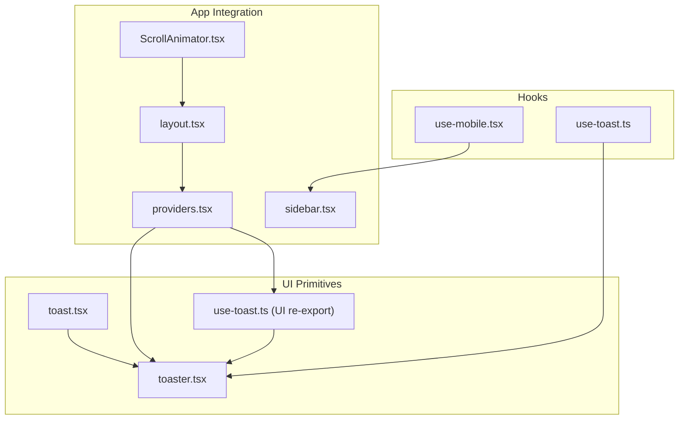
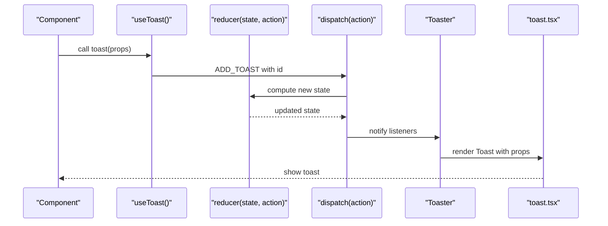
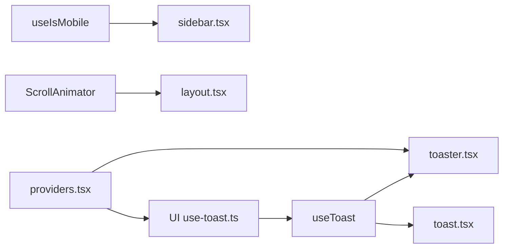

# Custom Hooks

<cite>
**Referenced Files in This Document**
- [use-mobile.tsx](file://src/hooks/use-mobile.tsx)
- [use-toast.ts](file://src/hooks/use-toast.ts)
- [ScrollAnimator.tsx](file://src/components/ScrollAnimator.tsx)
- [toast.tsx](file://src/components/ui/toast.tsx)
- [toaster.tsx](file://src/components/ui/toaster.tsx)
- [use-toast.ts (UI re-export)](file://src/components/ui/use-toast.ts)
- [sidebar.tsx](file://src/components/ui/sidebar.tsx)
- [layout.tsx](file://src/app/layout.tsx)
- [providers.tsx](file://src/app/providers.tsx)
</cite>

## Table of Contents
1. [Introduction](#introduction)
2. [Project Structure](#project-structure)
3. [Core Components](#core-components)
4. [Architecture Overview](#architecture-overview)
5. [Detailed Component Analysis](#detailed-component-analysis)
6. [Dependency Analysis](#dependency-analysis)
7. [Performance Considerations](#performance-considerations)
8. [Troubleshooting Guide](#troubleshooting-guide)
9. [Conclusion](#conclusion)

## Introduction
This document explains three custom React utilities used across the application:
- useIsMobile hook for responsive design detection
- useToast/useToastProvider for notification management
- ScrollAnimator component for scroll-based animations

It covers implementation, usage patterns, dependencies, integration points, best practices, and common use cases. Practical examples are provided via file references and diagrams.

## Project Structure
The hooks and components are organized by responsibility:
- Hooks live under src/hooks
- UI toast primitives and provider live under src/components/ui
- ScrollAnimator is a UI component under src/components
- Integration occurs in Next.js app layout and providers

**Diagram sources**
- [use-mobile.tsx:1-20](file://src/hooks/use-mobile.tsx#L1-L20)
- [use-toast.ts:1-187](file://src/hooks/use-toast.ts#L1-L187)
- [toast.tsx:1-112](file://src/components/ui/toast.tsx#L1-L112)
- [toaster.tsx:1-25](file://src/components/ui/toaster.tsx#L1-L25)
- [use-toast.ts (UI re-export):1-4](file://src/components/ui/use-toast.ts#L1-L4)
- [layout.tsx:1-120](file://src/app/layout.tsx#L1-L120)
- [providers.tsx:1-17](file://src/app/providers.tsx#L1-L17)
- [sidebar.tsx:45-244](file://src/components/ui/sidebar.tsx#L45-L244)
- [ScrollAnimator.tsx:1-65](file://src/components/ScrollAnimator.tsx#L1-L65)

**Section sources**
- [use-mobile.tsx:1-20](file://src/hooks/use-mobile.tsx#L1-L20)
- [use-toast.ts:1-187](file://src/hooks/use-toast.ts#L1-L187)
- [ScrollAnimator.tsx:1-65](file://src/components/ScrollAnimator.tsx#L1-L65)
- [toast.tsx:1-112](file://src/components/ui/toast.tsx#L1-L112)
- [toaster.tsx:1-25](file://src/components/ui/toaster.tsx#L1-L25)
- [use-toast.ts (UI re-export):1-4](file://src/components/ui/use-toast.ts#L1-L4)
- [layout.tsx:1-120](file://src/app/layout.tsx#L1-L120)
- [providers.tsx:1-17](file://src/app/providers.tsx#L1-L17)
- [sidebar.tsx:45-244](file://src/components/ui/sidebar.tsx#L45-L244)

## Core Components
- useIsMobile: Detects mobile viewport and updates on resize/matchMedia events
- useToast/toast: Global toast manager with reducer-based state, queue-based dismissal, and UI provider
- ScrollAnimator: Scroll-based reveal animation with reduced-motion awareness and dynamic DOM observation

**Section sources**
- [use-mobile.tsx:5-19](file://src/hooks/use-mobile.tsx#L5-L19)
- [use-toast.ts:166-184](file://src/hooks/use-toast.ts#L166-L184)
- [ScrollAnimator.tsx:5-62](file://src/components/ScrollAnimator.tsx#L5-L62)

## Architecture Overview
The toast system uses a local Redux-like reducer pattern with a global dispatcher and subscribers. The UI provider renders toasts and exposes a hook to subscribe to state. ScrollAnimator runs once per session to wire up intersection observers and reduced-motion handling.

**Diagram sources**
- [use-toast.ts:137-164](file://src/hooks/use-toast.ts#L137-L164)
- [use-toast.ts:128-133](file://src/hooks/use-toast.ts#L128-L133)
- [use-toast.ts:71-122](file://src/hooks/use-toast.ts#L71-L122)
- [toaster.tsx:4-24](file://src/components/ui/toaster.tsx#L4-L24)
- [toast.tsx:40-46](file://src/components/ui/toast.tsx#L40-L46)

## Detailed Component Analysis

### useIsMobile Hook
Purpose:
- Determine if the current device is mobile-sized using matchMedia and window width
- Provide a reactive boolean flag that updates on change

Implementation highlights:
- Uses matchMedia to listen for width changes
- Initializes state from current window width
- Cleans up listeners on unmount

Usage patterns:
- Conditional rendering of mobile-specific UI (e.g., Sheet vs fixed sidebar)
- Responsive breakpoints and layout adjustments

Integration:
- Consumed by sidebar component to decide between off-canvas and desktop layouts

Best practices:
- Prefer this hook over manual window checks inside components
- Keep breakpoint constants centralized for consistency

Common use cases:
- Mobile navigation toggles
- Adaptive grid layouts
- Touch-friendly controls

**Section sources**
- [use-mobile.tsx:5-19](file://src/hooks/use-mobile.tsx#L5-L19)
- [sidebar.tsx:50-76](file://src/components/ui/sidebar.tsx#L50-L76)

### useToast and toast
Purpose:
- Provide a global toast notification system with a single active toast limit
- Manage toast lifecycle: add, update, dismiss, remove
- Expose a hook to subscribe to toasts and a convenience function to trigger them

Implementation highlights:
- Local reducer with actions for ADD_TOAST, UPDATE_TOAST, DISMISS_TOAST, REMOVE_TOAST
- Unique ID generation and a removal queue with delayed timeouts
- Subscription model with a listener array and memory state
- UI provider maps state to toast components

Usage patterns:
- Call toast({ title, description, ... }) after async operations
- Dismiss individual toasts or batch dismiss
- Update existing toasts dynamically

Integration:
- UI provider Toaster subscribes to useToast and renders toast components
- Providers composes Toaster and Sonner

Best practices:
- Keep toasts concise and actionable
- Use dismissible toasts sparingly; rely on auto-dismiss for passive feedback
- Avoid flooding users with multiple simultaneous toasts

Common use cases:
- Form submission results
- Background sync notifications
- Error messages with optional actions

**Section sources**
- [use-toast.ts:15-27](file://src/hooks/use-toast.ts#L15-L27)
- [use-toast.ts:53-69](file://src/hooks/use-toast.ts#L53-L69)
- [use-toast.ts:71-122](file://src/hooks/use-toast.ts#L71-L122)
- [use-toast.ts:128-133](file://src/hooks/use-toast.ts#L128-L133)
- [use-toast.ts:137-164](file://src/hooks/use-toast.ts#L137-L164)
- [use-toast.ts:166-184](file://src/hooks/use-toast.ts#L166-L184)
- [toaster.tsx:4-24](file://src/components/ui/toaster.tsx#L4-L24)
- [toast.tsx:40-46](file://src/components/ui/toast.tsx#L40-L46)
- [providers.tsx:3-14](file://src/app/providers.tsx#L3-L14)

### ScrollAnimator Component
Purpose:
- Animate elements into view as the user scrolls
- Respect reduced-motion preferences
- Dynamically observe new elements added to the DOM

Implementation highlights:
- On mount, checks reduced-motion preference and either reveals immediately or initializes observers
- Uses IntersectionObserver with a root margin and threshold tuned for entrance animations
- Tracks observed items with a WeakSet to avoid duplicate observations
- Watches document body mutations to observe dynamically added elements
- Adds/removes a body class to coordinate CSS transitions

Usage patterns:
- Wrap the app shell with ScrollAnimator to enable scroll-based animations
- Add "motion-reveal" class to elements you want to animate
- Combine with CSS transitions for smooth reveals

Integration:
- Mounted in the root layout to initialize once per session
- Works independently of React state; relies on DOM classes and observers

Best practices:
- Keep thresholds and margins reasonable to avoid premature or delayed reveals
- Use reduced-motion-safe defaults; rely on the component to handle reduced-motion
- Avoid heavy work in the intersection callback; keep it focused on adding classes

Common use cases:
- Hero sections and feature blocks
- Content cards and testimonials
- Image galleries and media grids

**Section sources**
- [ScrollAnimator.tsx:5-62](file://src/components/ScrollAnimator.tsx#L5-L62)
- [layout.tsx:99-118](file://src/app/layout.tsx#L99-L118)

## Dependency Analysis
- useIsMobile depends on browser APIs (matchMedia, window) and React state
- useToast depends on React state and effects; it is consumed by Toaster and Sonner
- ScrollAnimator depends on DOM APIs (querySelectorAll, IntersectionObserver, MutationObserver) and matchMedia
- UI re-export file allows importing useToast and toast directly from the UI module

**Diagram sources**
- [use-mobile.tsx:5-19](file://src/hooks/use-mobile.tsx#L5-L19)
- [sidebar.tsx:50-76](file://src/components/ui/sidebar.tsx#L50-L76)
- [use-toast.ts:166-184](file://src/hooks/use-toast.ts#L166-L184)
- [toaster.tsx:4-24](file://src/components/ui/toaster.tsx#L4-L24)
- [toast.tsx:40-46](file://src/components/ui/toast.tsx#L40-L46)
- [use-toast.ts (UI re-export):1-4](file://src/components/ui/use-toast.ts#L1-L4)
- [ScrollAnimator.tsx:5-62](file://src/components/ScrollAnimator.tsx#L5-L62)
- [layout.tsx:99-118](file://src/app/layout.tsx#L99-L118)
- [providers.tsx:3-14](file://src/app/providers.tsx#L3-L14)

**Section sources**
- [use-mobile.tsx:5-19](file://src/hooks/use-mobile.tsx#L5-L19)
- [use-toast.ts:166-184](file://src/hooks/use-toast.ts#L166-L184)
- [ScrollAnimator.tsx:5-62](file://src/components/ScrollAnimator.tsx#L5-L62)
- [toaster.tsx:4-24](file://src/components/ui/toaster.tsx#L4-L24)
- [toast.tsx:40-46](file://src/components/ui/toast.tsx#L40-L46)
- [use-toast.ts (UI re-export):1-4](file://src/components/ui/use-toast.ts#L1-L4)
- [layout.tsx:99-118](file://src/app/layout.tsx#L99-L118)
- [providers.tsx:3-14](file://src/app/providers.tsx#L3-L14)

## Performance Considerations
- useIsMobile
  - Uses matchMedia change events; ensure minimal re-renders by consuming the boolean directly
  - Avoid expensive computations in effect callbacks
- useToast
  - Limits concurrent toasts to one for clarity; consider batching updates to avoid thrashing
  - Removal queue uses timeouts; ensure cleanup to prevent memory leaks
- ScrollAnimator
  - IntersectionObserver is efficient; avoid overly aggressive thresholds
  - MutationObserver watches the entire DOM tree; scope selectors to reduce work
  - Reduced-motion handling short-circuits heavy JS; keep CSS transitions lightweight

[No sources needed since this section provides general guidance]

## Troubleshooting Guide
- useIsMobile
  - Symptom: Hook returns undefined initially
    - Cause: SSR or early render before effect runs
    - Fix: Guard UI until the value is truthy or use client directives
  - Symptom: No updates on resize
    - Cause: Event listener not attached or removed prematurely
    - Fix: Verify effect cleanup and event registration
- useToast
  - Symptom: Toasts not appearing
    - Cause: Toaster not rendered in providers
    - Fix: Ensure Toaster is mounted under Providers
  - Symptom: Toasts stacking unexpectedly
    - Cause: Limit set to higher number or frequent triggers
    - Fix: Keep limit at one; debounce triggers
  - Symptom: Dismiss not working
    - Cause: Missing id or incorrect usage
    - Fix: Use returned id from toast() or call dismiss(id)
- ScrollAnimator
  - Symptom: Elements never animate
    - Cause: Missing "motion-reveal" class or reduced-motion enabled
    - Fix: Add class to targets; confirm reduced-motion setting
  - Symptom: New elements not animated
    - Cause: MutationObserver not observing or selector mismatch
    - Fix: Ensure selector matches and observer is active

**Section sources**
- [use-mobile.tsx:5-19](file://src/hooks/use-mobile.tsx#L5-L19)
- [use-toast.ts:166-184](file://src/hooks/use-toast.ts#L166-L184)
- [toaster.tsx:4-24](file://src/components/ui/toaster.tsx#L4-L24)
- [ScrollAnimator.tsx:5-62](file://src/components/ScrollAnimator.tsx#L5-L62)

## Conclusion
These utilities encapsulate cross-cutting concerns:
- useIsMobile centralizes responsive logic for adaptive UI
- useToast provides a scalable, predictable notification system
- ScrollAnimator enables accessible, performant scroll-based animations

They integrate cleanly with the app’s layout and providers, encouraging reuse and consistency across components.