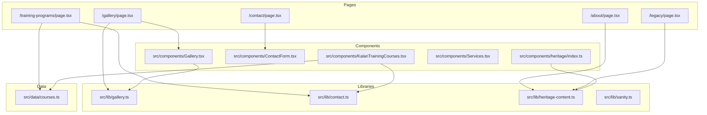
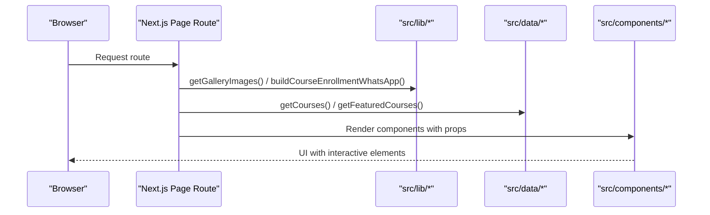
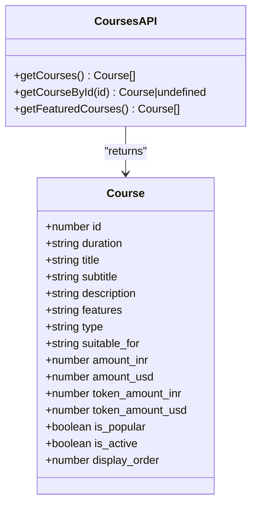
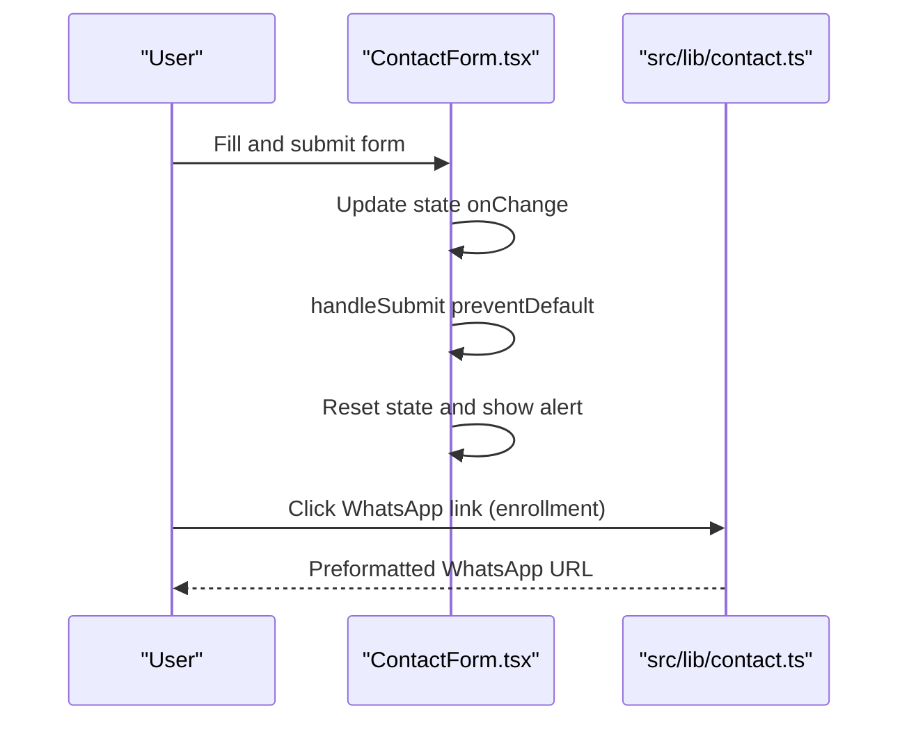
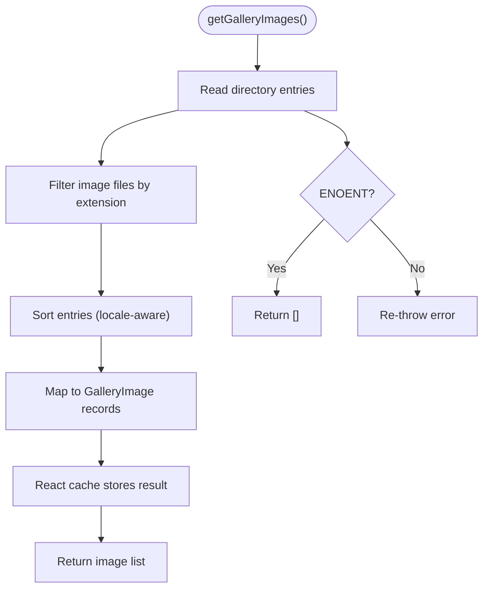
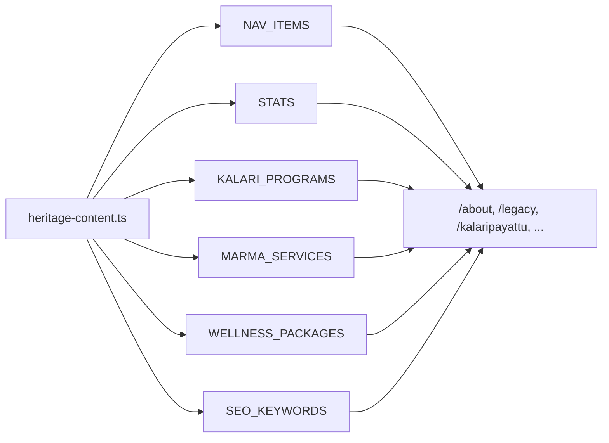
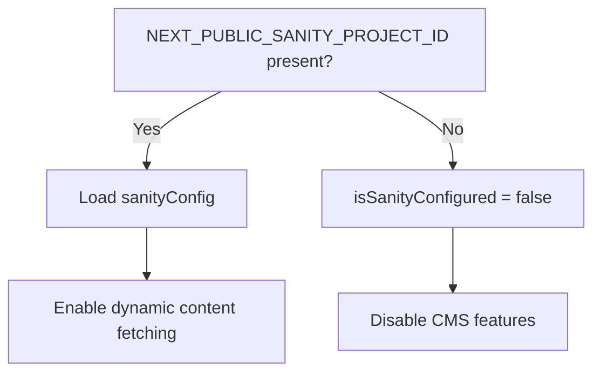
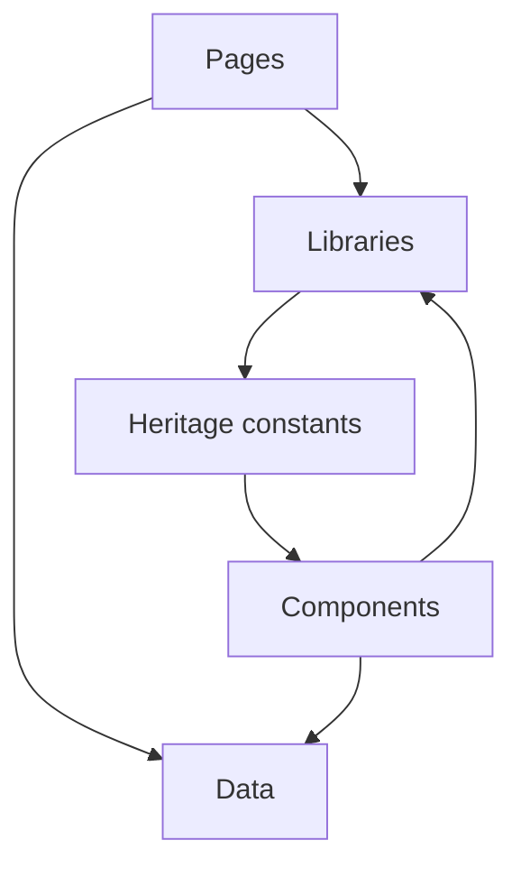

# Data Management

<cite>
**Referenced Files in This Document**
- [courses.ts](file://src/data/courses.ts)
- [contact.ts](file://src/lib/contact.ts)
- [gallery.ts](file://src/lib/gallery.ts)
- [sanity.ts](file://src/lib/sanity.ts)
- [heritage-content.ts](file://src/lib/heritage-content.ts)
- [index.ts](file://src/components/heritage/index.ts)
- [ContactForm.tsx](file://src/components/ContactForm.tsx)
- [Gallery.tsx](file://src/components/Gallery.tsx)
- [page.tsx](file://src/app/gallery/page.tsx)
- [page.tsx](file://src/app/contact/page.tsx)
- [page.tsx](file://src/app/training-programs/page.tsx)
- [page.tsx](file://src/app/about/page.tsx)
- [page.tsx](file://src/app/legacy/page.tsx)
- [Services.tsx](file://src/components/Services.tsx)
- [KalariTrainingCourses.tsx](file://src/components/KalariTrainingCourses.tsx)
</cite>

## Table of Contents
1. [Introduction](#introduction)
2. [Project Structure](#project-structure)
3. [Core Components](#core-components)
4. [Architecture Overview](#architecture-overview)
5. [Detailed Component Analysis](#detailed-component-analysis)
6. [Dependency Analysis](#dependency-analysis)
7. [Performance Considerations](#performance-considerations)
8. [Troubleshooting Guide](#troubleshooting-guide)
9. [Conclusion](#conclusion)
10. [Appendices](#appendices)

## Introduction
This document explains the data management approach for CVN Ponkunnam, focusing on:
- Course data model and retrieval helpers
- Contact form data handling and outbound communication links
- Gallery image management and rendering
- Heritage content organization and navigation
- Optional Sanity CMS integration patterns
It also covers data fetching strategies, transformation processes, validation approaches, error handling, caching, and synchronization/update mechanisms between local data and external content sources.

## Project Structure
The data layer is organized by responsibility:
- Local data models and helpers live under src/data and src/lib
- UI components that render data live under src/components
- Page routes orchestrate data fetching and pass props to components
- Heritage-specific components and content constants are grouped under src/components/heritage and src/lib

**Diagram sources**
- [page.tsx:1-22](file://src/app/gallery/page.tsx#L1-L22)
- [page.tsx:1-20](file://src/app/contact/page.tsx#L1-L20)
- [page.tsx:1-85](file://src/app/training-programs/page.tsx#L1-L85)
- [page.tsx:1-41](file://src/app/about/page.tsx#L1-L41)
- [page.tsx:1-56](file://src/app/legacy/page.tsx#L1-L56)
- [gallery.ts:1-73](file://src/lib/gallery.ts#L1-L73)
- [contact.ts:1-29](file://src/lib/contact.ts#L1-L29)
- [heritage-content.ts:1-105](file://src/lib/heritage-content.ts#L1-L105)
- [sanity.ts:1-15](file://src/lib/sanity.ts#L1-L15)
- [courses.ts:1-103](file://src/data/courses.ts#L1-L103)
- [Gallery.tsx:1-80](file://src/components/Gallery.tsx#L1-L80)
- [ContactForm.tsx:1-246](file://src/components/ContactForm.tsx#L1-L246)
- [KalariTrainingCourses.tsx:1-117](file://src/components/KalariTrainingCourses.tsx#L1-L117)
- [Services.tsx:1-110](file://src/components/Services.tsx#L1-L110)
- [index.ts:1-15](file://src/components/heritage/index.ts#L1-L15)

**Section sources**
- [page.tsx:1-22](file://src/app/gallery/page.tsx#L1-L22)
- [page.tsx:1-20](file://src/app/contact/page.tsx#L1-L20)
- [page.tsx:1-85](file://src/app/training-programs/page.tsx#L1-L85)
- [page.tsx:1-41](file://src/app/about/page.tsx#L1-L41)
- [page.tsx:1-56](file://src/app/legacy/page.tsx#L1-L56)
- [gallery.ts:1-73](file://src/lib/gallery.ts#L1-L73)
- [contact.ts:1-29](file://src/lib/contact.ts#L1-L29)
- [heritage-content.ts:1-105](file://src/lib/heritage-content.ts#L1-L105)
- [sanity.ts:1-15](file://src/lib/sanity.ts#L1-L15)
- [courses.ts:1-103](file://src/data/courses.ts#L1-L103)
- [Gallery.tsx:1-80](file://src/components/Gallery.tsx#L1-L80)
- [ContactForm.tsx:1-246](file://src/components/ContactForm.tsx#L1-L246)
- [KalariTrainingCourses.tsx:1-117](file://src/components/KalariTrainingCourses.tsx#L1-L117)
- [Services.tsx:1-110](file://src/components/Services.tsx#L1-L110)
- [index.ts:1-15](file://src/components/heritage/index.ts#L1-L15)

## Core Components
- Course data model and helpers: Defines the Course interface and provides filtering/sorting helpers for active and featured courses.
- Contact utilities: Centralizes phone, WhatsApp, and preformatted enrollment links.
- Gallery image loader: Reads images from the filesystem, normalizes filenames, and exposes typed image records with slugs and URLs.
- Heritage content constants: Brand, navigation, stats, program lists, service packages, and SEO keywords.
- Sanity integration: Configuration object and environment-driven toggles for optional CMS integration.

**Section sources**
- [courses.ts:1-103](file://src/data/courses.ts#L1-L103)
- [contact.ts:1-29](file://src/lib/contact.ts#L1-L29)
- [gallery.ts:1-73](file://src/lib/gallery.ts#L1-L73)
- [heritage-content.ts:1-105](file://src/lib/heritage-content.ts#L1-L105)
- [sanity.ts:1-15](file://src/lib/sanity.ts#L1-L15)

## Architecture Overview
The system follows a layered pattern:
- Pages fetch data (either local constants or filesystem) and pass it to components.
- Components render UI and trigger outbound actions (e.g., WhatsApp links).
- Optional Sanity integration is gated by environment configuration.

**Diagram sources**
- [page.tsx:10-21](file://src/app/gallery/page.tsx#L10-L21)
- [page.tsx:13-84](file://src/app/training-programs/page.tsx#L13-L84)
- [gallery.ts:27-67](file://src/lib/gallery.ts#L27-L67)
- [contact.ts:8-28](file://src/lib/contact.ts#L8-L28)
- [courses.ts:90-103](file://src/data/courses.ts#L90-L103)

## Detailed Component Analysis

### Course Data Model and Helpers
- Data model: Course interface defines fields for duration, pricing, popularity, activity, and ordering.
- Helpers:
  - getCourses: Filters active courses.
  - getCourseById: Retrieves a single active course by ID.
  - getFeaturedCourses: Returns active courses ordered by display order.

**Diagram sources**
- [courses.ts:1-17](file://src/data/courses.ts#L1-L17)
- [courses.ts:90-103](file://src/data/courses.ts#L90-L103)

**Section sources**
- [courses.ts:1-103](file://src/data/courses.ts#L1-L103)
- [page.tsx](file://src/app/training-programs/page.tsx#L14)
- [KalariTrainingCourses.tsx:6-7](file://src/components/KalariTrainingCourses.tsx#L6-L7)

### Contact Form Data Handling
- Form state: Tracks name, email, phone, subject, and message.
- Submission: Logs submission to console and resets form state; displays a confirmation alert.
- Outbound links: Provides formatted telephone and WhatsApp links; generates enrollment-specific WhatsApp links with pre-filled messages.

**Diagram sources**
- [ContactForm.tsx:12-41](file://src/components/ContactForm.tsx#L12-L41)
- [contact.ts:8-28](file://src/lib/contact.ts#L8-L28)

**Section sources**
- [ContactForm.tsx:1-246](file://src/components/ContactForm.tsx#L1-L246)
- [contact.ts:1-29](file://src/lib/contact.ts#L1-L29)

### Gallery Image Management
- Filesystem scanning: Reads gallery directory, filters supported image extensions, sorts entries, and builds normalized records.
- Slug generation: Converts filenames to URL-safe slugs.
- Public paths: Constructs asset URLs for Next.js Image.
- Caching: Uses React server-side caching to avoid repeated filesystem reads.
- Error handling: Swallows missing directory errors and returns empty list; rethrows other errors.

**Diagram sources**
- [gallery.ts:27-67](file://src/lib/gallery.ts#L27-L67)

**Section sources**
- [gallery.ts:1-73](file://src/lib/gallery.ts#L1-L73)
- [Gallery.tsx:1-80](file://src/components/Gallery.tsx#L1-L80)
- [page.tsx:10-21](file://src/app/gallery/page.tsx#L10-L21)

### Heritage Content Organization
- Constants: Brand identity, navigation items, statistics, program lists, service packages, and SEO keywords.
- Navigation: Centralized menu items with nested children for training programs.
- Page composition: Pages import these constants and pass them to heritage components.

**Diagram sources**
- [heritage-content.ts:1-105](file://src/lib/heritage-content.ts#L1-L105)
- [page.tsx:13-40](file://src/app/about/page.tsx#L13-L40)
- [page.tsx:20-56](file://src/app/legacy/page.tsx#L20-L56)

**Section sources**
- [heritage-content.ts:1-105](file://src/lib/heritage-content.ts#L1-L105)
- [index.ts:1-15](file://src/components/heritage/index.ts#L1-L15)
- [page.tsx:13-40](file://src/app/about/page.tsx#L13-L40)
- [page.tsx:20-56](file://src/app/legacy/page.tsx#L20-L56)

### Sanity CMS Integration Patterns
- Configuration: Exposes a runtime configuration object with project ID, dataset, API version, and CDN flag.
- Environment gating: Provides a boolean to check if Sanity is configured.
- Usage pattern: Integrate @sanity/client in pages or libraries when environment variables are present to fetch dynamic content.

**Diagram sources**
- [sanity.ts:7-15](file://src/lib/sanity.ts#L7-L15)

**Section sources**
- [sanity.ts:1-15](file://src/lib/sanity.ts#L1-L15)

## Dependency Analysis
- Pages depend on libraries for data fetching and on data modules for structured content.
- Components depend on libraries for image and contact utilities.
- Heritage components depend on content constants for branding and navigation.
- No circular dependencies observed among the analyzed modules.

**Diagram sources**
- [page.tsx:4-5](file://src/app/training-programs/page.tsx#L4-L5)
- [gallery.ts:1-3](file://src/lib/gallery.ts#L1-L3)
- [courses.ts:1-3](file://src/data/courses.ts#L1-L3)
- [heritage-content.ts:1-3](file://src/lib/heritage-content.ts#L1-L3)
- [Gallery.tsx:7-8](file://src/components/Gallery.tsx#L7-L8)
- [KalariTrainingCourses.tsx:3-4](file://src/components/KalariTrainingCourses.tsx#L3-L4)

**Section sources**
- [page.tsx:4-5](file://src/app/training-programs/page.tsx#L4-L5)
- [gallery.ts:1-3](file://src/lib/gallery.ts#L1-L3)
- [courses.ts:1-3](file://src/data/courses.ts#L1-L3)
- [heritage-content.ts:1-3](file://src/lib/heritage-content.ts#L1-L3)
- [Gallery.tsx:7-8](file://src/components/Gallery.tsx#L7-L8)
- [KalariTrainingCourses.tsx:3-4](file://src/components/KalariTrainingCourses.tsx#L3-L4)

## Performance Considerations
- React server caching: Gallery images are cached via React cache to avoid repeated filesystem scans.
- Minimal parsing: Course features are split on newline; keep lists concise to reduce DOM rendering overhead.
- Static assets: Gallery images are served from public assets; ensure appropriate compression and formats.
- Conditional CMS: Sanity integration is disabled when environment variables are absent, avoiding unnecessary network calls.

[No sources needed since this section provides general guidance]

## Troubleshooting Guide
- Gallery directory missing: On ENOENT, the gallery loader returns an empty array; verify the directory exists and is readable.
- Unexpected image formats: Only supported extensions are included; confirm file extensions match allowed set.
- Form submission: Current handler logs to console and resets state; integrate a backend endpoint to persist or notify.
- Sanity not loading: Ensure NEXT_PUBLIC_SANITY_PROJECT_ID is set; otherwise, CMS features remain disabled.

**Section sources**
- [gallery.ts:30-43](file://src/lib/gallery.ts#L30-L43)
- [ContactForm.tsx:28-41](file://src/components/ContactForm.tsx#L28-L41)
- [sanity.ts:7-15](file://src/lib/sanity.ts#L7-L15)

## Conclusion
CVN Ponkunnam’s data management relies on:
- Clear, typed data models for courses
- Utility libraries for contact and gallery operations
- Centralized heritage content constants
- Optional Sanity integration gated by environment
Pages orchestrate data fetching and pass props to components, ensuring a clean separation of concerns. The system leverages React caching for gallery images and keeps contact and course enrollment flows simple and user-friendly.

[No sources needed since this section summarizes without analyzing specific files]

## Appendices

### Data Validation Approaches
- Course filtering: Active-only and popular sorting occur at retrieval time.
- Feature list parsing: Split on newline to render bullet points; ensure consistent formatting.
- Contact links: Prebuilt with encoding for messages; validate presence of required environment variables for production.

**Section sources**
- [courses.ts:90-103](file://src/data/courses.ts#L90-L103)
- [KalariTrainingCourses.tsx:22-66](file://src/components/KalariTrainingCourses.tsx#L22-L66)
- [contact.ts:8-28](file://src/lib/contact.ts#L8-L28)

### Error Handling
- Gallery loader: Handles missing directory gracefully; rethrows other errors.
- Form submission: Immediate feedback via alert; consider integrating toast notifications and backend validation.

**Section sources**
- [gallery.ts:30-43](file://src/lib/gallery.ts#L30-L43)
- [ContactForm.tsx:28-41](file://src/components/ContactForm.tsx#L28-L41)

### Caching Strategies
- Gallery images: Cached via React cache to minimize filesystem IO.
- Sanity: CDN enabled in production to reduce latency.

**Section sources**
- [gallery.ts](file://src/lib/gallery.ts#L3)
- [sanity.ts](file://src/lib/sanity.ts#L11)

### Relationship Between Local Data and External Sources
- Local data: Courses, heritage content, and gallery images are loaded from local files/constants.
- External source: Sanity CMS can be integrated conditionally via environment variables to fetch dynamic content.
- Synchronization: No explicit sync mechanism is implemented; updates require redeployment or environment changes.

**Section sources**
- [courses.ts:1-103](file://src/data/courses.ts#L1-L103)
- [heritage-content.ts:1-105](file://src/lib/heritage-content.ts#L1-L105)
- [gallery.ts:13-14](file://src/lib/gallery.ts#L13-L14)
- [sanity.ts:7-15](file://src/lib/sanity.ts#L7-L15)