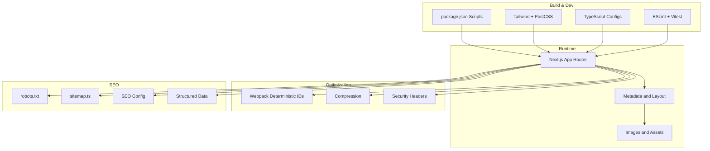
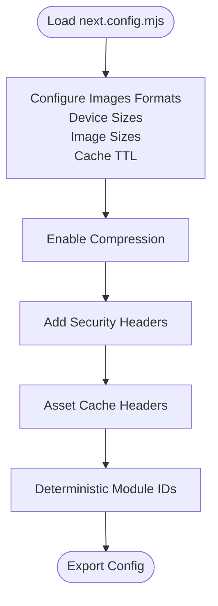
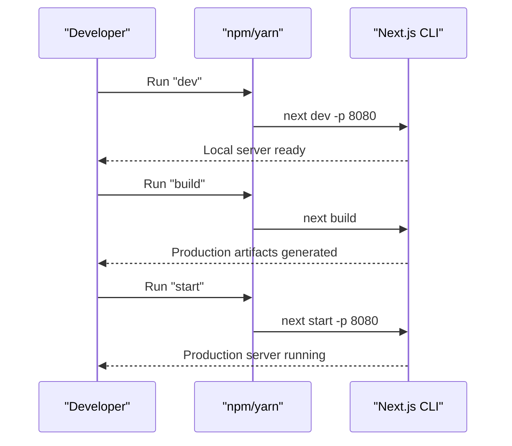
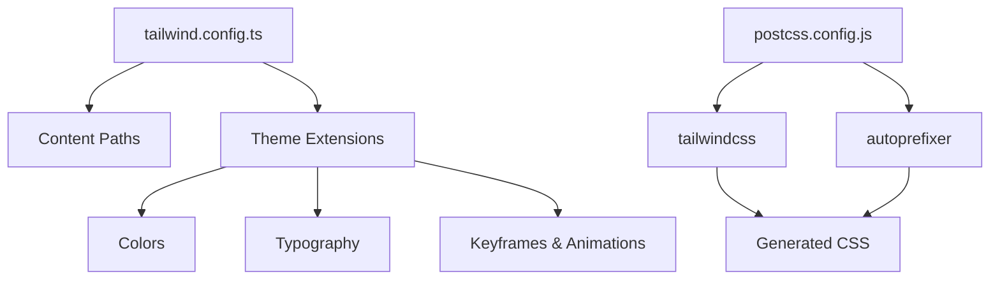
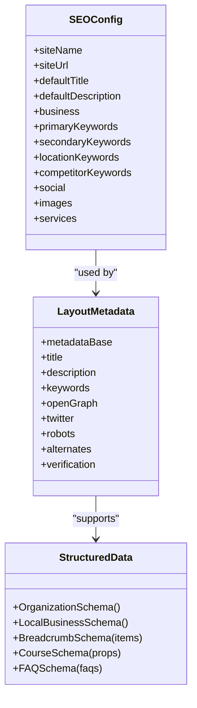
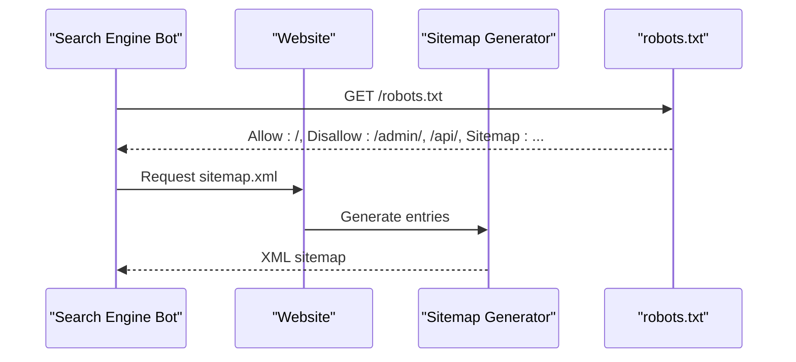
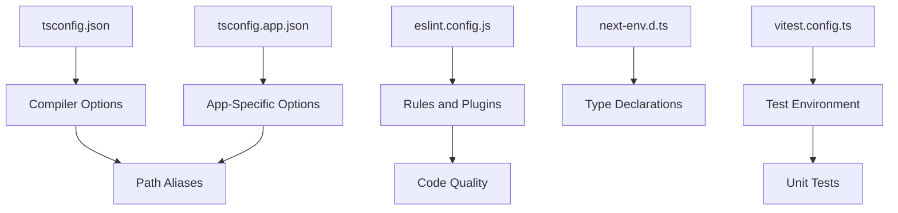
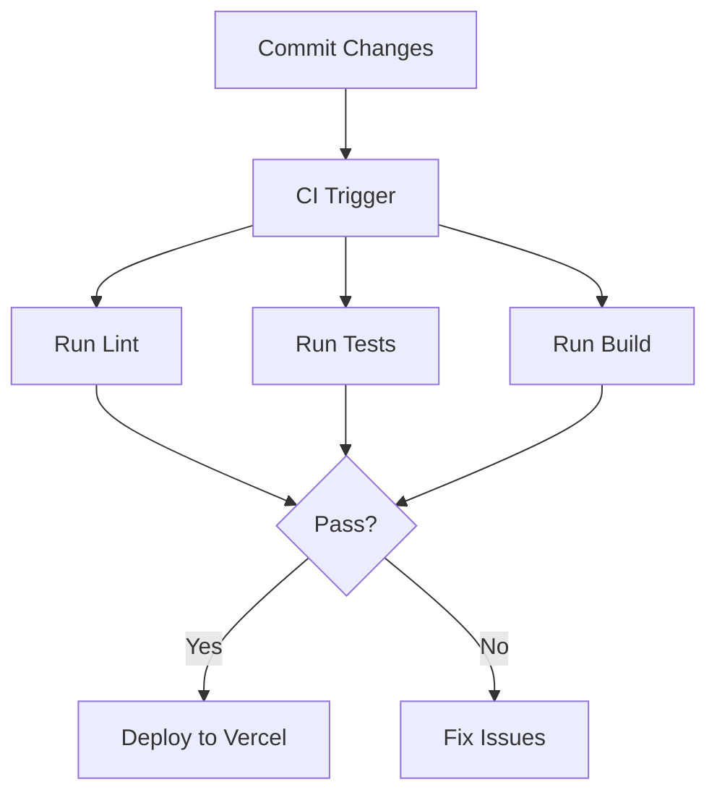
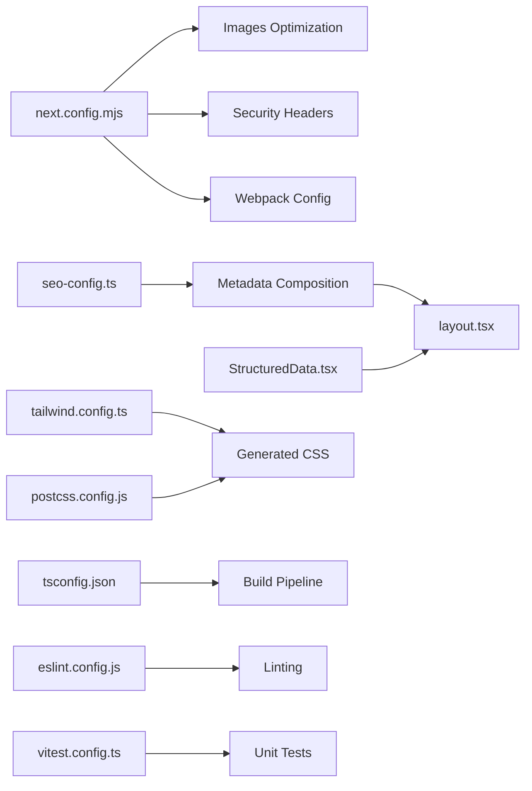

# Deployment & Configuration

<cite>
**Referenced Files in This Document**
- [next.config.mjs](file://next.config.mjs)
- [package.json](file://package.json)
- [tailwind.config.ts](file://tailwind.config.ts)
- [postcss.config.js](file://postcss.config.js)
- [public/robots.txt](file://public/robots.txt)
- [src/app/sitemap.ts](file://src/app/sitemap.ts)
- [src/lib/seo-config.ts](file://src/lib/seo-config.ts)
- [src/app/layout.tsx](file://src/app/layout.tsx)
- [src/components/StructuredData.tsx](file://src/components/StructuredData.tsx)
- [tsconfig.json](file://tsconfig.json)
- [tsconfig.app.json](file://tsconfig.app.json)
- [eslint.config.js](file://eslint.config.js)
- [next-env.d.ts](file://next-env.d.ts)
- [vitest.config.ts](file://vitest.config.ts)
- [components.json](file://components.json)
</cite>

## Table of Contents
1. [Introduction](#introduction)
2. [Project Structure](#project-structure)
3. [Core Components](#core-components)
4. [Architecture Overview](#architecture-overview)
5. [Detailed Component Analysis](#detailed-component-analysis)
6. [Dependency Analysis](#dependency-analysis)
7. [Performance Considerations](#performance-considerations)
8. [Troubleshooting Guide](#troubleshooting-guide)
9. [Conclusion](#conclusion)
10. [Appendices](#appendices)

## Introduction
This document provides comprehensive deployment and configuration guidance for CVN Ponkunnam’s Next.js application. It covers Next.js configuration, build optimization, deployment targets, production configuration, Vercel setup, environment variables, SEO configuration, performance optimization, robots.txt and sitemap generation, search engine optimization, CI/CD processes, build verification, deployment troubleshooting, performance monitoring, caching strategies, and production maintenance procedures.

## Project Structure
The project follows a Next.js App Router structure with TypeScript, Tailwind CSS, and PostCSS. Key configuration files include Next.js configuration, Tailwind and PostCSS setup, SEO and structured data components, and linting/testing configuration.

```mermaid
graph TB
A["next.config.mjs"] --> B["Build and Runtime Settings"]
C["package.json"] --> D["Scripts and Dependencies"]
E["tailwind.config.ts"] --> F["Styling and Design Tokens"]
G["postcss.config.js"] --> H["PostCSS Plugins"]
I["public/robots.txt"] --> J["Search Engine Access Control"]
K["src/app/sitemap.ts"] --> L["Dynamic Sitemap Generation"]
M["src/lib/seo-config.ts"] --> N["Centralized SEO Constants"]
O["src/app/layout.tsx"] --> P["Global Metadata and Robots"]
Q["src/components/StructuredData.tsx"] --> R["Schema Markup"]
S["tsconfig.json"] --> T["TypeScript Compiler Options"]
U["tsconfig.app.json"] --> V["App-Specific TS Options"]
W["eslint.config.js"] --> X["Linting Rules"]
Y["next-env.d.ts"] --> Z["Next.js Type Declarations"]
AA["vitest.config.ts"] --> BB["Testing Setup"]
CC["components.json"] --> DD["shadcn/ui Aliases"]
```

**Diagram sources**
- [next.config.mjs:1-64](file://next.config.mjs#L1-L64)
- [package.json:1-79](file://package.json#L1-L79)
- [tailwind.config.ts:1-106](file://tailwind.config.ts#L1-L106)
- [postcss.config.js:1-7](file://postcss.config.js#L1-L7)
- [public/robots.txt:1-24](file://public/robots.txt#L1-L24)
- [src/app/sitemap.ts:1-59](file://src/app/sitemap.ts#L1-L59)
- [src/lib/seo-config.ts:1-205](file://src/lib/seo-config.ts#L1-L205)
- [src/app/layout.tsx:1-120](file://src/app/layout.tsx#L1-L120)
- [src/components/StructuredData.tsx:1-240](file://src/components/StructuredData.tsx#L1-L240)
- [tsconfig.json:1-46](file://tsconfig.json#L1-L46)
- [tsconfig.app.json:1-35](file://tsconfig.app.json#L1-L35)
- [eslint.config.js:1-24](file://eslint.config.js#L1-L24)
- [next-env.d.ts:1-7](file://next-env.d.ts#L1-L7)
- [vitest.config.ts:1-15](file://vitest.config.ts#L1-L15)
- [components.json:1-21](file://components.json#L1-L21)

**Section sources**
- [next.config.mjs:1-64](file://next.config.mjs#L1-L64)
- [package.json:1-79](file://package.json#L1-L79)
- [tailwind.config.ts:1-106](file://tailwind.config.ts#L1-L106)
- [postcss.config.js:1-7](file://postcss.config.js#L1-L7)
- [public/robots.txt:1-24](file://public/robots.txt#L1-L24)
- [src/app/sitemap.ts:1-59](file://src/app/sitemap.ts#L1-L59)
- [src/lib/seo-config.ts:1-205](file://src/lib/seo-config.ts#L1-L205)
- [src/app/layout.tsx:1-120](file://src/app/layout.tsx#L1-L120)
- [src/components/StructuredData.tsx:1-240](file://src/components/StructuredData.tsx#L1-L240)
- [tsconfig.json:1-46](file://tsconfig.json#L1-L46)
- [tsconfig.app.json:1-35](file://tsconfig.app.json#L1-L35)
- [eslint.config.js:1-24](file://eslint.config.js#L1-L24)
- [next-env.d.ts:1-7](file://next-env.d.ts#L1-L7)
- [vitest.config.ts:1-15](file://vitest.config.ts#L1-L15)
- [components.json:1-21](file://components.json#L1-L21)

## Core Components
- Next.js configuration defines image optimization, compression, security headers, and Webpack deterministic module IDs for cache stability.
- Build scripts and dependencies enable local development, production builds, and server startup.
- Tailwind CSS and PostCSS configure design tokens, animations, and plugin pipeline.
- SEO configuration centralizes site metadata, keywords, and structured data generation.
- robots.txt and sitemap.ts manage crawling permissions and dynamic sitemaps.
- TypeScript configurations define strictness, module resolution, and path aliases.
- Linting and testing configurations enforce code quality and unit testing.

**Section sources**
- [next.config.mjs:1-64](file://next.config.mjs#L1-L64)
- [package.json:6-11](file://package.json#L6-L11)
- [tailwind.config.ts:1-106](file://tailwind.config.ts#L1-L106)
- [postcss.config.js:1-7](file://postcss.config.js#L1-L7)
- [src/lib/seo-config.ts:1-205](file://src/lib/seo-config.ts#L1-L205)
- [public/robots.txt:1-24](file://public/robots.txt#L1-L24)
- [src/app/sitemap.ts:1-59](file://src/app/sitemap.ts#L1-L59)
- [tsconfig.json:1-46](file://tsconfig.json#L1-L46)
- [tsconfig.app.json:1-35](file://tsconfig.app.json#L1-L35)
- [eslint.config.js:1-24](file://eslint.config.js#L1-L24)
- [vitest.config.ts:1-15](file://vitest.config.ts#L1-L15)

## Architecture Overview
The deployment architecture integrates Next.js runtime, static generation, and serverless hosting via Vercel. SEO and performance are configured centrally through Next.js metadata, headers, and sitemap generation.

**Diagram sources**
- [next.config.mjs:1-64](file://next.config.mjs#L1-L64)
- [src/app/layout.tsx:1-120](file://src/app/layout.tsx#L1-L120)
- [public/robots.txt:1-24](file://public/robots.txt#L1-L24)
- [src/app/sitemap.ts:1-59](file://src/app/sitemap.ts#L1-L59)
- [src/lib/seo-config.ts:1-205](file://src/lib/seo-config.ts#L1-L205)
- [src/components/StructuredData.tsx:1-240](file://src/components/StructuredData.tsx#L1-L240)
- [package.json:6-11](file://package.json#L6-L11)
- [tailwind.config.ts:1-106](file://tailwind.config.ts#L1-L106)
- [postcss.config.js:1-7](file://postcss.config.js#L1-L7)
- [tsconfig.json:1-46](file://tsconfig.json#L1-L46)
- [eslint.config.js:1-24](file://eslint.config.js#L1-L24)
- [vitest.config.ts:1-15](file://vitest.config.ts#L1-L15)

## Detailed Component Analysis

### Next.js Configuration
Key settings:
- Image optimization with AVIF and WebP support, device sizes, image sizes, and cache TTL.
- Compression enabled for smaller payloads.
- Security headers applied globally and asset-specific cache headers.
- Webpack deterministic module IDs for stable client-side caching.

**Diagram sources**
- [next.config.mjs:1-64](file://next.config.mjs#L1-L64)

**Section sources**
- [next.config.mjs:1-64](file://next.config.mjs#L1-L64)

### Build Scripts and Environment
- Development: starts Next.js dev server on port 8080.
- Build: generates optimized production artifacts.
- Start: runs production server on port 8080.
- Lint: runs ESLint across the repository.

**Diagram sources**
- [package.json:6-11](file://package.json#L6-L11)

**Section sources**
- [package.json:6-11](file://package.json#L6-L11)

### Tailwind CSS and PostCSS
- Tailwind configured with content paths across app, components, and src.
- Theme extensions include color palettes, typography, border radius, keyframes, and animations.
- PostCSS pipeline applies Tailwind and Autoprefixer.

**Diagram sources**
- [tailwind.config.ts:1-106](file://tailwind.config.ts#L1-L106)
- [postcss.config.js:1-7](file://postcss.config.js#L1-L7)

**Section sources**
- [tailwind.config.ts:1-106](file://tailwind.config.ts#L1-L106)
- [postcss.config.js:1-7](file://postcss.config.js#L1-L7)

### SEO Configuration and Metadata
- Centralized SEO constants define site identity, business info, keywords, social links, and images.
- Page metadata generator composes Open Graph and Twitter metadata.
- Global layout metadata includes canonical URL, author/publisher info, robots directives, and verification tokens.
- Structured data components render Organization, LocalBusiness, Breadcrumbs, Courses, and FAQ schemas.

**Diagram sources**
- [src/lib/seo-config.ts:1-205](file://src/lib/seo-config.ts#L1-L205)
- [src/app/layout.tsx:1-120](file://src/app/layout.tsx#L1-L120)
- [src/components/StructuredData.tsx:1-240](file://src/components/StructuredData.tsx#L1-L240)

**Section sources**
- [src/lib/seo-config.ts:1-205](file://src/lib/seo-config.ts#L1-L205)
- [src/app/layout.tsx:1-120](file://src/app/layout.tsx#L1-L120)
- [src/components/StructuredData.tsx:1-240](file://src/components/StructuredData.tsx#L1-L240)

### robots.txt and Sitemap
- robots.txt allows crawling, disallows admin and API routes, and specifies sitemap location.
- Dynamic sitemap.ts generates XML entries for home, about, services, sub-services, gallery, and contact pages.

**Diagram sources**
- [public/robots.txt:1-24](file://public/robots.txt#L1-L24)
- [src/app/sitemap.ts:1-59](file://src/app/sitemap.ts#L1-L59)

**Section sources**
- [public/robots.txt:1-24](file://public/robots.txt#L1-L24)
- [src/app/sitemap.ts:1-59](file://src/app/sitemap.ts#L1-L59)

### TypeScript and Linting
- tsconfig.json sets strict null checks, module resolution, JSX preservation, and path aliases.
- tsconfig.app.json configures app-specific options and test types.
- eslint.config.js enforces recommended TypeScript and React Hooks rules with custom overrides.
- next-env.d.ts declares Next.js types.
- vitest.config.ts configures unit tests with jsdom and aliases.

**Diagram sources**
- [tsconfig.json:1-46](file://tsconfig.json#L1-L46)
- [tsconfig.app.json:1-35](file://tsconfig.app.json#L1-L35)
- [eslint.config.js:1-24](file://eslint.config.js#L1-L24)
- [next-env.d.ts:1-7](file://next-env.d.ts#L1-L7)
- [vitest.config.ts:1-15](file://vitest.config.ts#L1-L15)

**Section sources**
- [tsconfig.json:1-46](file://tsconfig.json#L1-L46)
- [tsconfig.app.json:1-35](file://tsconfig.app.json#L1-L35)
- [eslint.config.js:1-24](file://eslint.config.js#L1-L24)
- [next-env.d.ts:1-7](file://next-env.d.ts#L1-L7)
- [vitest.config.ts:1-15](file://vitest.config.ts#L1-L15)

### Vercel Deployment Setup
- Use Vercel CLI or GitHub integration to deploy the Next.js application.
- Configure environment variables for NEXT_PUBLIC_SITE_URL and any backend/API secrets.
- Enable ISR/static generation where appropriate; rely on Next.js automatic optimizations.
- Verify redirects and headers are applied in production via Vercel’s platform defaults.

[No sources needed since this section provides general guidance]

### Environment Variables
- NEXT_PUBLIC_SITE_URL: Used by sitemap and metadata to construct absolute URLs.
- Verification tokens: Placeholders exist for Google Search Console and other platforms.

**Section sources**
- [src/app/sitemap.ts:3](file://src/app/sitemap.ts#L3)
- [src/app/layout.tsx:6](file://src/app/layout.tsx#L6)
- [src/app/layout.tsx:91-95](file://src/app/layout.tsx#L91-L95)

### CI/CD Processes and Build Verification
- Build verification: Run the build script locally and review output.
- Linting: Execute linting to catch issues pre-deploy.
- Testing: Run unit tests to ensure component correctness.
- Deployment: Push to the production branch on your Git provider to trigger Vercel deployment.

**Diagram sources**
- [package.json:6-11](file://package.json#L6-L11)
- [eslint.config.js:1-24](file://eslint.config.js#L1-L24)
- [vitest.config.ts:1-15](file://vitest.config.ts#L1-L15)

**Section sources**
- [package.json:6-11](file://package.json#L6-L11)
- [eslint.config.js:1-24](file://eslint.config.js#L1-L24)
- [vitest.config.ts:1-15](file://vitest.config.ts#L1-L15)

### Performance Optimization
- Image optimization: AVIF/WebP formats, device/image sizes, and cache TTL.
- Compression: Enabled via Next.js configuration.
- Security headers: Applied globally to improve trust and safety signals.
- Deterministic Webpack module IDs: Improve long-term caching stability.

**Section sources**
- [next.config.mjs:5-12](file://next.config.mjs#L5-L12)
- [next.config.mjs:14-15](file://next.config.mjs#L14-L15)
- [next.config.mjs:18-51](file://next.config.mjs#L18-L51)
- [next.config.mjs:53-59](file://next.config.mjs#L53-L59)

### Caching Strategies
- Asset cache headers: Immutable cache for static assets under /assets/.
- Image cache TTL: Minimum cache TTL set for optimized images.
- Deterministic module IDs: Stable client-side caching across deployments.

**Section sources**
- [next.config.mjs:11](file://next.config.mjs#L11)
- [next.config.mjs:42-49](file://next.config.mjs#L42-L49)
- [next.config.mjs:56](file://next.config.mjs#L56)

### Production Maintenance Procedures
- Monitor search visibility via robots.txt and sitemap updates.
- Validate structured data markup using Google Rich Results Test.
- Review and update SEO configuration as content evolves.
- Keep dependencies current and rebuild after updates.

[No sources needed since this section provides general guidance]

## Dependency Analysis
The project’s configuration exhibits low coupling and high cohesion among build, styling, and SEO layers. Next.js configuration depends on image optimization and headers; SEO components depend on centralized configuration; Tailwind and PostCSS are decoupled from runtime logic.

**Diagram sources**
- [next.config.mjs:1-64](file://next.config.mjs#L1-L64)
- [src/lib/seo-config.ts:1-205](file://src/lib/seo-config.ts#L1-L205)
- [src/app/layout.tsx:1-120](file://src/app/layout.tsx#L1-L120)
- [src/components/StructuredData.tsx:1-240](file://src/components/StructuredData.tsx#L1-L240)
- [tailwind.config.ts:1-106](file://tailwind.config.ts#L1-L106)
- [postcss.config.js:1-7](file://postcss.config.js#L1-L7)
- [tsconfig.json:1-46](file://tsconfig.json#L1-L46)
- [eslint.config.js:1-24](file://eslint.config.js#L1-L24)
- [vitest.config.ts:1-15](file://vitest.config.ts#L1-L15)

**Section sources**
- [next.config.mjs:1-64](file://next.config.mjs#L1-L64)
- [src/lib/seo-config.ts:1-205](file://src/lib/seo-config.ts#L1-L205)
- [src/app/layout.tsx:1-120](file://src/app/layout.tsx#L1-L120)
- [src/components/StructuredData.tsx:1-240](file://src/components/StructuredData.tsx#L1-L240)
- [tailwind.config.ts:1-106](file://tailwind.config.ts#L1-L106)
- [postcss.config.js:1-7](file://postcss.config.js#L1-L7)
- [tsconfig.json:1-46](file://tsconfig.json#L1-L46)
- [eslint.config.js:1-24](file://eslint.config.js#L1-L24)
- [vitest.config.ts:1-15](file://vitest.config.ts#L1-L15)

## Performance Considerations
- Prefer AVIF/WebP images for reduced bandwidth.
- Keep image sizes and device sizes aligned with typical viewport widths.
- Use compression and deterministic module IDs to minimize bundle churn.
- Apply immutable caching for static assets to maximize CDN efficiency.

[No sources needed since this section provides general guidance]

## Troubleshooting Guide
- Build fails due to lint errors: Run linting locally and fix reported issues.
- Tests fail: Inspect unit tests and ensure mocks and setup align with configuration.
- SEO issues: Verify NEXT_PUBLIC_SITE_URL is set and sitemap entries reflect current routes.
- robots.txt blocking pages: Confirm disallowed paths and sitemap URL are correct.
- Structured data invalid: Validate JSON-LD using Google’s Rich Results Test.

**Section sources**
- [eslint.config.js:1-24](file://eslint.config.js#L1-L24)
- [vitest.config.ts:1-15](file://vitest.config.ts#L1-L15)
- [src/app/sitemap.ts:3](file://src/app/sitemap.ts#L3)
- [public/robots.txt:1-24](file://public/robots.txt#L1-L24)
- [src/components/StructuredData.tsx:1-240](file://src/components/StructuredData.tsx#L1-L240)

## Conclusion
This guide consolidates Next.js configuration, build optimization, SEO, and deployment practices for CVN Ponkunnam. By leveraging Next.js built-in optimizations, centralized SEO configuration, and robust build/lint/testing setups, teams can maintain a fast, discoverable, and reliable website on Vercel.

[No sources needed since this section summarizes without analyzing specific files]

## Appendices
- shadcn/ui configuration: Aliases and Tailwind integration are defined for consistent component usage.

**Section sources**
- [components.json:1-21](file://components.json#L1-L21)