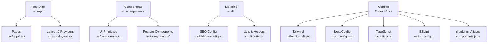
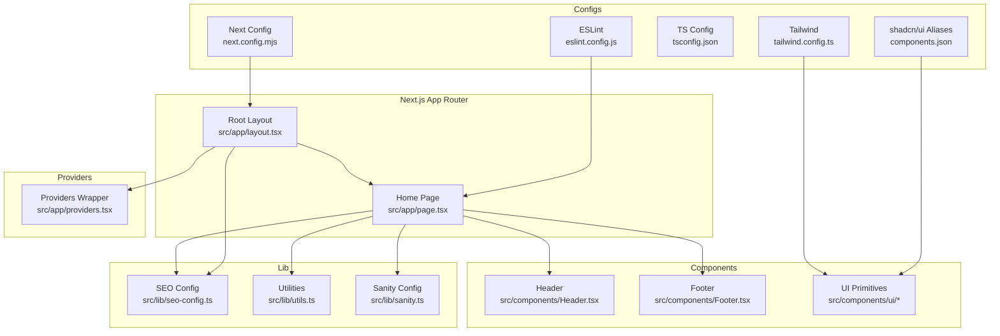
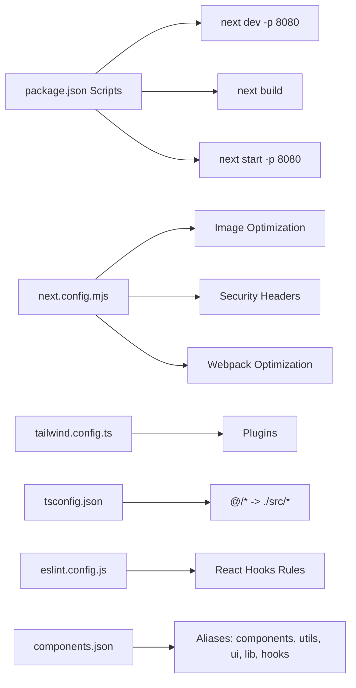

# Getting Started

<cite>
**Referenced Files in This Document**
- [package.json](file://package.json)
- [next.config.mjs](file://next.config.mjs)
- [tailwind.config.ts](file://tailwind.config.ts)
- [tsconfig.json](file://tsconfig.json)
- [components.json](file://components.json)
- [eslint.config.js](file://eslint.config.js)
- [src/app/layout.tsx](file://src/app/layout.tsx)
- [src/app/page.tsx](file://src/app/page.tsx)
- [src/lib/seo-config.ts](file://src/lib/seo-config.ts)
- [src/lib/sanity.ts](file://src/lib/sanity.ts)
- [src/components/Header.tsx](file://src/components/Header.tsx)
- [src/components/Footer.tsx](file://src/components/Footer.tsx)
- [src/lib/utils.ts](file://src/lib/utils.ts)
</cite>

## Table of Contents
1. [Introduction](#introduction)
2. [Project Structure](#project-structure)
3. [Core Components](#core-components)
4. [Architecture Overview](#architecture-overview)
5. [Detailed Component Analysis](#detailed-component-analysis)
6. [Dependency Analysis](#dependency-analysis)
7. [Performance Considerations](#performance-considerations)
8. [Troubleshooting Guide](#troubleshooting-guide)
9. [Conclusion](#conclusion)
10. [Appendices](#appendices)

## Introduction
This guide helps you quickly set up and work with the CVN Ponkunnam website project. It covers prerequisites, installation, development workflow, build and deployment preparation, environment configuration, and basic project structure. The project is built with Next.js 14 App Router, React, TypeScript, and Tailwind CSS, and includes SEO configuration, shadcn/ui component integration, and optional Sanity CMS support.

## Project Structure
The project follows Next.js App Router conventions with a clear separation of pages, components, libraries, and configuration files. Key areas:
- Application shell and metadata live in the root app directory.
- UI primitives and reusable components are under src/components.
- Shared utilities, SEO configuration, and integrations live under src/lib.
- Global styles and theme configuration are centralized in Tailwind and Next config.

**Diagram sources**
- [src/app/layout.tsx](file://src/app/layout.tsx)
- [src/app/page.tsx](file://src/app/page.tsx)
- [src/lib/seo-config.ts](file://src/lib/seo-config.ts)
- [tailwind.config.ts](file://tailwind.config.ts)
- [next.config.mjs](file://next.config.mjs)
- [tsconfig.json](file://tsconfig.json)
- [eslint.config.js](file://eslint.config.js)
- [components.json](file://components.json)

**Section sources**
- [src/app/layout.tsx](file://src/app/layout.tsx)
- [src/app/page.tsx](file://src/app/page.tsx)
- [tailwind.config.ts](file://tailwind.config.ts)
- [next.config.mjs](file://next.config.mjs)
- [tsconfig.json](file://tsconfig.json)
- [eslint.config.js](file://eslint.config.js)
- [components.json](file://components.json)

## Core Components
- Root layout and metadata define global SEO, viewport, and providers.
- Home page composes feature components and structured data.
- Header and Footer provide navigation and policy links.
- SEO configuration centralizes site metadata and keyword sets.
- Utility helpers integrate Tailwind classes and shadcn/ui aliases.

Key implementation references:
- Root layout and metadata: [src/app/layout.tsx](file://src/app/layout.tsx)
- Home page composition: [src/app/page.tsx](file://src/app/page.tsx)
- Header navigation and mobile menu: [src/components/Header.tsx](file://src/components/Header.tsx)
- Footer links and social CTAs: [src/components/Footer.tsx](file://src/components/Footer.tsx)
- SEO constants and helpers: [src/lib/seo-config.ts](file://src/lib/seo-config.ts)
- Tailwind utilities helper: [src/lib/utils.ts](file://src/lib/utils.ts)

**Section sources**
- [src/app/layout.tsx](file://src/app/layout.tsx)
- [src/app/page.tsx](file://src/app/page.tsx)
- [src/components/Header.tsx](file://src/components/Header.tsx)
- [src/components/Footer.tsx](file://src/components/Footer.tsx)
- [src/lib/seo-config.ts](file://src/lib/seo-config.ts)
- [src/lib/utils.ts](file://src/lib/utils.ts)

## Architecture Overview
The application uses Next.js App Router with a single root layout wrapping all pages. Providers encapsulate theme and state, while components are organized by feature and UI primitives. SEO metadata is centralized, and Tailwind is extended with brand colors and animations.

**Diagram sources**
- [src/app/layout.tsx](file://src/app/layout.tsx)
- [src/app/page.tsx](file://src/app/page.tsx)
- [src/components/Header.tsx](file://src/components/Header.tsx)
- [src/components/Footer.tsx](file://src/components/Footer.tsx)
- [src/lib/seo-config.ts](file://src/lib/seo-config.ts)
- [src/lib/utils.ts](file://src/lib/utils.ts)
- [src/lib/sanity.ts](file://src/lib/sanity.ts)
- [tailwind.config.ts](file://tailwind.config.ts)
- [next.config.mjs](file://next.config.mjs)
- [tsconfig.json](file://tsconfig.json)
- [eslint.config.js](file://eslint.config.js)
- [components.json](file://components.json)

## Detailed Component Analysis

### Root Layout and Metadata
- Defines viewport, metadata, Open Graph, Twitter, and canonical URLs.
- Uses environment variable for site URL and includes structured data components.
- Wraps children with Providers and ScrollAnimator.

Implementation reference:
- [src/app/layout.tsx](file://src/app/layout.tsx)

**Section sources**
- [src/app/layout.tsx](file://src/app/layout.tsx)

### Home Page Composition
- Imports header, hero slider, info bar, services, about, featured programs, testimonials, gallery, contact form, stats, footer, and sticky buttons.
- Renders structured data components and fetches gallery images asynchronously.

Implementation reference:
- [src/app/page.tsx](file://src/app/page.tsx)

**Section sources**
- [src/app/page.tsx](file://src/app/page.tsx)

### Header Navigation
- Implements desktop and mobile navigation with nested services menu.
- Tracks active links, scroll effects, and mobile overlay behavior.
- Integrates contact and branding assets.

Implementation reference:
- [src/components/Header.tsx](file://src/components/Header.tsx)

**Section sources**
- [src/components/Header.tsx](file://src/components/Header.tsx)

### Footer and Policies
- Provides quick links to About, Gallery, and Policies.
- Includes contact and social media links.

Implementation reference:
- [src/components/Footer.tsx](file://src/components/Footer.tsx)

**Section sources**
- [src/components/Footer.tsx](file://src/components/Footer.tsx)

### SEO Configuration
- Centralizes site name, URL, business info, keywords, images, and service entries.
- Exposes helpers to generate page metadata and derive keywords per page type.

Implementation reference:
- [src/lib/seo-config.ts](file://src/lib/seo-config.ts)

**Section sources**
- [src/lib/seo-config.ts](file://src/lib/seo-config.ts)

### Tailwind Utilities Helper
- Combines clsx and tailwind-merge for safe class merging.

Implementation reference:
- [src/lib/utils.ts](file://src/lib/utils.ts)

**Section sources**
- [src/lib/utils.ts](file://src/lib/utils.ts)

### Sanity CMS Integration
- Optional configuration for Sanity project ID and dataset.
- Enables dynamic content fetching when environment variables are present.

Implementation reference:
- [src/lib/sanity.ts](file://src/lib/sanity.ts)

**Section sources**
- [src/lib/sanity.ts](file://src/lib/sanity.ts)

## Dependency Analysis
The project relies on Next.js 14 for routing and SSR/SSG, React 18 for UI, TypeScript for type safety, and Tailwind CSS for styling. UI primitives are provided by shadcn/ui, integrated via components.json aliases. ESLint enforces TypeScript and React Hooks rules.

**Diagram sources**
- [package.json](file://package.json)
- [next.config.mjs](file://next.config.mjs)
- [tailwind.config.ts](file://tailwind.config.ts)
- [tsconfig.json](file://tsconfig.json)
- [eslint.config.js](file://eslint.config.js)
- [components.json](file://components.json)

**Section sources**
- [package.json](file://package.json)
- [next.config.mjs](file://next.config.mjs)
- [tailwind.config.ts](file://tailwind.config.ts)
- [tsconfig.json](file://tsconfig.json)
- [eslint.config.js](file://eslint.config.js)
- [components.json](file://components.json)

## Performance Considerations
- Image optimization is enabled with WebP/AVIF formats and deterministic module IDs.
- Compression is turned on for smaller bundles.
- Security headers are injected globally for performance and safety.
- Tailwind is scoped to app, components, and pages for efficient purging.

Recommendations:
- Keep images under src/app/assets or public assets and leverage Next/image for optimization.
- Monitor bundle sizes with Next.js telemetry and remove unused UI components.
- Use static generation where possible and pre-render content with metadata.

**Section sources**
- [next.config.mjs](file://next.config.mjs)
- [tailwind.config.ts](file://tailwind.config.ts)

## Troubleshooting Guide
Common setup and runtime issues:

- Node.js and npm versions
  - Ensure you are using a modern LTS Node.js version compatible with Next.js 14 and TypeScript 5.
  - Verify your package manager cache is clean if encountering dependency resolution errors.

- Port conflicts during development
  - The dev script runs on port 8080. If unavailable, change the port in scripts or stop the conflicting process.
  - Reference: [package.json](file://package.json)

- Environment variables
  - Site URL is read from NEXT_PUBLIC_SITE_URL in layout metadata.
  - Sanity integration requires NEXT_PUBLIC_SANITY_PROJECT_ID and NEXT_PUBLIC_SANITY_DATASET for dynamic content.
  - Reference: [src/app/layout.tsx](file://src/app/layout.tsx), [src/lib/sanity.ts](file://src/lib/sanity.ts)

- Tailwind not generating styles
  - Confirm content globs match your file extensions and locations.
  - Ensure PostCSS and Tailwind CSS are installed and configured.
  - Reference: [tailwind.config.ts](file://tailwind.config.ts)

- ESLint errors
  - The ESLint config extends recommended TypeScript and React Hooks rules and ignores build artifacts.
  - Fix lint warnings or adjust rules as needed.
  - Reference: [eslint.config.js](file://eslint.config.js)

- TypeScript path aliases
  - Path aliases @/* resolve to ./src/*; ensure imports align with tsconfig paths.
  - Reference: [tsconfig.json](file://tsconfig.json)

- shadcn/ui setup
  - Aliases are defined in components.json; ensure CLI commands use the correct config.
  - Reference: [components.json](file://components.json)

**Section sources**
- [package.json](file://package.json)
- [src/app/layout.tsx](file://src/app/layout.tsx)
- [src/lib/sanity.ts](file://src/lib/sanity.ts)
- [tailwind.config.ts](file://tailwind.config.ts)
- [eslint.config.js](file://eslint.config.js)
- [tsconfig.json](file://tsconfig.json)
- [components.json](file://components.json)

## Conclusion
You now have the essentials to install, run, and iterate on the CVN Ponkunnam website. Use the scripts in package.json for development and production builds, configure environment variables for metadata and optional CMS integration, and rely on the centralized SEO and Tailwind configs for consistent branding and performance.

## Appendices

### Initial Setup Checklist
- Install dependencies: [package.json](file://package.json)
- Start development server: [package.json](file://package.json)
- Open browser to http://localhost:8080
- Configure environment variables:
  - NEXT_PUBLIC_SITE_URL for metadata and canonical URLs
  - NEXT_PUBLIC_SANITY_PROJECT_ID and NEXT_PUBLIC_SANITY_DATASET for CMS
  - References: [src/app/layout.tsx](file://src/app/layout.tsx), [src/lib/sanity.ts](file://src/lib/sanity.ts)
- Build for production: [package.json](file://package.json)
- Prepare deployment:
  - Use Next.js static export or server mode depending on hosting provider
  - Ensure environment variables are set in production
  - Reference: [next.config.mjs](file://next.config.mjs)

### Development Workflow Examples
- Run the dev server: [package.json](file://package.json)
- Lint the codebase: [package.json](file://package.json), [eslint.config.js](file://eslint.config.js)
- Add a new page:
  - Create a new route under src/app/<route>/page.tsx
  - Import shared components from src/components
  - Reference: [src/app/page.tsx](file://src/app/page.tsx)
- Customize styles:
  - Extend Tailwind theme in tailwind.config.ts
  - Use shadcn/ui components via aliases in components.json
  - Reference: [tailwind.config.ts](file://tailwind.config.ts), [components.json](file://components.json)
- Optimize images:
  - Place assets under public or src/app/assets and use Next/image
  - Reference: [next.config.mjs](file://next.config.mjs)