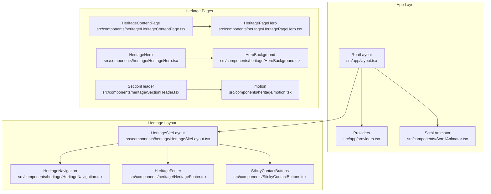
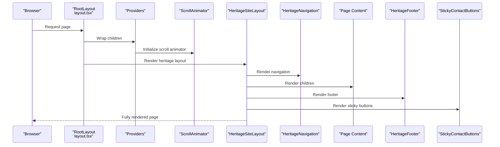
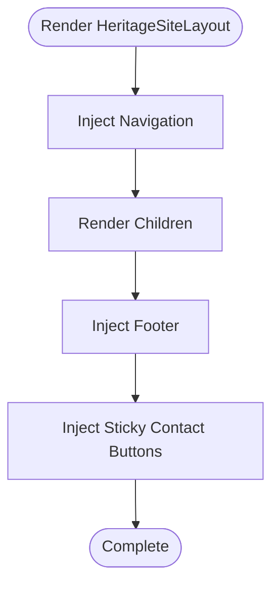
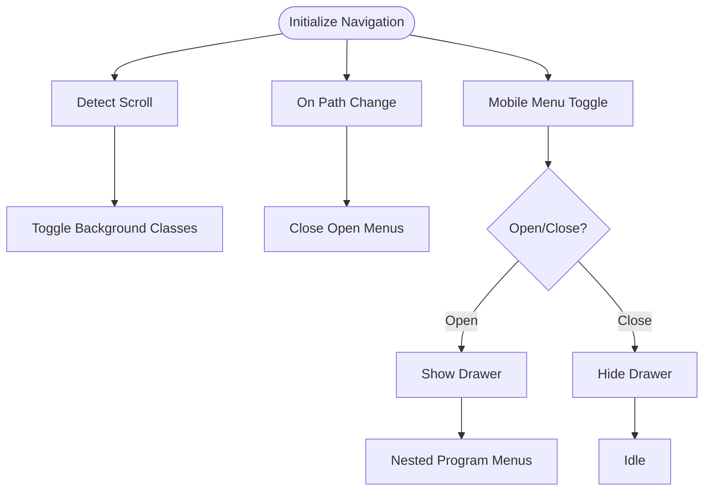
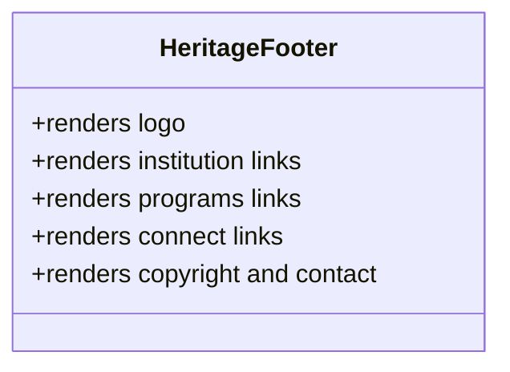
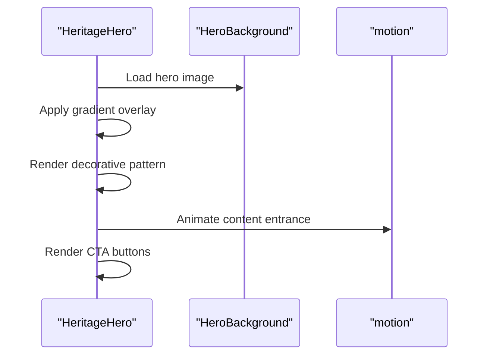
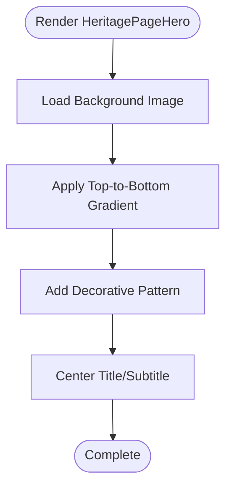
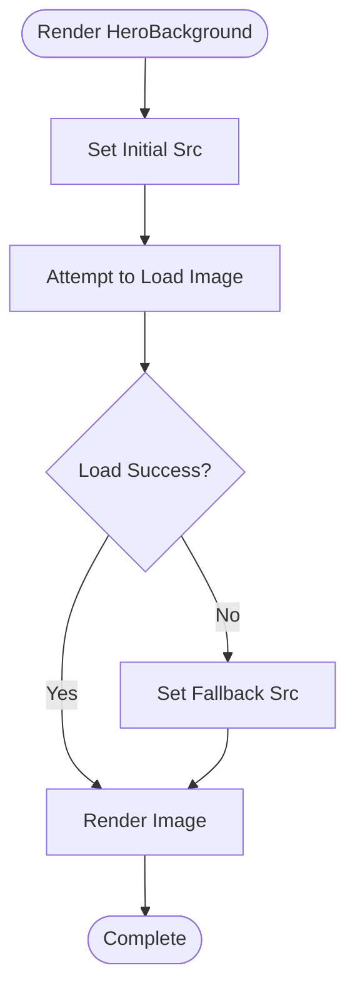
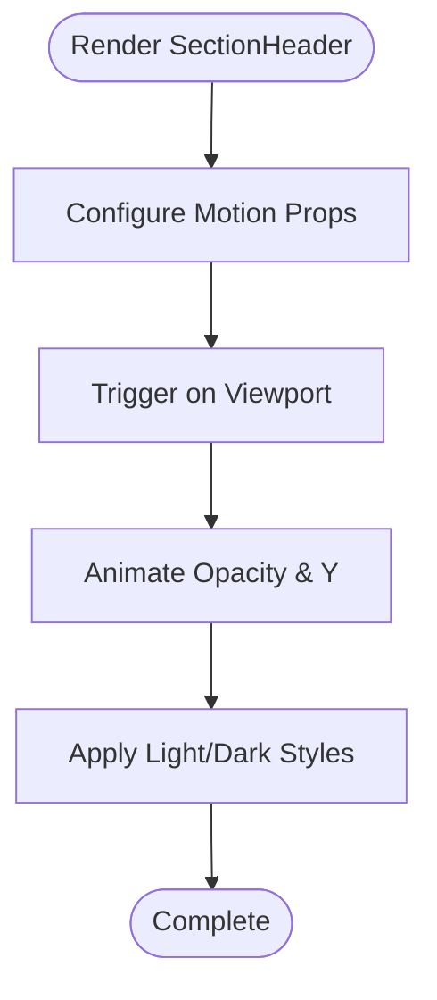
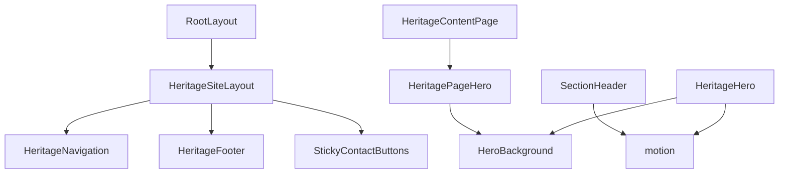

# Heritage Layout System

<cite>
**Referenced Files in This Document**
- [layout.tsx](file://src/app/layout.tsx)
- [HeritageSiteLayout.tsx](file://src/components/heritage/HeritageSiteLayout.tsx)
- [HeritageNavigation.tsx](file://src/components/heritage/HeritageNavigation.tsx)
- [HeritageFooter.tsx](file://src/components/heritage/HeritageFooter.tsx)
- [HeritageHero.tsx](file://src/components/heritage/HeritageHero.tsx)
- [HeritagePageHero.tsx](file://src/components/heritage/HeritagePageHero.tsx)
- [HeroBackground.tsx](file://src/components/heritage/HeroBackground.tsx)
- [SectionHeader.tsx](file://src/components/heritage/SectionHeader.tsx)
- [motion.tsx](file://src/components/heritage/motion.tsx)
- [index.ts](file://src/components/heritage/index.ts)
</cite>

## Table of Contents
1. [Introduction](#introduction)
2. [Project Structure](#project-structure)
3. [Core Components](#core-components)
4. [Architecture Overview](#architecture-overview)
5. [Detailed Component Analysis](#detailed-component-analysis)
6. [Dependency Analysis](#dependency-analysis)
7. [Performance Considerations](#performance-considerations)
8. [Troubleshooting Guide](#troubleshooting-guide)
9. [Conclusion](#conclusion)

## Introduction
This document describes the heritage site layout system used for cultural and educational pages. It explains how the specialized layout architecture differs from the main application layout, focusing on the HeritageSiteLayout component structure, background hero implementations, section header styling, and motion effects. It also covers layout inheritance patterns, responsive design considerations, styling approaches specific to heritage content, composition patterns, container structures, and integration with the main application layout. Practical examples of customization, component nesting, and performance optimizations for rendering cultural content are included.

## Project Structure
The heritage layout system is organized under the heritage components directory and integrates with the Next.js app router. The main application layout wraps all pages with providers and global scripts, while heritage pages use a dedicated site layout that injects navigation, footer, and sticky contact buttons around page-specific content.

**Diagram sources**
- [layout.tsx:99-119](file://src/app/layout.tsx#L99-L119)
- [HeritageSiteLayout.tsx:5-14](file://src/components/heritage/HeritageSiteLayout.tsx#L5-L14)
- [HeritageNavigation.tsx:11-177](file://src/components/heritage/HeritageNavigation.tsx#L11-L177)
- [HeritageFooter.tsx:28-86](file://src/components/heritage/HeritageFooter.tsx#L28-L86)
- [HeritageContentPage.tsx:10-19](file://src/components/heritage/HeritageContentPage.tsx#L10-L19)
- [HeritagePageHero.tsx:12-36](file://src/components/heritage/HeritagePageHero.tsx#L12-L36)
- [HeritageHero.tsx:9-92](file://src/components/heritage/HeritageHero.tsx#L9-L92)
- [HeroBackground.tsx:14-30](file://src/components/heritage/HeroBackground.tsx#L14-L30)
- [SectionHeader.tsx:13-51](file://src/components/heritage/SectionHeader.tsx#L13-L51)
- [motion.tsx:1-4](file://src/components/heritage/motion.tsx#L1-L4)

**Section sources**
- [layout.tsx:99-119](file://src/app/layout.tsx#L99-L119)
- [HeritageSiteLayout.tsx:5-14](file://src/components/heritage/HeritageSiteLayout.tsx#L5-L14)

## Core Components
- HeritageSiteLayout: Provides the foundational layout for heritage pages, embedding navigation, footer, and sticky contact buttons around child content. It sets the base color scheme and font family appropriate for heritage content.
- HeritageNavigation: Implements a responsive navigation bar with logo, primary links, nested program menus, and a call-to-action button. It adapts styling on scroll and manages mobile menu state.
- HeritageFooter: Presents institutional, program, and connect links in a grid layout with branding and contact information.
- HeritageHero: Implements a full-screen hero with layered background, overlay gradient, decorative pattern, animated headline, tagline, and call-to-action buttons. Includes subtle scroll indicator animation.
- HeritagePageHero: A page-specific hero variant for content pages with a downward gradient and centered title/subtitle.
- HeroBackground: A robust background image component with fallback handling for failed image loads.
- SectionHeader: A motion-enabled section header with eyebrow, title, optional description, and light/dark variants.
- motion: A thin wrapper around Framer Motion exports for consistent client-side animations across heritage components.

These components collectively define the heritage layout’s identity, motion, and responsiveness.

**Section sources**
- [HeritageSiteLayout.tsx:5-14](file://src/components/heritage/HeritageSiteLayout.tsx#L5-L14)
- [HeritageNavigation.tsx:11-177](file://src/components/heritage/HeritageNavigation.tsx#L11-L177)
- [HeritageFooter.tsx:28-86](file://src/components/heritage/HeritageFooter.tsx#L28-L86)
- [HeritageHero.tsx:9-92](file://src/components/heritage/HeritageHero.tsx#L9-L92)
- [HeritagePageHero.tsx:12-36](file://src/components/heritage/HeritagePageHero.tsx#L12-L36)
- [HeroBackground.tsx:14-30](file://src/components/heritage/HeroBackground.tsx#L14-L30)
- [SectionHeader.tsx:13-51](file://src/components/heritage/SectionHeader.tsx#L13-L51)
- [motion.tsx:1-4](file://src/components/heritage/motion.tsx#L1-L4)

## Architecture Overview
The heritage layout architecture follows a layered approach:
- The root layout initializes providers and global scripts.
- Heritage pages opt-in to the heritage layout, which injects navigation, footer, and sticky contact buttons.
- Page-specific components (hero, content page, section headers) compose the page content.
- Motion utilities enable scroll-triggered and interactive animations.

**Diagram sources**
- [layout.tsx:99-119](file://src/app/layout.tsx#L99-L119)
- [HeritageSiteLayout.tsx:5-14](file://src/components/heritage/HeritageSiteLayout.tsx#L5-L14)
- [HeritageNavigation.tsx:11-177](file://src/components/heritage/HeritageNavigation.tsx#L11-L177)
- [HeritageFooter.tsx:28-86](file://src/components/heritage/HeritageFooter.tsx#L28-L86)

## Detailed Component Analysis

### HeritageSiteLayout
- Purpose: Base container for heritage pages, establishing the visual and structural foundation.
- Composition: Wraps children with navigation, footer, and sticky contact buttons.
- Styling: Uses heritage-specific colors and a body font class for consistent typography.
- Integration: Works alongside the root layout to provide a heritage-aware shell for page content.

**Diagram sources**
- [HeritageSiteLayout.tsx:5-14](file://src/components/heritage/HeritageSiteLayout.tsx#L5-L14)

**Section sources**
- [HeritageSiteLayout.tsx:5-14](file://src/components/heritage/HeritageSiteLayout.tsx#L5-L14)

### HeritageNavigation
- Responsive behavior: Desktop uses a static menu; mobile toggles a collapsible drawer with nested program menus.
- Active state detection: Highlights current route or routes under a selected parent.
- Scroll adaptation: Changes background and blur effect when scrolling.
- Accessibility: Proper ARIA attributes for menu toggling and navigation regions.

**Diagram sources**
- [HeritageNavigation.tsx:17-34](file://src/components/heritage/HeritageNavigation.tsx#L17-L34)
- [HeritageNavigation.tsx:36-37](file://src/components/heritage/HeritageNavigation.tsx#L36-L37)
- [HeritageNavigation.tsx:126-173](file://src/components/heritage/HeritageNavigation.tsx#L126-L173)

**Section sources**
- [HeritageNavigation.tsx:11-177](file://src/components/heritage/HeritageNavigation.tsx#L11-L177)

### HeritageFooter
- Grid layout: Three-column layout on small screens, four-column on larger screens.
- Branding: Displays logo, institution description, and recognition badge.
- Links: Organized into institution, programs, and connect categories.
- Footer details: Copyright and contact links with hover states.

**Diagram sources**
- [HeritageFooter.tsx:28-86](file://src/components/heritage/HeritageFooter.tsx#L28-L86)

**Section sources**
- [HeritageFooter.tsx:28-86](file://src/components/heritage/HeritageFooter.tsx#L28-L86)

### HeritageHero
- Full-screen hero with layered background, gradient overlay, decorative pattern, and centered content.
- Animated elements: Scroll-triggered entrance for content blocks and a pulsing indicator.
- Call-to-action buttons: Styled with hover scaling and directional icons.

**Diagram sources**
- [HeritageHero.tsx:9-92](file://src/components/heritage/HeritageHero.tsx#L9-L92)
- [HeroBackground.tsx:14-30](file://src/components/heritage/HeroBackground.tsx#L14-L30)
- [motion.tsx:1-4](file://src/components/heritage/motion.tsx#L1-L4)

**Section sources**
- [HeritageHero.tsx:9-92](file://src/components/heritage/HeritageHero.tsx#L9-L92)
- [HeroBackground.tsx:14-30](file://src/components/heritage/HeroBackground.tsx#L14-L30)

### HeritagePageHero
- Purpose: A compact hero for internal content pages with a top-down gradient and centered title/subtitle.
- Composition: Uses a background image component and motion for fade-in.

**Diagram sources**
- [HeritagePageHero.tsx:12-36](file://src/components/heritage/HeritagePageHero.tsx#L12-L36)

**Section sources**
- [HeritagePageHero.tsx:12-36](file://src/components/heritage/HeritagePageHero.tsx#L12-L36)

### HeroBackground
- Robust image loading with fallback: On error, switches to a predefined fallback image.
- Optimizations: Uses fill, priority, and sizes for responsive loading.

**Diagram sources**
- [HeroBackground.tsx:14-30](file://src/components/heritage/HeroBackground.tsx#L14-L30)

**Section sources**
- [HeroBackground.tsx:14-30](file://src/components/heritage/HeroBackground.tsx#L14-L30)

### SectionHeader
- Motion-driven entrance: Fade-in and upward movement when in view, with viewport threshold and single-use behavior.
- Variants: Light and dark modes with distinct color classes for eyebrow, title, and description.
- Typography: Responsive font sizing and leading for headings and descriptions.

**Diagram sources**
- [SectionHeader.tsx:13-51](file://src/components/heritage/SectionHeader.tsx#L13-L51)
- [motion.tsx:1-4](file://src/components/heritage/motion.tsx#L1-L4)

**Section sources**
- [SectionHeader.tsx:13-51](file://src/components/heritage/SectionHeader.tsx#L13-L51)
- [motion.tsx:1-4](file://src/components/heritage/motion.tsx#L1-L4)

### motion Wrapper
- Centralizes Framer Motion imports for consistent usage across heritage components.
- Ensures client directive is present for browser-side animations.

**Section sources**
- [motion.tsx:1-4](file://src/components/heritage/motion.tsx#L1-L4)

### Layout Composition Patterns
- Container structures: HeritageSiteLayout acts as a page shell; HeritageContentPage composes a page hero with a content container.
- Nesting: Navigation and footer are consistently placed at the top and bottom of the layout; page content occupies the middle region.
- Integration: The root layout provides Providers and ScrollAnimator globally, while heritage pages wrap content with the heritage layout.

**Section sources**
- [HeritageSiteLayout.tsx:5-14](file://src/components/heritage/HeritageSiteLayout.tsx#L5-L14)
- [HeritageContentPage.tsx:10-19](file://src/components/heritage/HeritageContentPage.tsx#L10-L19)
- [layout.tsx:99-119](file://src/app/layout.tsx#L99-L119)

## Dependency Analysis
The heritage layout system exhibits low coupling and high cohesion among components. Dependencies primarily flow from the layout shell to navigation, footer, and sticky buttons, with page-specific components depending on shared motion utilities and background components.

**Diagram sources**
- [layout.tsx:99-119](file://src/app/layout.tsx#L99-L119)
- [HeritageSiteLayout.tsx:5-14](file://src/components/heritage/HeritageSiteLayout.tsx#L5-L14)
- [HeritageNavigation.tsx:11-177](file://src/components/heritage/HeritageNavigation.tsx#L11-L177)
- [HeritageFooter.tsx:28-86](file://src/components/heritage/HeritageFooter.tsx#L28-L86)
- [HeritageContentPage.tsx:10-19](file://src/components/heritage/HeritageContentPage.tsx#L10-L19)
- [HeritagePageHero.tsx:12-36](file://src/components/heritage/HeritagePageHero.tsx#L12-L36)
- [HeroBackground.tsx:14-30](file://src/components/heritage/HeroBackground.tsx#L14-L30)
- [SectionHeader.tsx:13-51](file://src/components/heritage/SectionHeader.tsx#L13-L51)
- [motion.tsx:1-4](file://src/components/heritage/motion.tsx#L1-L4)
- [HeritageHero.tsx:9-92](file://src/components/heritage/HeritageHero.tsx#L9-L92)

**Section sources**
- [index.ts:1-15](file://src/components/heritage/index.ts#L1-L15)

## Performance Considerations
- Lazy loading and fallbacks: HeroBackground uses a fallback image to prevent broken visuals and reduce layout shifts.
- Priority and sizing: Hero images use priority and sizes to improve Core Web Vitals metrics.
- Motion thresholds: SectionHeader uses viewport margin and once-only triggering to avoid unnecessary animations.
- Scroll handling: Navigation scroll listener uses passive event listeners to minimize layout thrashing.
- Global providers: Root layout initializes providers once, avoiding per-page re-initialization overhead.

[No sources needed since this section provides general guidance]

## Troubleshooting Guide
- Broken hero images: Verify the fallback mechanism in HeroBackground and ensure the fallback URL is reachable.
- Navigation not closing on route change: Confirm pathname effect resets menu state in HeritageNavigation.
- Scroll animations not firing: Check viewport configuration and ensure motion wrapper is imported client-side.
- Footer layout issues: Validate grid classes and responsive breakpoints for footer column widths.

**Section sources**
- [HeroBackground.tsx:14-30](file://src/components/heritage/HeroBackground.tsx#L14-L30)
- [HeritageNavigation.tsx:17-20](file://src/components/heritage/HeritageNavigation.tsx#L17-L20)
- [SectionHeader.tsx:15-18](file://src/components/heritage/SectionHeader.tsx#L15-L18)
- [HeritageFooter.tsx:28-86](file://src/components/heritage/HeritageFooter.tsx#L28-L86)

## Conclusion
The heritage layout system provides a cohesive, motion-rich, and responsive framework tailored for cultural and educational content. By composing a dedicated site layout with navigation, footer, and sticky buttons, and by leveraging motion-enabled heroes and section headers, the system delivers an immersive experience while maintaining performance and accessibility. The modular structure allows easy customization and extension for new heritage pages.