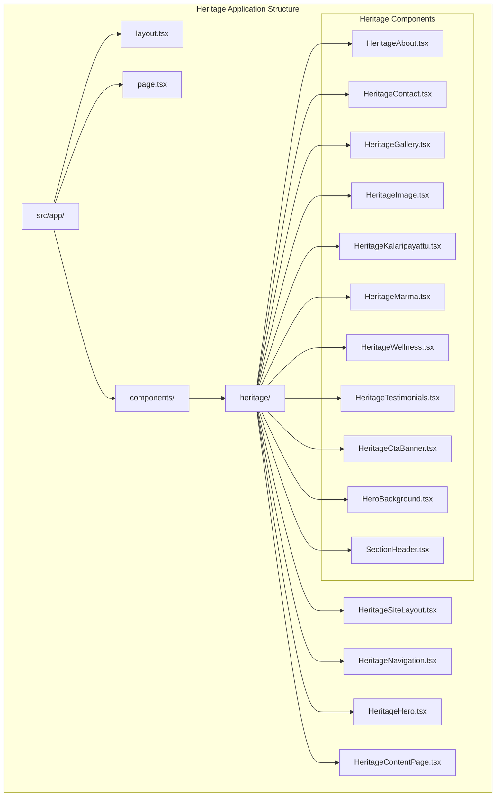
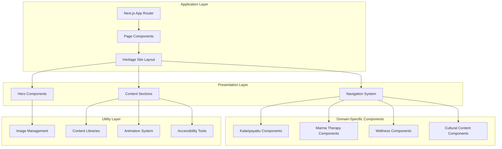
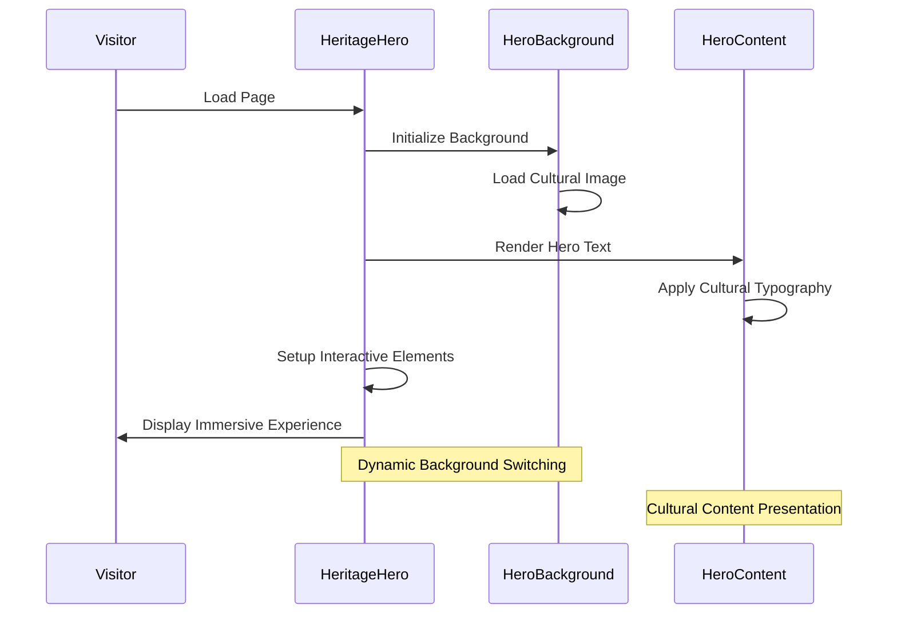
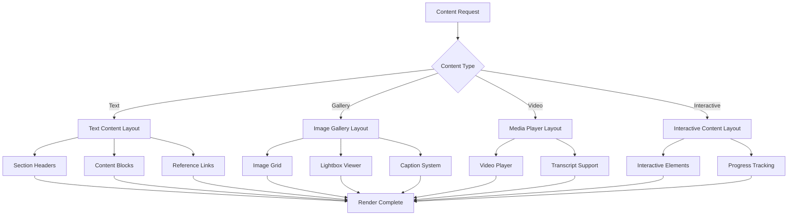
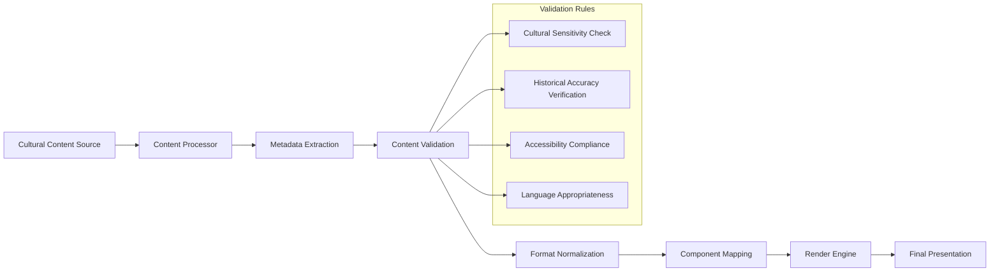
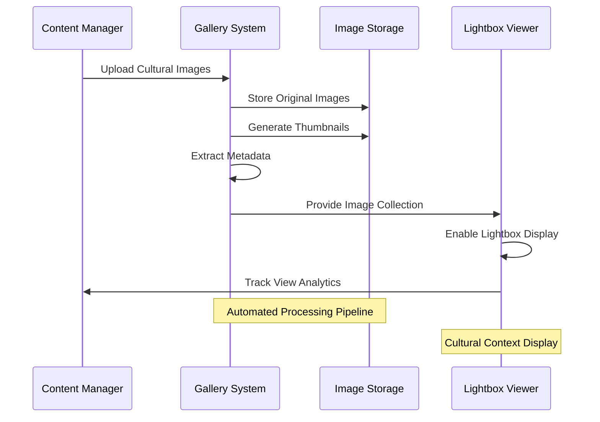
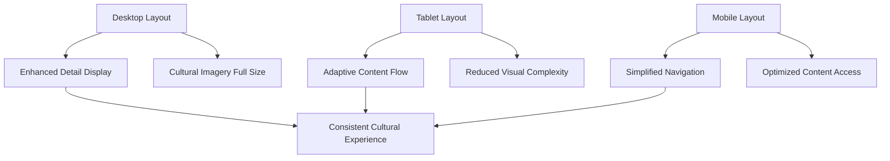
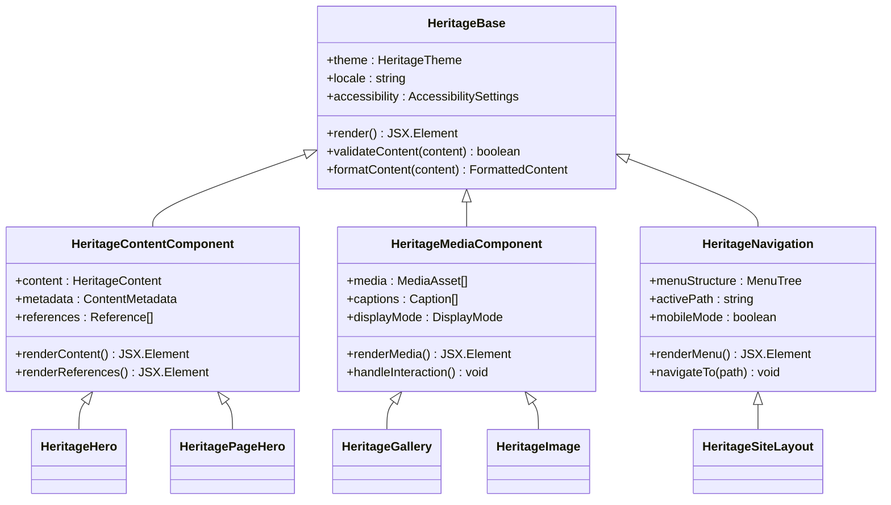
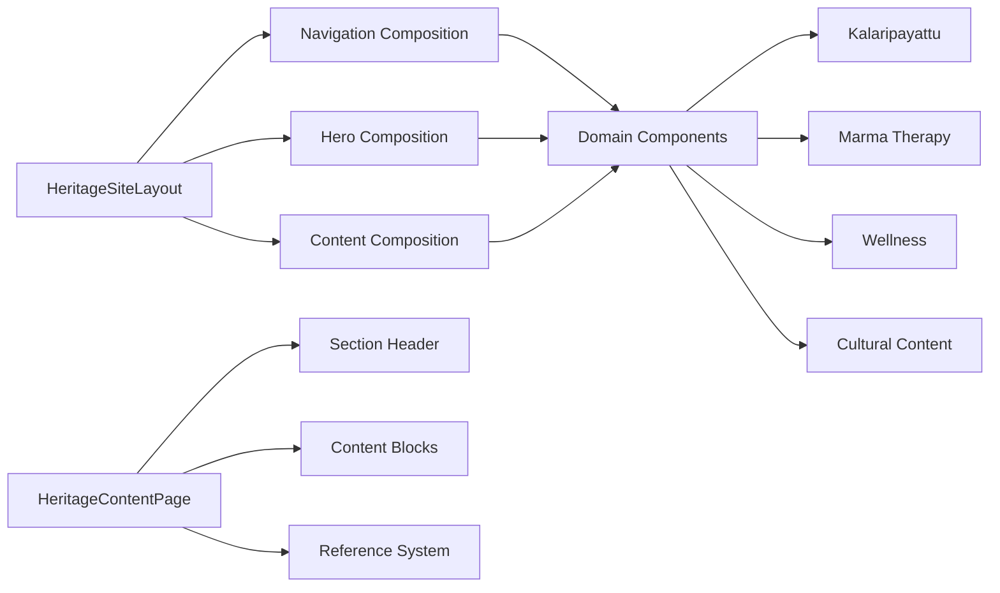

# Heritage Site Components

<cite>
**Referenced Files in This Document**
- [HeritageSiteLayout.tsx](file://src/components/heritage/HeritageSiteLayout.tsx)
- [HeritageNavigation.tsx](file://src/components/heritage/HeritageNavigation.tsx)
- [HeritageHero.tsx](file://src/components/heritage/HeritageHero.tsx)
- [HeritagePageHero.tsx](file://src/components/heritage/HeritagePageHero.tsx)
- [HeritageContentPage.tsx](file://src/components/heritage/HeritageContentPage.tsx)
- [HeritageGallery.tsx](file://src/components/heritage/HeritageGallery.tsx)
- [HeritageImage.tsx](file://src/components/heritage/HeritageImage.tsx)
- [HeritageAbout.tsx](file://src/components/heritage/HeritageAbout.tsx)
- [HeritageContact.tsx](file://src/components/heritage/HeritageContact.tsx)
- [HeritageKalaripayattu.tsx](file://src/components/heritage/HeritageKalaripayattu.tsx)
- [HeritageMarma.tsx](file://src/components/heritage/HeritageMarma.tsx)
- [HeritageWellness.tsx](file://src/components/heritage/HeritageWellness.tsx)
- [HeritageTestimonials.tsx](file://src/components/heritage/HeritageTestimonials.tsx)
- [HeritageCtaBanner.tsx](file://src/components/heritage/HeritageCtaBanner.tsx)
- [HeroBackground.tsx](file://src/components/heritage/HeroBackground.tsx)
- [SectionHeader.tsx](file://src/components/heritage/SectionHeader.tsx)
- [motion.tsx](file://src/components/heritage/motion.tsx)
- [layout.tsx](file://src/app/layout.tsx)
- [page.tsx](file://src/app/page.tsx)
- [globals.css](file://src/app/globals.css)
- [index.ts](file://src/components/heritage/index.ts)
- [heritage-content.ts](file://src/lib/heritage-content.ts)
- [gallery.ts](file://src/lib/gallery.ts)
- [sanity.ts](file://src/lib/sanity.ts)
</cite>

## Table of Contents
1. [Introduction](#introduction)
2. [Project Structure](#project-structure)
3. [Core Components](#core-components)
4. [Architecture Overview](#architecture-overview)
5. [Detailed Component Analysis](#detailed-component-analysis)
6. [Content Management System](#content-management-system)
7. [Styling and Theming](#styling-and-theming)
8. [Component Inheritance Patterns](#component-inheritance-patterns)
9. [Performance Considerations](#performance-considerations)
10. [Troubleshooting Guide](#troubleshooting-guide)
11. [Conclusion](#conclusion)

## Introduction

The Heritage Site Components system represents a specialized web architecture designed specifically for cultural heritage documentation and presentation. This system extends the standard Next.js application structure to create a comprehensive platform for showcasing traditional knowledge systems, cultural practices, and historical artifacts. The heritage site focuses on four primary domains: Kalaripayattu martial arts, Marma therapy, Wellness practices, and general cultural content.

Unlike the main site architecture, the heritage system implements a dedicated component library optimized for cultural storytelling, traditional knowledge presentation, and heritage preservation documentation. The system emphasizes authentic representation, cultural sensitivity, and educational value while maintaining modern web standards and accessibility.

## Project Structure

The heritage site component system is organized within a specialized directory structure that separates heritage-specific functionality from general site components:

**Diagram sources**
- [HeritageSiteLayout.tsx](file://src/components/heritage/HeritageSiteLayout.tsx)
- [HeritageNavigation.tsx](file://src/components/heritage/HeritageNavigation.tsx)
- [HeritageHero.tsx](file://src/components/heritage/HeritageHero.tsx)
- [HeritageContentPage.tsx](file://src/components/heritage/HeritageContentPage.tsx)

The structure follows a modular approach where each heritage domain has dedicated components while sharing common infrastructure. The system leverages React's composition pattern to create flexible, reusable components that can adapt to different cultural content types.

**Section sources**
- [HeritageSiteLayout.tsx](file://src/components/heritage/HeritageSiteLayout.tsx)
- [HeritageNavigation.tsx](file://src/components/heritage/HeritageNavigation.tsx)
- [HeritageHero.tsx](file://src/components/heritage/HeritageHero.tsx)
- [HeritageContentPage.tsx](file://src/components/heritage/HeritageContentPage.tsx)

## Core Components

The heritage site system consists of several foundational components that work together to create a cohesive cultural presentation platform:

### Layout System
The [HeritageSiteLayout.tsx](file://src/components/heritage/HeritageSiteLayout.tsx) serves as the primary container, establishing the overall structure and styling framework for heritage pages. It manages global layout concerns including navigation positioning, responsive behavior, and cultural theme application.

### Navigation Infrastructure
The [HeritageNavigation.tsx](file://src/components/heritage/HeritageNavigation.tsx) component provides heritage-specific navigation patterns, supporting both desktop and mobile experiences while accommodating cultural content hierarchy and traditional knowledge pathways.

### Hero System
The hero system combines [HeritageHero.tsx](file://src/components/heritage/HeritageHero.tsx) and [HeritagePageHero.tsx](file://src/components/heritage/HeritagePageHero.tsx) to create immersive cultural presentations. These components handle dynamic background imagery, cultural typography, and interactive elements that reflect heritage themes.

### Content Organization
The [HeritageContentPage.tsx](file://src/components/heritage/HeritageContentPage.tsx) component orchestrates the display of heritage-specific content, managing section layouts, cultural narrative flow, and interactive elements that enhance the visitor's understanding of traditional practices.

**Section sources**
- [HeritageSiteLayout.tsx](file://src/components/heritage/HeritageSiteLayout.tsx)
- [HeritageNavigation.tsx](file://src/components/heritage/HeritageNavigation.tsx)
- [HeritageHero.tsx](file://src/components/heritage/HeritageHero.tsx)
- [HeritagePageHero.tsx](file://src/components/heritage/HeritagePageHero.tsx)
- [HeritageContentPage.tsx](file://src/components/heritage/HeritageContentPage.tsx)

## Architecture Overview

The heritage site architecture implements a layered approach that separates concerns while maintaining flexibility for cultural content presentation:

**Diagram sources**
- [HeritageSiteLayout.tsx](file://src/components/heritage/HeritageSiteLayout.tsx)
- [HeritageNavigation.tsx](file://src/components/heritage/HeritageNavigation.tsx)
- [HeritageHero.tsx](file://src/components/heritage/HeritageHero.tsx)
- [HeritageContentPage.tsx](file://src/components/heritage/HeritageContentPage.tsx)

The architecture emphasizes modularity and reusability, allowing heritage content to be presented consistently across different cultural domains while maintaining the flexibility to address specific cultural requirements.

**Section sources**
- [HeritageSiteLayout.tsx](file://src/components/heritage/HeritageSiteLayout.tsx)
- [HeritageNavigation.tsx](file://src/components/heritage/HeritageNavigation.tsx)
- [HeritageHero.tsx](file://src/components/heritage/HeritageHero.tsx)
- [HeritageContentPage.tsx](file://src/components/heritage/HeritageContentPage.tsx)

## Detailed Component Analysis

### Heritage Navigation System

The navigation component implements a sophisticated menu structure designed to accommodate cultural knowledge hierarchies and traditional learning pathways:

```mermaid
classDiagram
class HeritageNavigation {
+navigationItems : NavigationItem[]
+currentPath : string
+isMobile : boolean
+render() JSX.Element
+handleItemClick(item) void
+toggleMobileMenu() void
}
class NavigationItem {
+id : string
+label : string
+href : string
+icon : ReactNode
+children : NavigationItem[]
+active : boolean
}
class MobileNavigation {
+isOpen : boolean
+menuItems : NavigationItem[]
+render() JSX.Element
+closeMenu() void
}
HeritageNavigation --> NavigationItem : "manages"
HeritageNavigation --> MobileNavigation : "uses"
NavigationItem --> NavigationItem : "nested children"
```

**Diagram sources**
- [HeritageNavigation.tsx](file://src/components/heritage/HeritageNavigation.tsx)

The navigation system supports hierarchical cultural content organization, enabling visitors to explore traditional knowledge systems in structured pathways that reflect cultural learning traditions.

**Section sources**
- [HeritageNavigation.tsx](file://src/components/heritage/HeritageNavigation.tsx)

### Heritage Hero Components

The hero system creates immersive cultural experiences through dynamic background management and interactive elements:

**Diagram sources**
- [HeritageHero.tsx](file://src/components/heritage/HeritageHero.tsx)
- [HeroBackground.tsx](file://src/components/heritage/HeroBackground.tsx)

The hero components utilize cultural imagery and typography to establish immediate connection with heritage themes while maintaining accessibility and performance standards.

**Section sources**
- [HeritageHero.tsx](file://src/components/heritage/HeritageHero.tsx)
- [HeroBackground.tsx](file://src/components/heritage/HeroBackground.tsx)

### Domain-Specific Components

Each cultural domain has dedicated components that address specific presentation needs:

#### Kalaripayattu Component System
The [HeritageKalaripayattu.tsx](file://src/components/heritage/HeritageKalaripayattu.tsx) component handles martial arts demonstrations, technique explanations, and historical context presentation. It integrates video content, movement diagrams, and cultural storytelling elements.

#### Marma Therapy Components
The [HeritageMarma.tsx](file://src/components/heritage/HeritageMarma.tsx) component presents therapeutic knowledge systems with anatomical illustrations, treatment protocols, and cultural significance context. It balances scientific accuracy with traditional wisdom presentation.

#### Wellness Components
The [HeritageWellness.tsx](file://src/components/heritage/HeritageWellness.tsx) component showcases holistic health practices, incorporating traditional remedies, lifestyle guidance, and cultural wellness philosophies.

**Section sources**
- [HeritageKalaripayattu.tsx](file://src/components/heritage/HeritageKalaripayattu.tsx)
- [HeritageMarma.tsx](file://src/components/heritage/HeritageMarma.tsx)
- [HeritageWellness.tsx](file://src/components/heritage/HeritageWellness.tsx)

### Content Organization Components

The content system provides flexible layout mechanisms for heritage documentation:

**Diagram sources**
- [HeritageContentPage.tsx](file://src/components/heritage/HeritageContentPage.tsx)
- [HeritageGallery.tsx](file://src/components/heritage/HeritageGallery.tsx)
- [SectionHeader.tsx](file://src/components/heritage/SectionHeader.tsx)

**Section sources**
- [HeritageContentPage.tsx](file://src/components/heritage/HeritageContentPage.tsx)
- [HeritageGallery.tsx](file://src/components/heritage/HeritageGallery.tsx)
- [SectionHeader.tsx](file://src/components/heritage/SectionHeader.tsx)

## Content Management System

The heritage site implements a comprehensive content management approach tailored to cultural documentation and preservation:

### Content Libraries
The system utilizes specialized libraries for heritage content management:

- [heritage-content.ts](file://src/lib/heritage-content.ts): Manages cultural content structures, metadata, and presentation logic
- [gallery.ts](file://src/lib/gallery.ts): Handles image gallery organization, categorization, and display logic
- [sanity.ts](file://src/lib/sanity.ts): Provides content management integration for cultural documentation workflows

### Content Rendering Approach
Content rendering follows a structured approach that preserves cultural authenticity while ensuring digital accessibility:

**Diagram sources**
- [heritage-content.ts](file://src/lib/heritage-content.ts)
- [sanity.ts](file://src/lib/sanity.ts)

### Image Gallery Management
The gallery system provides sophisticated image handling for cultural documentation:

**Diagram sources**
- [HeritageGallery.tsx](file://src/components/heritage/HeritageGallery.tsx)
- [HeritageImage.tsx](file://src/components/heritage/HeritageImage.tsx)
- [gallery.ts](file://src/lib/gallery.ts)

**Section sources**
- [heritage-content.ts](file://src/lib/heritage-content.ts)
- [gallery.ts](file://src/lib/gallery.ts)
- [sanity.ts](file://src/lib/sanity.ts)
- [HeritageGallery.tsx](file://src/components/heritage/HeritageGallery.tsx)
- [HeritageImage.tsx](file://src/components/heritage/HeritageImage.tsx)

## Styling and Theming

The heritage site implements a distinctive styling approach that reflects cultural aesthetics while maintaining modern web standards:

### Global Styling Framework
The [globals.css](file://src/app/globals.css) establishes the foundation for heritage-themed visual presentation, incorporating cultural color palettes, typography choices, and design systems that honor traditional aesthetics.

### Component-Specific Styling
Individual components implement heritage-appropriate styling patterns:

- **Color Schemes**: Earth tones, natural hues, and culturally significant colors
- **Typography**: Traditional fonts alongside modern web-safe alternatives
- **Layout Patterns**: Symmetrical compositions reflecting cultural design principles
- **Animation Systems**: Subtle transitions that enhance rather than distract from cultural content

### Responsive Design Considerations
The styling system accommodates various devices while preserving cultural presentation integrity:

**Diagram sources**
- [globals.css](file://src/app/globals.css)
- [HeritageSiteLayout.tsx](file://src/components/heritage/HeritageSiteLayout.tsx)

**Section sources**
- [globals.css](file://src/app/globals.css)
- [HeritageSiteLayout.tsx](file://src/components/heritage/HeritageSiteLayout.tsx)

## Component Inheritance Patterns

The heritage component system implements sophisticated inheritance and composition patterns to maximize code reuse while maintaining flexibility:

### Base Component Hierarchy

**Diagram sources**
- [HeritageSiteLayout.tsx](file://src/components/heritage/HeritageSiteLayout.tsx)
- [HeritageNavigation.tsx](file://src/components/heritage/HeritageNavigation.tsx)
- [HeritageHero.tsx](file://src/components/heritage/HeritageHero.tsx)
- [HeritageGallery.tsx](file://src/components/heritage/HeritageGallery.tsx)

### Composition Over Inheritance
The system favors composition patterns that allow components to be combined flexibly:

**Diagram sources**
- [HeritageSiteLayout.tsx](file://src/components/heritage/HeritageSiteLayout.tsx)
- [HeritageContentPage.tsx](file://src/components/heritage/HeritageContentPage.tsx)
- [index.ts](file://src/components/heritage/index.ts)

**Section sources**
- [HeritageSiteLayout.tsx](file://src/components/heritage/HeritageSiteLayout.tsx)
- [HeritageNavigation.tsx](file://src/components/heritage/HeritageNavigation.tsx)
- [HeritageHero.tsx](file://src/components/heritage/HeritageHero.tsx)
- [HeritageContentPage.tsx](file://src/components/heritage/HeritageContentPage.tsx)
- [index.ts](file://src/components/heritage/index.ts)

## Performance Considerations

The heritage site system implements several performance optimization strategies tailored to cultural content delivery:

### Image Optimization
- Lazy loading for cultural image galleries
- Adaptive image sizing based on device capabilities
- WebP format support for improved compression
- Cultural context-aware image prioritization

### Content Delivery
- Static generation for frequently accessed heritage content
- Incremental static regeneration for dynamic cultural updates
- CDN integration for global accessibility
- Localized content delivery for regional audiences

### Animation Performance
- Hardware-accelerated transitions for smooth cultural presentations
- Motion reduction options for accessibility compliance
- Optimized animation timing for cultural storytelling pacing

### Memory Management
- Component lifecycle optimization for long-form cultural content
- Efficient state management for interactive heritage elements
- Cleanup procedures for media resources and animations

## Troubleshooting Guide

Common issues and solutions for the heritage site component system:

### Navigation Issues
**Problem**: Navigation items not displaying correctly in mobile view
**Solution**: Verify mobile breakpoint configuration and ensure proper state management for menu visibility

### Content Loading Problems
**Problem**: Heritage content not rendering properly
**Solution**: Check content validation logic and ensure proper metadata formatting

### Image Display Issues
**Problem**: Cultural images not loading or displaying incorrectly
**Solution**: Verify image processing pipeline and ensure proper file format support

### Performance Degradation
**Problem**: Slow loading times for cultural content
**Solution**: Implement lazy loading strategies and optimize image assets

### Accessibility Concerns
**Problem**: Heritage components not meeting accessibility standards
**Solution**: Review ARIA labels and keyboard navigation support

**Section sources**
- [HeritageNavigation.tsx](file://src/components/heritage/HeritageNavigation.tsx)
- [HeritageContentPage.tsx](file://src/components/heritage/HeritageContentPage.tsx)
- [HeritageGallery.tsx](file://src/components/heritage/HeritageGallery.tsx)

## Conclusion

The heritage site component system represents a sophisticated approach to digital cultural preservation and presentation. By implementing specialized components, content management systems, and cultural design principles, the system successfully bridges traditional knowledge systems with modern web technologies.

The modular architecture ensures maintainability and scalability while the domain-specific components address the unique requirements of cultural content presentation. The system's emphasis on accessibility, performance, and cultural authenticity positions it as a model for digital heritage documentation platforms.

Future enhancements could include expanded multimedia support, enhanced interactive storytelling capabilities, and deeper integration with cultural preservation initiatives. The current architecture provides a solid foundation for these developments while maintaining the system's commitment to cultural integrity and educational value.