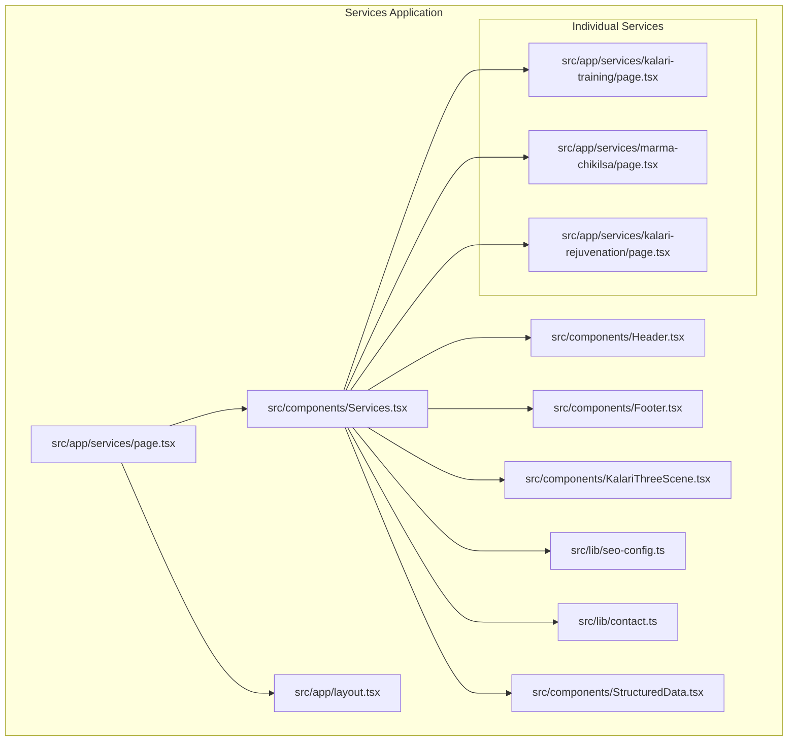
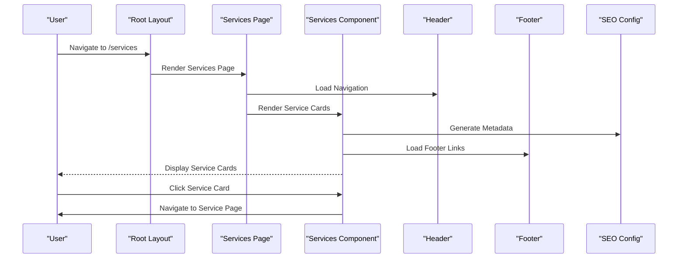
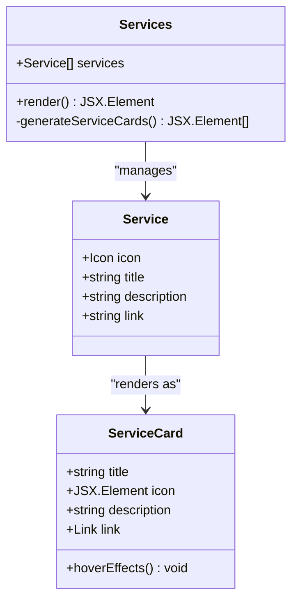
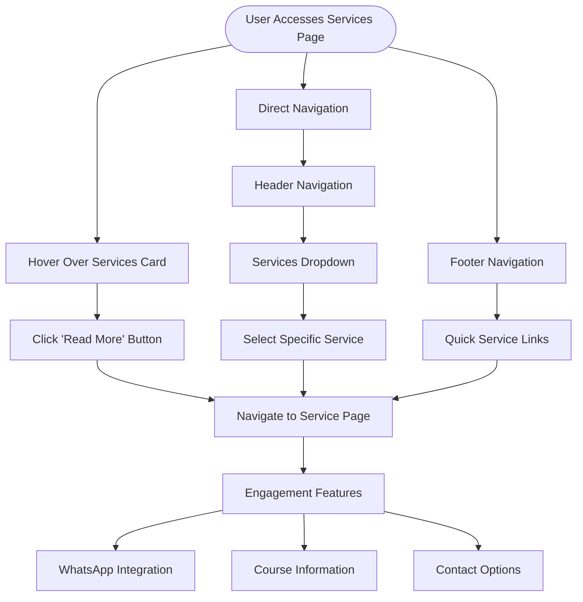
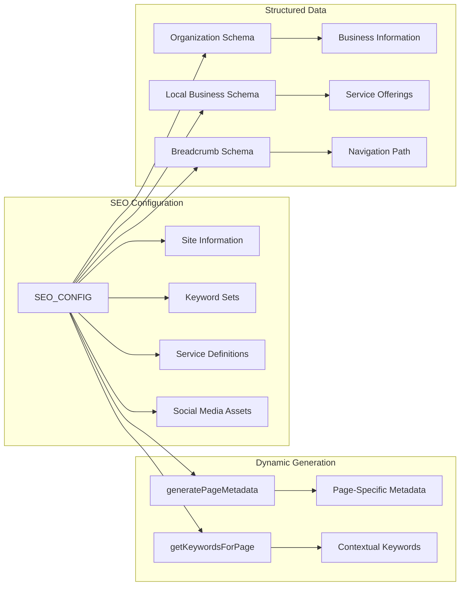
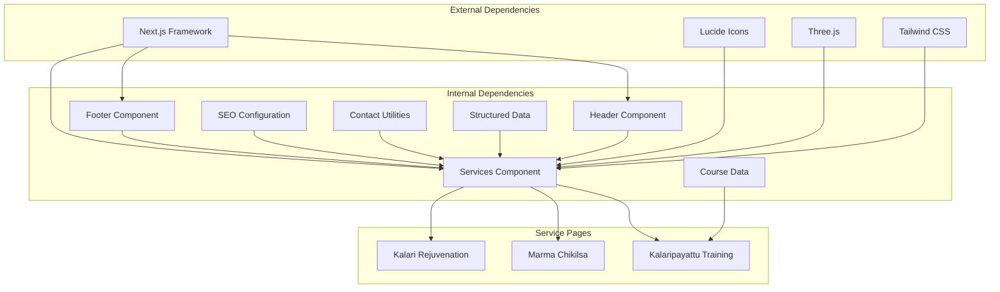

# Main Services Page

<cite>
**Referenced Files in This Document**
- [services/page.tsx](file://src/app/services/page.tsx)
- [Services.tsx](file://src/components/Services.tsx)
- [layout.tsx](file://src/app/layout.tsx)
- [seo-config.ts](file://src/lib/seo-config.ts)
- [Header.tsx](file://src/components/Header.tsx)
- [Footer.tsx](file://src/components/Footer.tsx)
- [contact.ts](file://src/lib/contact.ts)
- [StructuredData.tsx](file://src/components/StructuredData.tsx)
- [courses.ts](file://src/data/courses.ts)
- [KalariTrainingCourses.tsx](file://src/components/KalariTrainingCourses.tsx)
- [KalariThreeScene.tsx](file://src/components/KalariThreeScene.tsx)
- [services/kalari-training/page.tsx](file://src/app/services/kalari-training/page.tsx)
- [services/marma-chikilsa/page.tsx](file://src/app/services/marma-chikilsa/page.tsx)
- [services/kalari-rejuvenation/page.tsx](file://src/app/services/kalari-rejuvenation/page.tsx)
</cite>

## Table of Contents
1. [Introduction](#introduction)
2. [Project Structure](#project-structure)
3. [Core Components](#core-components)
4. [Architecture Overview](#architecture-overview)
5. [Detailed Component Analysis](#detailed-component-analysis)
6. [Dependency Analysis](#dependency-analysis)
7. [Performance Considerations](#performance-considerations)
8. [Troubleshooting Guide](#troubleshooting-guide)
9. [Conclusion](#conclusion)

## Introduction
This document provides comprehensive documentation for the main services page implementation. The services page serves as the primary entry point to the organization's offerings, presenting service categories through interactive cards that link to detailed service pages. The implementation demonstrates a clean separation of concerns with dedicated components for navigation, service presentation, and SEO optimization.

## Project Structure
The services page follows Next.js file-based routing with a clear hierarchical structure:

**Diagram sources**
- [services/page.tsx:1-22](file://src/app/services/page.tsx#L1-L22)
- [Services.tsx:1-110](file://src/components/Services.tsx#L1-L110)

**Section sources**
- [services/page.tsx:1-22](file://src/app/services/page.tsx#L1-L22)
- [layout.tsx:1-120](file://src/app/layout.tsx#L1-L120)

## Core Components
The main services page consists of several interconnected components that work together to deliver a cohesive user experience:

### Services Component Architecture
The Services component serves as the central hub for service presentation, featuring:
- Three distinct service categories: Marma Chikilsa, Kalaripayattu Training, and Kalari Rejuvenation
- Interactive service cards with hover animations and transitions
- Responsive grid layout adapting to different screen sizes
- Integrated 3D visualization elements for enhanced engagement

### Navigation Integration
The header component provides comprehensive navigation with:
- Hierarchical service dropdown menu
- Active state detection for current page
- Mobile-responsive navigation with smooth animations
- Consistent branding and visual identity

### Content Management Approach
The implementation utilizes a data-driven approach:
- Static service definitions in the Services component
- Dynamic metadata generation through SEO configuration
- Centralized contact and configuration utilities
- Structured data implementation for improved SEO

**Section sources**
- [Services.tsx:13-35](file://src/components/Services.tsx#L13-L35)
- [Header.tsx:16-29](file://src/components/Header.tsx#L16-L29)
- [seo-config.ts:106-126](file://src/lib/seo-config.ts#L106-L126)

## Architecture Overview
The services page architecture demonstrates a modular, component-based design pattern:

**Diagram sources**
- [services/page.tsx:10-20](file://src/app/services/page.tsx#L10-L20)
- [Services.tsx:37-107](file://src/components/Services.tsx#L37-L107)
- [Header.tsx:31-82](file://src/components/Header.tsx#L31-L82)

The architecture emphasizes:
- Separation of concerns between page layout and content presentation
- Reusable components for navigation and footer elements
- Centralized SEO configuration management
- Responsive design patterns for cross-device compatibility

## Detailed Component Analysis

### Services Component Implementation
The Services component implements a sophisticated card-based service presentation system:

**Diagram sources**
- [Services.tsx:13-35](file://src/components/Services.tsx#L13-L35)
- [Services.tsx:75-104](file://src/components/Services.tsx#L75-L104)

Key implementation patterns include:
- **Static Service Definition**: Service data is defined statically within the component
- **Dynamic Rendering**: Service cards are generated dynamically using array mapping
- **Interactive Elements**: Hover effects and transitions enhance user engagement
- **Responsive Grid**: CSS Grid layout adapts to different screen sizes

### Navigation Patterns and User Experience
The navigation system provides intuitive service discovery through multiple interaction patterns:

**Diagram sources**
- [Services.tsx:95-101](file://src/components/Services.tsx#L95-L101)
- [Header.tsx:16-29](file://src/components/Header.tsx#L16-L29)
- [Footer.tsx:22-35](file://src/components/Footer.tsx#L22-L35)

### Service Category Organization
The services are organized into three distinct categories, each with specific characteristics:

| Service Category | Icon | Primary Focus | Target Audience |
|------------------|------|---------------|-----------------|
| Marma Chikilsa | Leaf | Traditional healing and wellness | General wellness seekers |
| Kalaripayattu Training | Swords | Martial arts training | Students and practitioners |
| Kalari Rejuvenation | Droplets | Recovery and therapy | Recovery-focused clients |

Each service category maintains consistent presentation patterns while allowing for unique content customization.

### Content Management and Metadata Configuration
The SEO configuration system provides centralized metadata management:

**Diagram sources**
- [seo-config.ts:6-127](file://src/lib/seo-config.ts#L6-L127)
- [StructuredData.tsx:8-94](file://src/components/StructuredData.tsx#L8-L94)

**Section sources**
- [Services.tsx:37-107](file://src/components/Services.tsx#L37-L107)
- [Header.tsx:104-156](file://src/components/Header.tsx#L104-L156)
- [Footer.tsx:4-50](file://src/components/Footer.tsx#L4-L50)
- [seo-config.ts:132-204](file://src/lib/seo-config.ts#L132-L204)

## Dependency Analysis
The services page implementation demonstrates clear dependency relationships:

**Diagram sources**
- [Services.tsx:1-11](file://src/components/Services.tsx#L1-L11)
- [services/page.tsx:1-4](file://src/app/services/page.tsx#L1-L4)

Key dependency patterns include:
- **Component Composition**: Services component depends on Header, Footer, and 3D visualization
- **Utility Integration**: Contact utilities and SEO configuration provide shared functionality
- **Data Layer**: Course data supports training program presentations
- **External Libraries**: Three.js enables interactive 3D scenes

**Section sources**
- [services/page.tsx:1-22](file://src/app/services/page.tsx#L1-L22)
- [Services.tsx:1-11](file://src/components/Services.tsx#L1-L11)

## Performance Considerations
The implementation incorporates several performance optimization strategies:

### Rendering Optimizations
- **Lazy Loading**: 3D scenes are rendered client-side only when needed
- **CSS Animations**: Hardware-accelerated transitions minimize layout thrashing
- **Component Splitting**: Independent service components reduce unnecessary re-renders
- **Responsive Design**: Grid layouts adapt to device capabilities efficiently

### SEO Performance Benefits
- **Centralized Metadata**: Single source of truth for SEO configuration
- **Structured Data**: Rich snippets improve search visibility
- **Image Optimization**: Proper meta tags for social sharing
- **Mobile Responsiveness**: Core web vitals maintained across devices

### User Experience Enhancements
- **Progressive Enhancement**: Basic functionality works without JavaScript
- **Accessibility**: Semantic HTML and ARIA attributes for screen readers
- **Performance Budget**: Optimized asset loading and rendering
- **Cross-Browser Compatibility**: Graceful degradation for older browsers

## Troubleshooting Guide

### Common Issues and Solutions

**Service Card Navigation Problems**
- Verify service links match actual page routes
- Check for typos in service definition arrays
- Ensure route parameters are correctly formatted

**SEO Configuration Issues**
- Confirm metadata keys match expected structure
- Validate Open Graph and Twitter card configurations
- Check for missing or empty keyword sets

**Navigation Menu Problems**
- Verify active state detection logic
- Check mobile menu state management
- Ensure proper event listener cleanup

**3D Scene Rendering Issues**
- Confirm Three.js dependencies are properly installed
- Check WebGL support in target browsers
- Validate scene initialization and cleanup

**Contact Integration Problems**
- Verify WhatsApp link construction
- Check phone number formatting
- Ensure proper URL encoding for messages

**Section sources**
- [contact.ts:8-28](file://src/lib/contact.ts#L8-L28)
- [seo-config.ts:132-163](file://src/lib/seo-config.ts#L132-L163)
- [Header.tsx:37-48](file://src/components/Header.tsx#L37-L48)

## Conclusion
The main services page implementation demonstrates a well-architected, scalable solution for presenting service offerings. The component-based approach ensures maintainability and extensibility, while the integrated SEO and navigation systems provide optimal user experience and discoverability. The implementation successfully balances visual appeal with functional requirements, creating an effective entry point for service exploration and conversion.

The modular design allows for easy addition of new service categories, while the centralized configuration system ensures consistency across the platform. The responsive design patterns and performance optimizations provide a solid foundation for future enhancements and scaling requirements.