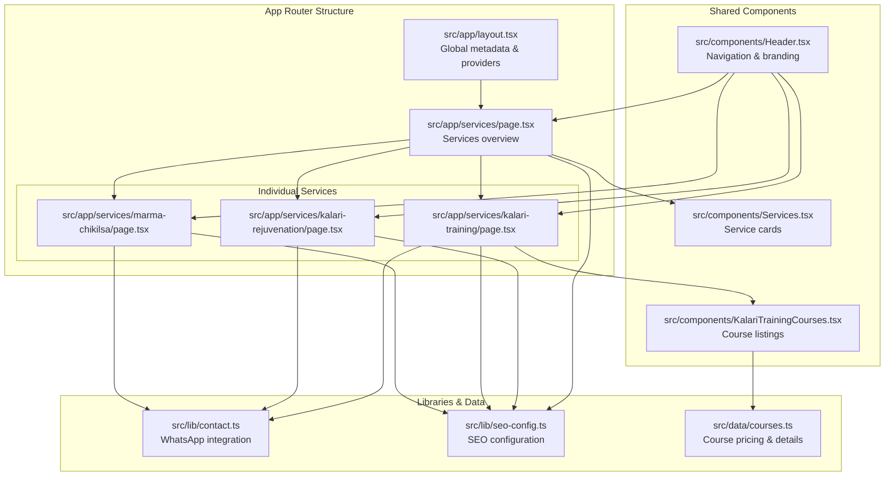
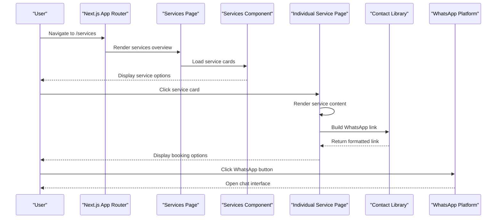
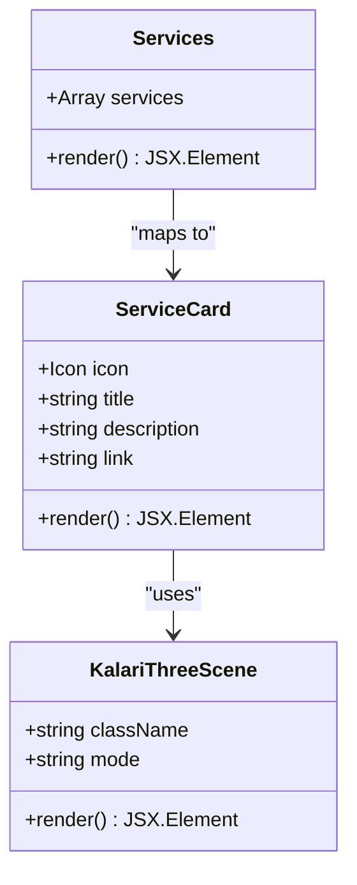
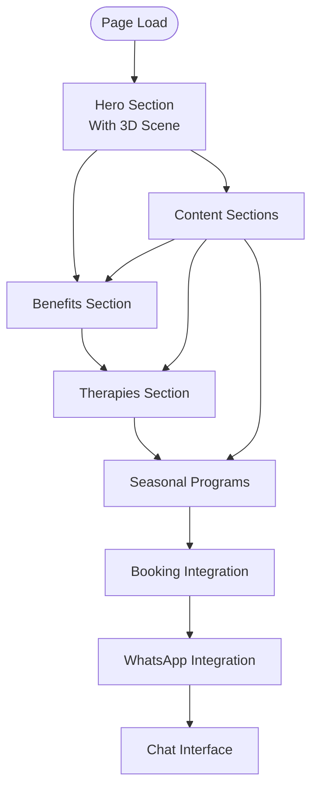
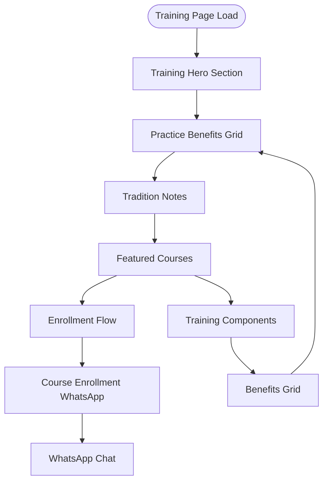
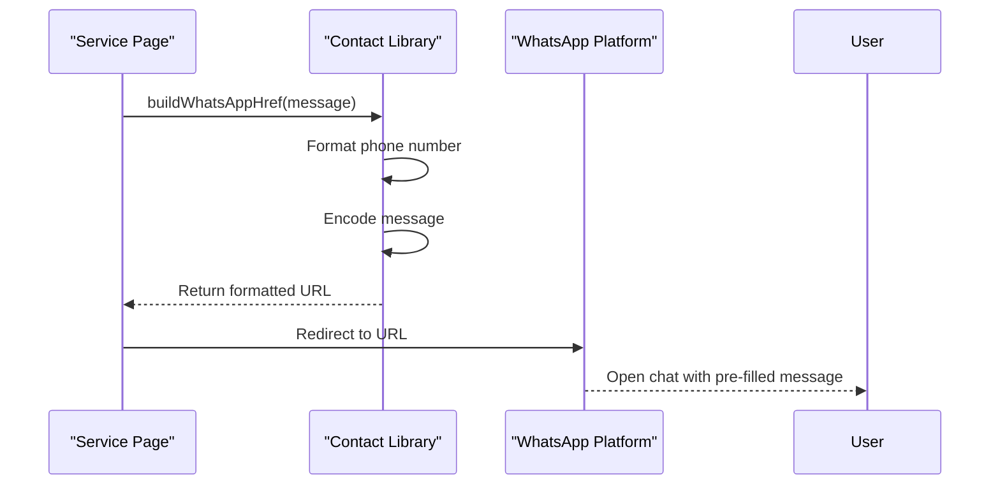
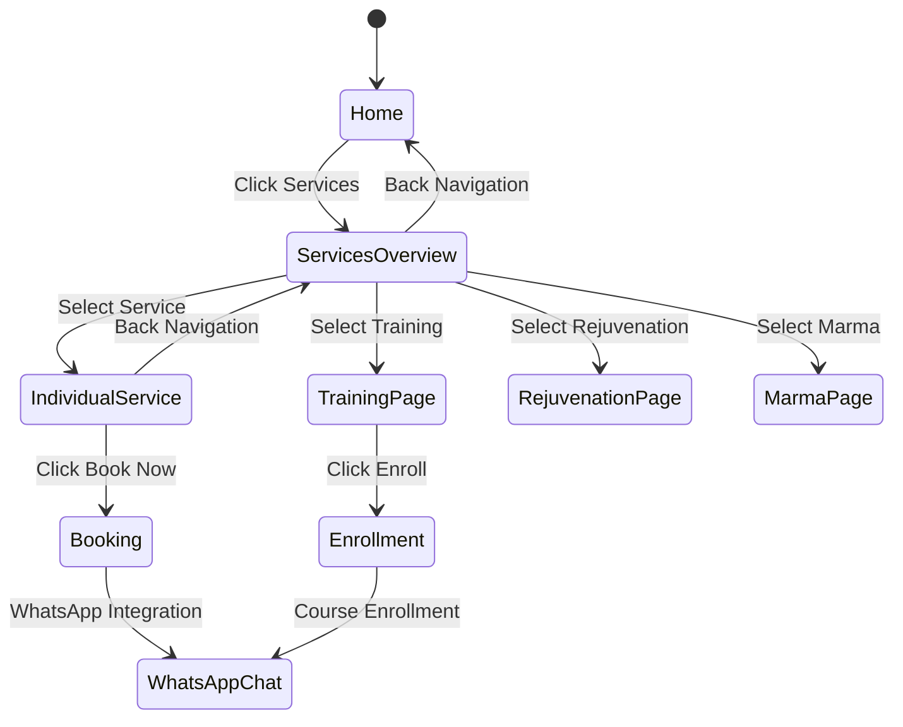
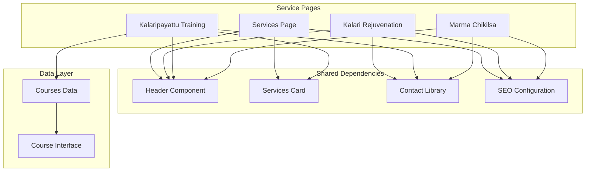

# Service Pages

<cite>
**Referenced Files in This Document**
- [layout.tsx](file://src/app/layout.tsx)
- [services/page.tsx](file://src/app/services/page.tsx)
- [services/kalari-rejuvenation/page.tsx](file://src/app/services/kalari-rejuvenation/page.tsx)
- [services/kalari-training/page.tsx](file://src/app/services/kalari-training/page.tsx)
- [services/marma-chikilsa/page.tsx](file://src/app/services/marma-chikilsa/page.tsx)
- [components/Services.tsx](file://src/components/Services.tsx)
- [components/Header.tsx](file://src/components/Header.tsx)
- [components/KalariTrainingCourses.tsx](file://src/components/KalariTrainingCourses.tsx)
- [lib/contact.ts](file://src/lib/contact.ts)
- [lib/seo-config.ts](file://src/lib/seo-config.ts)
- [data/courses.ts](file://src/data/courses.ts)
</cite>

## Table of Contents
1. [Introduction](#introduction)
2. [Project Structure](#project-structure)
3. [Core Components](#core-components)
4. [Architecture Overview](#architecture-overview)
5. [Detailed Component Analysis](#detailed-component-analysis)
6. [Dependency Analysis](#dependency-analysis)
7. [Performance Considerations](#performance-considerations)
8. [Troubleshooting Guide](#troubleshooting-guide)
9. [Conclusion](#conclusion)

## Introduction
This document provides comprehensive technical documentation for the service pages implementation at CVN Ponkunnam. The service pages showcase three core offerings: Kalari Rejuvenation, Kalaripayattu Training, and Marma Chikilsa. The implementation follows Next.js App Router conventions with metadata-driven SEO, integrated booking flows via WhatsApp, and responsive design patterns optimized for wellness and martial arts content.

## Project Structure
The service pages are organized under the Next.js App Router structure with dedicated routes for each service and a centralized services overview page. The architecture emphasizes content organization, metadata configuration, and seamless booking integrations.

**Diagram sources**
- [layout.tsx:1-120](file://src/app/layout.tsx#L1-L120)
- [services/page.tsx:1-22](file://src/app/services/page.tsx#L1-L22)
- [services/kalari-rejuvenation/page.tsx:1-275](file://src/app/services/kalari-rejuvenation/page.tsx#L1-L275)
- [services/kalari-training/page.tsx:1-291](file://src/app/services/kalari-training/page.tsx#L1-L291)
- [services/marma-chikilsa/page.tsx:1-217](file://src/app/services/marma-chikilsa/page.tsx#L1-L217)
- [components/Services.tsx:1-110](file://src/components/Services.tsx#L1-L110)
- [components/Header.tsx:1-376](file://src/components/Header.tsx#L1-L376)
- [components/KalariTrainingCourses.tsx:1-117](file://src/components/KalariTrainingCourses.tsx#L1-L117)
- [lib/contact.ts:1-29](file://src/lib/contact.ts#L1-L29)
- [lib/seo-config.ts:1-205](file://src/lib/seo-config.ts#L1-L205)
- [data/courses.ts:1-103](file://src/data/courses.ts#L1-L103)

**Section sources**
- [layout.tsx:1-120](file://src/app/layout.tsx#L1-L120)
- [services/page.tsx:1-22](file://src/app/services/page.tsx#L1-L22)

## Core Components
The service pages implementation consists of several interconnected components that handle content presentation, navigation, booking integration, and SEO optimization.

### Services Overview Page
The main services page serves as a gateway to individual service offerings. It integrates with the shared Services component to present service cards and maintains consistent metadata configuration.

### Individual Service Pages
Each service page implements a comprehensive structure with hero sections, content sections, and booking integration points. The pages share common patterns for content organization and user engagement.

### Navigation System
The header component provides hierarchical navigation with dropdown menus for services, ensuring intuitive user flow and accessibility across devices.

**Section sources**
- [components/Services.tsx:1-110](file://src/components/Services.tsx#L1-L110)
- [components/Header.tsx:16-29](file://src/components/Header.tsx#L16-L29)

## Architecture Overview
The service pages architecture follows a modular design pattern with clear separation of concerns between content presentation, navigation, booking integration, and SEO configuration.

**Diagram sources**
- [services/page.tsx:10-20](file://src/app/services/page.tsx#L10-L20)
- [components/Services.tsx:75-104](file://src/components/Services.tsx#L75-L104)
- [services/kalari-rejuvenation/page.tsx:112-125](file://src/app/services/kalari-rejuvenation/page.tsx#L112-L125)
- [lib/contact.ts:8-9](file://src/lib/contact.ts#L8-L9)

## Detailed Component Analysis

### Services Overview Component
The Services component serves as the central hub for service discovery, featuring interactive cards with icons, descriptions, and navigation links to individual service pages.

**Diagram sources**
- [components/Services.tsx:13-35](file://src/components/Services.tsx#L13-L35)
- [components/Services.tsx:75-104](file://src/components/Services.tsx#L75-L104)

The component implements a responsive grid layout with animated transitions, featuring:
- Three service cards for Marma Chikilsa, Kalaripayattu Training, and Kalari Rejuvenation
- Interactive hover effects with gradient backgrounds and scaling animations
- Integrated 3D scene rendering for visual enhancement
- Consistent typography and spacing following the brand's design system

**Section sources**
- [components/Services.tsx:37-110](file://src/components/Services.tsx#L37-L110)

### Kalari Rejuvenation Service Page
The Kalari Rejuvenation page implements a comprehensive wellness service presentation with multiple content sections and integrated booking flows.

**Diagram sources**
- [services/kalari-rejuvenation/page.tsx:83-274](file://src/app/services/kalari-rejuvenation/page.tsx#L83-L274)

Key features include:
- Hero section with background imagery and 3D scene integration
- Benefits presentation with numbered lists
- Therapy descriptions with detailed explanations
- Seasonal program offerings
- Integrated WhatsApp booking system

**Section sources**
- [services/kalari-rejuvenation/page.tsx:1-275](file://src/app/services/kalari-rejuvenation/page.tsx#L1-L275)

### Kalaripayattu Training Service Page
The Kalaripayattu Training page focuses on martial arts education with structured course presentations and enrollment integration.

**Diagram sources**
- [services/kalari-training/page.tsx:108-290](file://src/app/services/kalari-training/page.tsx#L108-L290)

The page structure includes:
- Hero section highlighting training philosophy
- Practice benefits presentation
- Tradition information with lineage details
- Featured courses with pricing and enrollment
- Training components with detailed breakdowns
- Comprehensive benefits grid

**Section sources**
- [services/kalari-training/page.tsx:1-291](file://src/app/services/kalari-training/page.tsx#L1-L291)

### Marma Chikilsa Service Page
The Marma Chikilsa page presents traditional healing practices with therapeutic focus and integration points.

**Section sources**
- [services/marma-chikilsa/page.tsx:1-217](file://src/app/services/marma-chikilsa/page.tsx#L1-L217)

### Booking Integration Patterns
All service pages integrate with the contact library to provide seamless booking experiences through WhatsApp.

**Diagram sources**
- [lib/contact.ts:8-9](file://src/lib/contact.ts#L8-L9)
- [services/kalari-rejuvenation/page.tsx:112-125](file://src/app/services/kalari-rejuvenation/page.tsx#L112-L125)
- [services/marma-chikilsa/page.tsx:84-97](file://src/app/services/marma-chikilsa/page.tsx#L84-L97)

**Section sources**
- [lib/contact.ts:1-29](file://src/lib/contact.ts#L1-L29)

### Navigation and User Flow
The navigation system provides intuitive access to service pages with responsive design patterns.

**Diagram sources**
- [components/Header.tsx:16-29](file://src/components/Header.tsx#L16-L29)
- [components/Header.tsx:109-142](file://src/components/Header.tsx#L109-L142)

**Section sources**
- [components/Header.tsx:31-376](file://src/components/Header.tsx#L31-L376)

## Dependency Analysis
The service pages implementation demonstrates clear dependency relationships between components, libraries, and data sources.

**Diagram sources**
- [services/page.tsx:2-3](file://src/app/services/page.tsx#L2-L3)
- [services/kalari-rejuvenation/page.tsx:4-6](file://src/app/services/kalari-rejuvenation/page.tsx#L4-L6)
- [services/kalari-training/page.tsx:3-8](file://src/app/services/kalari-training/page.tsx#L3-L8)
- [services/marma-chikilsa/page.tsx:2-6](file://src/app/services/marma-chikilsa/page.tsx#L2-L6)
- [components/KalariTrainingCourses.tsx:1-4](file://src/components/KalariTrainingCourses.tsx#L1-L4)
- [data/courses.ts:1-17](file://src/data/courses.ts#L1-L17)

### Content Management Approach
The implementation uses a hybrid content management approach combining static content definition with dynamic data sourcing:

- Static content: Service descriptions, benefits lists, and structural content are defined directly in the page components
- Dynamic content: Course information is managed through the courses data module with filtering and sorting capabilities
- Shared components: Common UI patterns are extracted into reusable components for consistency

**Section sources**
- [components/KalariTrainingCourses.tsx:6-7](file://src/components/KalariTrainingCourses.tsx#L6-L7)
- [data/courses.ts:98-103](file://src/data/courses.ts#L98-L103)

## Performance Considerations
The service pages implementation incorporates several performance optimization strategies:

### Lazy Loading and Rendering
- 3D scenes are conditionally rendered only on larger screens to optimize mobile performance
- Content sections use responsive grid layouts that adapt to different screen sizes
- SVG icons are used for crisp rendering across all device densities

### Asset Optimization
- Background images are loaded with lazy loading attributes
- Image dimensions are specified for proper layout calculation
- CSS-in-JS ensures scoped styling without global conflicts

### Navigation Performance
- Client-side navigation prevents full page reloads
- Active state detection minimizes unnecessary re-renders
- Mobile menu uses CSS transforms for smooth animations

## Troubleshooting Guide

### Booking Integration Issues
Common issues with WhatsApp integration and their solutions:

**WhatsApp Link Not Formatted Correctly**
- Verify phone number formatting in contact library constants
- Check message encoding for special characters
- Ensure proper URL construction with protocol specification

**Course Enrollment Links Not Working**
- Validate course ID existence in courses data
- Check course active status filtering
- Verify display order sorting logic

**Navigation Menu Problems**
- Confirm nav item href paths match actual route structure
- Check mobile menu state management
- Verify active link detection logic

### SEO Configuration Issues
- Validate metadata keys and values in page-level metadata
- Check SEO configuration constants for proper formatting
- Ensure canonical URLs are correctly generated

**Section sources**
- [lib/contact.ts:1-29](file://src/lib/contact.ts#L1-L29)
- [lib/seo-config.ts:132-163](file://src/lib/seo-config.ts#L132-L163)
- [components/Header.tsx:37-48](file://src/components/Header.tsx#L37-L48)

## Conclusion
The service pages implementation at CVN Ponkunnam demonstrates a well-structured, scalable approach to showcasing wellness and martial arts services. The architecture effectively balances content presentation, user experience, and technical performance while maintaining consistency across all service offerings. The integration of booking systems, SEO optimization, and responsive design creates a comprehensive digital experience that aligns with the organization's traditional values and modern digital requirements.

The modular component structure, centralized configuration management, and clear dependency relationships provide a solid foundation for future enhancements and maintenance. The implementation successfully bridges traditional wellness practices with contemporary web technologies, creating an accessible and engaging platform for service discovery and booking.