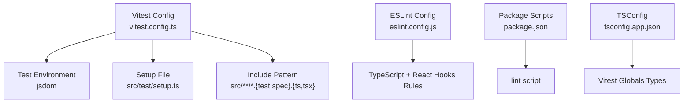
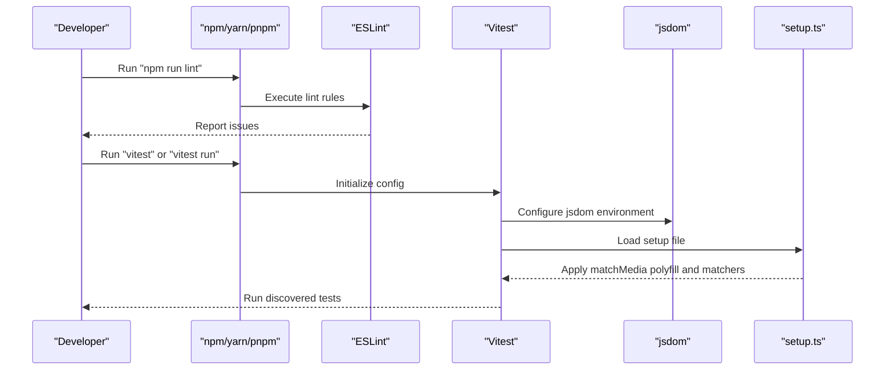
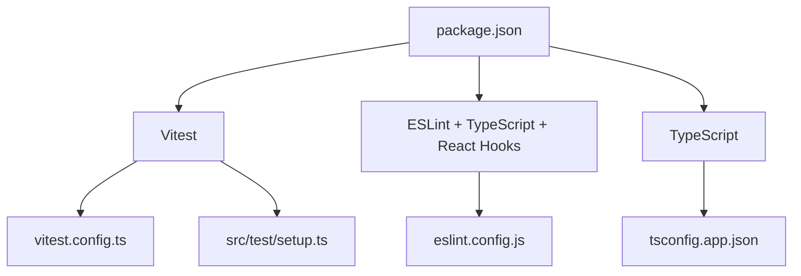

# Testing & Quality Assurance

<cite>
**Referenced Files in This Document**
- [vitest.config.ts](file://vitest.config.ts)
- [setup.ts](file://src/test/setup.ts)
- [example.test.ts](file://src/test/example.test.ts)
- [eslint.config.js](file://eslint.config.js)
- [package.json](file://package.json)
- [tsconfig.app.json](file://tsconfig.app.json)
</cite>

## Table of Contents
1. [Introduction](#introduction)
2. [Project Structure](#project-structure)
3. [Core Components](#core-components)
4. [Architecture Overview](#architecture-overview)
5. [Detailed Component Analysis](#detailed-component-analysis)
6. [Dependency Analysis](#dependency-analysis)
7. [Performance Considerations](#performance-considerations)
8. [Troubleshooting Guide](#troubleshooting-guide)
9. [Conclusion](#conclusion)
10. [Appendices](#appendices)

## Introduction
This document provides comprehensive testing and quality assurance guidance for the CVN Ponkunnam project. It explains the Vitest testing setup, test configuration, and testing patterns used in the application. It also documents ESLint configuration, code quality standards, and automated linting processes. Guidance is included for unit testing approaches, component testing strategies, integration testing methods, best practices, coverage considerations, and continuous integration readiness. Practical examples are referenced via file paths to help you implement and debug tests effectively.

## Project Structure
The testing and quality assurance setup centers around:
- Vitest configuration for unit and component testing
- A global setup file for DOM environment and polyfills
- Example test demonstrating the recommended pattern
- ESLint configuration for TypeScript and React Hooks
- Package scripts for development, build, start, and linting
- TypeScript compiler options enabling Vitest globals

**Diagram sources**
- [vitest.config.ts:1-15](file://vitest.config.ts#L1-L15)
- [setup.ts:1-16](file://src/test/setup.ts#L1-L16)
- [eslint.config.js:1-24](file://eslint.config.js#L1-L24)
- [package.json:6-11](file://package.json#L6-L11)
- [tsconfig.app.json:27-29](file://tsconfig.app.json#L27-L29)

**Section sources**
- [vitest.config.ts:1-15](file://vitest.config.ts#L1-L15)
- [setup.ts:1-16](file://src/test/setup.ts#L1-L16)
- [example.test.ts:1-8](file://src/test/example.test.ts#L1-L8)
- [eslint.config.js:1-24](file://eslint.config.js#L1-L24)
- [package.json:6-11](file://package.json#L6-L11)
- [tsconfig.app.json:27-29](file://tsconfig.app.json#L27-L29)

## Core Components
- Vitest configuration defines the jsdom environment, global APIs, setup file inclusion, and test file discovery pattern.
- Global setup initializes Jest DOM matchers and a minimal window.matchMedia polyfill for responsive testing.
- ESLint configuration enforces TypeScript best practices and React Hooks rules while ignoring generated/dist folders.
- Package scripts expose a lint command for automated code quality checks.
- TSConfig enables Vitest globals so tests can use describe, it, expect without explicit imports.

Key capabilities:
- Unit and component tests targeting TypeScript/React components
- DOM-like environment for UI component tests
- Automated linting via ESLint with TypeScript and React Hooks presets
- Path aliases support for imports in tests

**Section sources**
- [vitest.config.ts:4-14](file://vitest.config.ts#L4-L14)
- [setup.ts:1-16](file://src/test/setup.ts#L1-L16)
- [eslint.config.js:6-23](file://eslint.config.js#L6-L23)
- [package.json:10](file://package.json#L10)
- [tsconfig.app.json:27-29](file://tsconfig.app.json#L27-L29)

## Architecture Overview
The testing and quality pipeline integrates configuration-driven tooling with the Next.js application:

**Diagram sources**
- [package.json:10](file://package.json#L10)
- [vitest.config.ts:5-10](file://vitest.config.ts#L5-L10)
- [setup.ts:1-16](file://src/test/setup.ts#L1-L16)

## Detailed Component Analysis

### Vitest Configuration
- Environment: jsdom to simulate browser DOM APIs for component tests
- Globals: Enables describe, it, expect globally without imports
- Setup file: Loads Jest DOM matchers and matchMedia polyfill
- Include pattern: Discovers tests under src/**/*.{test,spec}.{ts,tsx}
- Aliasing: Maps "@" to the src directory for clean imports

Recommended usage:
- Place tests alongside source files using .test.ts/.test.tsx or .spec.ts/.spec.tsx suffixes
- Use describe blocks to group related tests
- Leverage expect matchers for assertions

**Section sources**
- [vitest.config.ts:4-14](file://vitest.config.ts#L4-L14)

### Global Setup (setup.ts)
- Imports Jest DOM matchers to enable toBeInTheDocument, toHaveAttribute, etc.
- Defines window.matchMedia to avoid runtime errors during SSR or headless runs
- Ensures consistent behavior across tests requiring responsive logic

Best practices:
- Keep setup minimal and focused on environment needs
- Add polyfills here rather than duplicating across tests

**Section sources**
- [setup.ts:1-16](file://src/test/setup.ts#L1-L16)

### Example Test (example.test.ts)
- Demonstrates the basic Vitest pattern: describe block, it test case, and expect assertion
- Serves as a template for new tests

Implementation guidance:
- Mirror the folder structure of tested components
- Name test files consistently (e.g., ComponentName.test.ts)
- Group tests by behavior and use nested describe blocks for clarity

**Section sources**
- [example.test.ts:1-8](file://src/test/example.test.ts#L1-L8)

### ESLint Configuration
- Extends recommended TypeScript and TypeScript ESLint configurations
- Applies React Hooks rules for safe effect usage
- Ignores generated/dist folders and Next.js configuration files
- Uses modern ECMAScript features with browser globals

Automated linting:
- Run npm run lint to enforce code quality automatically
- Integrate with pre-commit hooks or CI to prevent low-quality commits

Rules highlights:
- React Hooks recommended rules are enabled
- Unused variables rule is disabled to reduce noise in UI projects

**Section sources**
- [eslint.config.js:6-23](file://eslint.config.js#L6-L23)

### TypeScript Compiler Options for Tests
- Enables Vitest globals types so tests can use describe/it/expect without importing
- Supports bundler module resolution and JSX transform for React components

Implications:
- Tests can import components and utilities directly using path aliases
- Strict mode is relaxed for application code, but tests remain concise and readable

**Section sources**
- [tsconfig.app.json:27-29](file://tsconfig.app.json#L27-L29)

## Dependency Analysis
Testing and quality tools are declared as devDependencies and orchestrated via package scripts:

**Diagram sources**
- [package.json:63-77](file://package.json#L63-L77)
- [vitest.config.ts:1-15](file://vitest.config.ts#L1-L15)
- [setup.ts:1-16](file://src/test/setup.ts#L1-L16)
- [eslint.config.js:1-24](file://eslint.config.js#L1-L24)
- [tsconfig.app.json:27-29](file://tsconfig.app.json#L27-L29)

**Section sources**
- [package.json:63-77](file://package.json#L63-L77)

## Performance Considerations
- Prefer lightweight assertions and avoid heavy DOM queries in unit tests
- Use setup.ts to mock expensive APIs (e.g., IntersectionObserver) when needed
- Keep tests focused on a single responsibility to minimize flakiness
- Use describe blocks to organize tests and speed up filtering during development

## Troubleshooting Guide
Common issues and resolutions:
- Missing Jest DOM matchers: Ensure setup.ts is loaded by Vitest configuration
- window.matchMedia undefined errors: The setup file defines a minimal polyfill; verify it is included
- Path alias resolution failures: Confirm the alias mapping in Vitest config matches tsconfig paths
- Lint errors in generated files: Verify ignores in ESLint config exclude dist/.next folders
- No tests discovered: Confirm test file naming convention and include pattern in Vitest config

Debugging tips:
- Run Vitest in watch mode to iterate quickly on failing tests
- Use describe.only and it.only to isolate failing tests during development
- Add console logging sparingly; prefer assertions to validate behavior

**Section sources**
- [vitest.config.ts:8](file://vitest.config.ts#L8)
- [setup.ts:3-15](file://src/test/setup.ts#L3-L15)
- [eslint.config.js:7](file://eslint.config.js#L7)

## Conclusion
The CVN Ponkunnam project employs a pragmatic testing stack centered on Vitest with jsdom and a global setup for DOM compatibility. ESLint enforces TypeScript and React Hooks best practices, while package scripts integrate linting into developer workflows. By following the documented patterns—consistent test naming, setup file usage, and ESLint rules—you can maintain high-quality, reliable tests and code. Extend the example test as a blueprint for new tests, and leverage the configuration to support scalable unit and component testing.

## Appendices

### Testing Patterns and Best Practices
- Unit testing: Focus on pure functions and small units; mock external dependencies
- Component testing: Render components in jsdom, assert DOM attributes and behavior
- Integration testing: Compose multiple units to verify interactions (e.g., form submission)
- Coverage: Aim for meaningful coverage without obsessing over percentages; prioritize critical paths
- Continuous Integration: Add jobs to run lint and tests on pull requests; cache dependencies for speed

### Example Implementation References
- Basic test pattern: [example.test.ts:1-8](file://src/test/example.test.ts#L1-L8)
- Vitest configuration: [vitest.config.ts:1-15](file://vitest.config.ts#L1-L15)
- Global setup: [setup.ts:1-16](file://src/test/setup.ts#L1-L16)
- ESLint configuration: [eslint.config.js:1-24](file://eslint.config.js#L1-L24)
- Lint script: [package.json](file://package.json#L10)
- Vitest globals in TSConfig: [tsconfig.app.json:27-29](file://tsconfig.app.json#L27-L29)