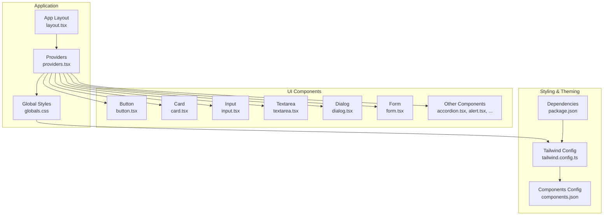
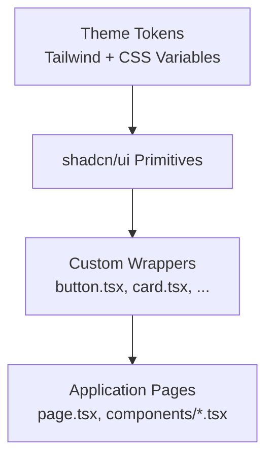
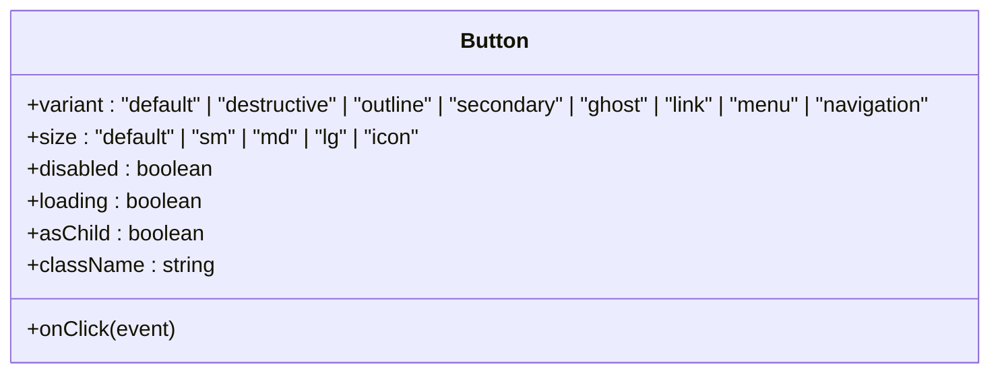
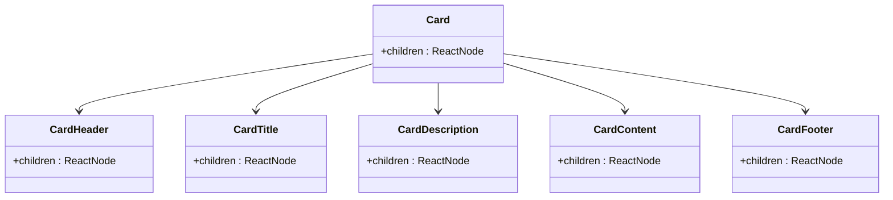
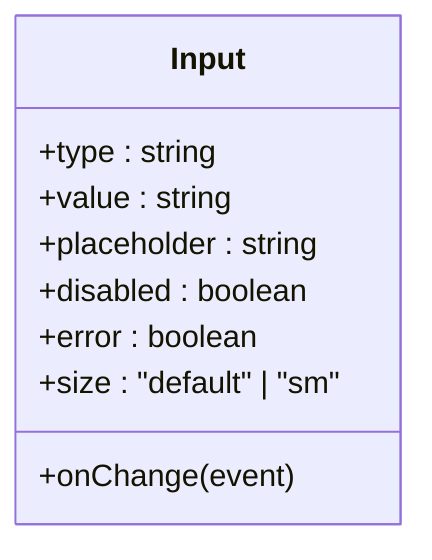
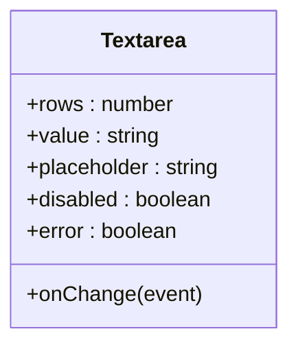
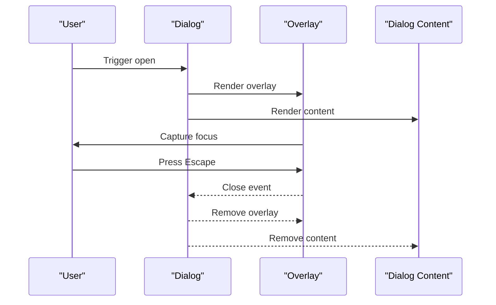
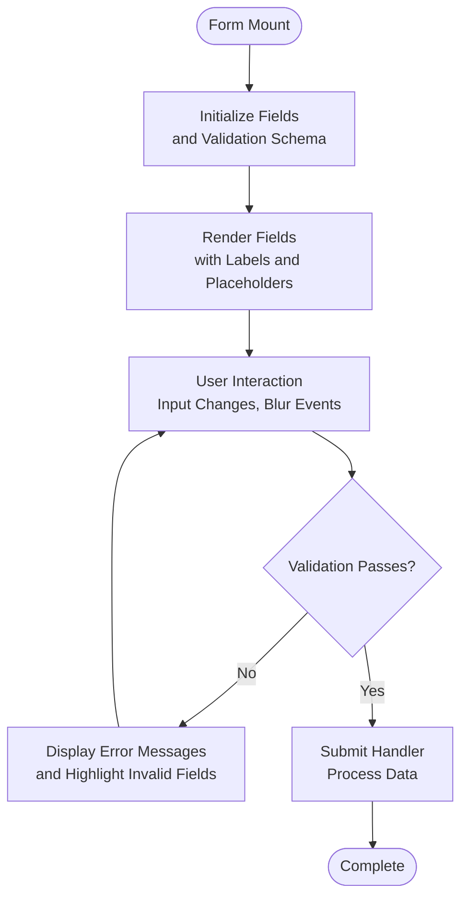
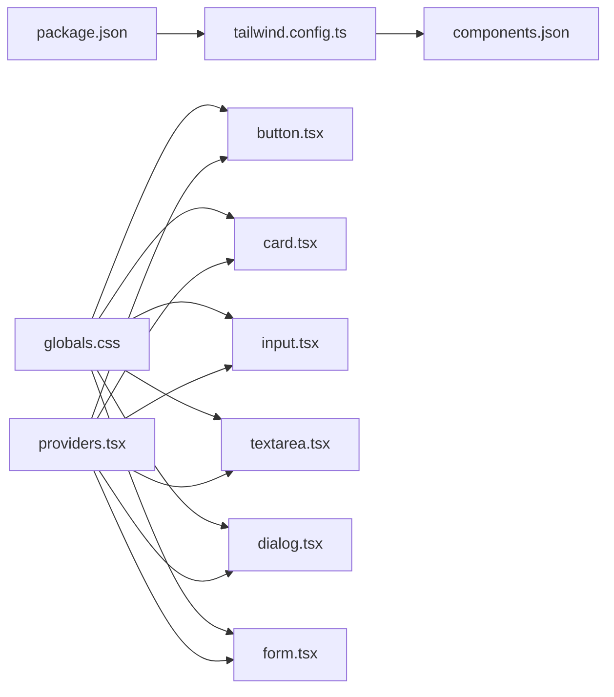

# UI Component Library

<cite>
**Referenced Files in This Document**
- [button.tsx](file://src/components/ui/button.tsx)
- [card.tsx](file://src/components/ui/card.tsx)
- [input.tsx](file://src/components/ui/input.tsx)
- [textarea.tsx](file://src/components/ui/textarea.tsx)
- [dialog.tsx](file://src/components/ui/dialog.tsx)
- [form.tsx](file://src/components/ui/form.tsx)
- [accordion.tsx](file://src/components/ui/accordion.tsx)
- [alert-dialog.tsx](file://src/components/ui/alert-dialog.tsx)
- [alert.tsx](file://src/components/ui/alert.tsx)
- [aspect-ratio.tsx](file://src/components/ui/aspect-ratio.tsx)
- [avatar.tsx](file://src/components/ui/avatar.tsx)
- [badge.tsx](file://src/components/ui/badge.tsx)
- [breadcrumb.tsx](file://src/components/ui/breadcrumb.tsx)
- [calendar.tsx](file://src/components/ui/calendar.tsx)
- [carousel.tsx](file://src/components/ui/carousel.tsx)
- [checkbox.tsx](file://src/components/ui/checkbox.tsx)
- [collapsible.tsx](file://src/components/ui/collapsible.tsx)
- [command.tsx](file://src/components/ui/command.tsx)
- [context-menu.tsx](file://src/components/ui/context-menu.tsx)
- [drawer.tsx](file://src/components/ui/drawer.tsx)
- [dropdown-menu.tsx](file://src/components/ui/dropdown-menu.tsx)
- [hover-card.tsx](file://src/components/ui/hover-card.tsx)
- [input-otp.tsx](file://src/components/ui/input-otp.tsx)
- [label.tsx](file://src/components/ui/label.tsx)
- [menubar.tsx](file://src/components/ui/menubar.tsx)
- [navigation-menu.tsx](file://src/components/ui/navigation-menu.tsx)
- [pagination.tsx](file://src/components/ui/pagination.tsx)
- [popover.tsx](file://src/components/ui/popover.tsx)
- [progress.tsx](file://src/components/ui/progress.tsx)
- [radio-group.tsx](file://src/components/ui/radio-group.tsx)
- [resizable.tsx](file://src/components/ui/resizable.tsx)
- [scroll-area.tsx](file://src/components/ui/scroll-area.tsx)
- [select.tsx](file://src/components/ui/select.tsx)
- [separator.tsx](file://src/components/ui/separator.tsx)
- [sheet.tsx](file://src/components/ui/sheet.tsx)
- [sidebar.tsx](file://src/components/ui/sidebar.tsx)
- [skeleton.tsx](file://src/components/ui/skeleton.tsx)
- [slider.tsx](file://src/components/ui/slider.tsx)
- [sonner.tsx](file://src/components/ui/sonner.tsx)
- [switch.tsx](file://src/components/ui/switch.tsx)
- [table.tsx](file://src/components/ui/table.tsx)
- [tabs.tsx](file://src/components/ui/tabs.tsx)
- [toast.tsx](file://src/components/ui/toast.tsx)
- [toaster.tsx](file://src/components/ui/toaster.tsx)
- [toggle-group.tsx](file://src/components/ui/toggle-group.tsx)
- [toggle.tsx](file://src/components/ui/toggle.tsx)
- [tooltip.tsx](file://src/components/ui/tooltip.tsx)
- [use-toast.ts](file://src/components/ui/use-toast.ts)
- [globals.css](file://src/app/globals.css)
- [layout.tsx](file://src/app/layout.tsx)
- [providers.tsx](file://src/app/providers.tsx)
- [tailwind.config.ts](file://src/tailwind.config.ts)
- [package.json](file://package.json)
- [components.json](file://components.json)
</cite>

## Table of Contents
1. [Introduction](#introduction)
2. [Project Structure](#project-structure)
3. [Core Components](#core-components)
4. [Architecture Overview](#architecture-overview)
5. [Detailed Component Analysis](#detailed-component-analysis)
6. [Dependency Analysis](#dependency-analysis)
7. [Performance Considerations](#performance-considerations)
8. [Troubleshooting Guide](#troubleshooting-guide)
9. [Conclusion](#conclusion)

## Introduction
This document describes the custom UI component library built on top of shadcn/ui within a Next.js application. It focuses on reusable components such as Button, Card, Input, Textarea, Dialog, and Form, along with the broader set of components available in the ui directory. The documentation covers component props, styling customization, accessibility features, integration patterns, variant options, composition patterns, and how the design system maintains consistency across the application.

## Project Structure
The UI components are organized under a dedicated ui directory, enabling centralized reuse and consistent theming. The global styles and Tailwind configuration define the base design tokens and component variants. Providers wrap the application to supply theme and state management utilities.

**Diagram sources**
- [layout.tsx](file://src/app/layout.tsx)
- [providers.tsx](file://src/app/providers.tsx)
- [globals.css](file://src/app/globals.css)
- [tailwind.config.ts](file://src/tailwind.config.ts)
- [components.json](file://components.json)
- [package.json](file://package.json)

**Section sources**
- [layout.tsx](file://src/app/layout.tsx)
- [providers.tsx](file://src/app/providers.tsx)
- [globals.css](file://src/app/globals.css)
- [tailwind.config.ts](file://src/tailwind.config.ts)
- [components.json](file://components.json)
- [package.json](file://package.json)

## Core Components
This section documents the primary custom UI components and their roles within the design system.

- Button: Provides interactive actions with variants, sizes, and states. Supports accessibility attributes and integrates with form contexts.
- Card: Encapsulates content in a bordered container with header, body, and footer regions for consistent layouts.
- Input: Accepts textual user input with validation support and accessible labeling.
- Textarea: Multi-line input area suitable for extended text entry with similar validation and labeling patterns.
- Dialog: Presents content in an overlay modal with focus management and keyboard navigation.
- Form: Integrates with form libraries to manage field groups, validation, and submission states.

These components share a common design language: consistent spacing, typography, border radii, and color palettes derived from the Tailwind theme. They expose props for variants, sizes, disabled states, and accessibility attributes to ensure inclusive experiences.

**Section sources**
- [button.tsx](file://src/components/ui/button.tsx)
- [card.tsx](file://src/components/ui/card.tsx)
- [input.tsx](file://src/components/ui/input.tsx)
- [textarea.tsx](file://src/components/ui/textarea.tsx)
- [dialog.tsx](file://src/components/ui/dialog.tsx)
- [form.tsx](file://src/components/ui/form.tsx)

## Architecture Overview
The UI library leverages shadcn/ui primitives while extending them with custom wrappers and variants. The architecture ensures:
- Centralized theming via Tailwind and CSS custom properties
- Consistent component APIs across the application
- Accessibility-first patterns with proper ARIA attributes and keyboard navigation
- Composition-friendly designs that allow stacking and nesting of components

**Diagram sources**
- [tailwind.config.ts](file://src/tailwind.config.ts)
- [globals.css](file://src/app/globals.css)
- [button.tsx](file://src/components/ui/button.tsx)
- [card.tsx](file://src/components/ui/card.tsx)
- [input.tsx](file://src/components/ui/input.tsx)
- [textarea.tsx](file://src/components/ui/textarea.tsx)
- [dialog.tsx](file://src/components/ui/dialog.tsx)
- [form.tsx](file://src/components/ui/form.tsx)

## Detailed Component Analysis

### Button Component
Purpose: Standard action element with multiple variants and sizes.

Key capabilities:
- Variants: primary, secondary, ghost, outline, destructive, menu, navigation
- Sizes: sm, md, lg, icon
- States: disabled, loading
- Accessibility: supports aria attributes and keyboard activation
- Composition: integrates with icons and links

Usage patterns:
- As submit buttons within forms
- As navigational elements with routing integration
- As part of compound components like DropdownMenu or NavigationMenu

**Diagram sources**
- [button.tsx](file://src/components/ui/button.tsx)

**Section sources**
- [button.tsx](file://src/components/ui/button.tsx)

### Card Component
Purpose: Container for grouping related content with optional header, body, and footer.

Key capabilities:
- Regions: header, title, description, body, footer
- Variants: default, accent
- Accessibility: semantic headings and roles

Usage patterns:
- Feature cards, pricing blocks, content summaries
- Compound with Button and Badge for CTAs

**Diagram sources**
- [card.tsx](file://src/components/ui/card.tsx)

**Section sources**
- [card.tsx](file://src/components/ui/card.tsx)

### Input Component
Purpose: Single-line text input with accessible labeling and validation support.

Key capabilities:
- Props: placeholder, type, value, onChange, disabled, error state
- Accessibility: associates with labels via htmlFor/id
- Variants: default, destructive
- Sizes: default, sm

Usage patterns:
- Search bars, login forms, filters
- Controlled/uncontrolled modes

**Diagram sources**
- [input.tsx](file://src/components/ui/input.tsx)

**Section sources**
- [input.tsx](file://src/components/ui/input.tsx)

### Textarea Component
Purpose: Multi-line text input for extended content entry.

Key capabilities:
- Props: placeholder, rows, value, onChange, disabled, error state
- Accessibility: labeled by associated Label
- Variants: default, destructive

Usage patterns:
- Comments, descriptions, feedback forms

**Diagram sources**
- [textarea.tsx](file://src/components/ui/textarea.tsx)

**Section sources**
- [textarea.tsx](file://src/components/ui/textarea.tsx)

### Dialog Component
Purpose: Modal overlay for focused tasks or confirmations.

Key capabilities:
- Open/close state management
- Escape-to-close and click-outside-to-close
- Focus trapping and return focus
- Variants: default, sidebar
- Sizes: xs, sm, md, lg, xl, fullscreen

Usage patterns:
- Confirmations, modals, sidebars, lightboxes

**Diagram sources**
- [dialog.tsx](file://src/components/ui/dialog.tsx)

**Section sources**
- [dialog.tsx](file://src/components/ui/dialog.tsx)

### Form Component
Purpose: High-level form container integrating validation and submission.

Key capabilities:
- Field grouping and validation
- Submission handling and loading states
- Integration with Input, Textarea, Select, Checkbox, etc.
- Accessibility: labels, descriptions, error messages

Usage patterns:
- Contact forms, user registration, settings panels

**Diagram sources**
- [form.tsx](file://src/components/ui/form.tsx)

**Section sources**
- [form.tsx](file://src/components/ui/form.tsx)

### Additional UI Components
Beyond the core components, the ui directory includes a comprehensive set of components that follow the same design principles:

- Feedback: Alert, Alert Dialog, Toast, Toaster, Sonner
- Data Display: Avatar, Badge, Progress, Separator, Skeleton, Table, Tabs
- Data Entry: Checkbox, Command, Input OTP, Label, Radio Group, Select, Slider, Switch, Toggle, Toggle Group
- Layout: Accordion, Aspect Ratio, Carousel, Collapsible, Pagination, Scroll Area, Sidebar
- Menus & Overlays: Context Menu, Dialog, Drawer, Dropdown Menu, Hover Card, Navigation Menu, Popover, Sheet, Tooltip
- Pickers: Calendar
- Typography: Alert, Badge

Each component exposes consistent props for variant, size, disabled state, and accessibility attributes. They integrate with the shared design system to ensure visual and behavioral coherence.

**Section sources**
- [accordion.tsx](file://src/components/ui/accordion.tsx)
- [alert-dialog.tsx](file://src/components/ui/alert-dialog.tsx)
- [alert.tsx](file://src/components/ui/alert.tsx)
- [aspect-ratio.tsx](file://src/components/ui/aspect-ratio.tsx)
- [avatar.tsx](file://src/components/ui/avatar.tsx)
- [badge.tsx](file://src/components/ui/badge.tsx)
- [breadcrumb.tsx](file://src/components/ui/breadcrumb.tsx)
- [calendar.tsx](file://src/components/ui/calendar.tsx)
- [carousel.tsx](file://src/components/ui/carousel.tsx)
- [checkbox.tsx](file://src/components/ui/checkbox.tsx)
- [collapsible.tsx](file://src/components/ui/collapsible.tsx)
- [command.tsx](file://src/components/ui/command.tsx)
- [context-menu.tsx](file://src/components/ui/context-menu.tsx)
- [drawer.tsx](file://src/components/ui/drawer.tsx)
- [dropdown-menu.tsx](file://src/components/ui/dropdown-menu.tsx)
- [hover-card.tsx](file://src/components/ui/hover-card.tsx)
- [input-otp.tsx](file://src/components/ui/input-otp.tsx)
- [label.tsx](file://src/components/ui/label.tsx)
- [menubar.tsx](file://src/components/ui/menubar.tsx)
- [navigation-menu.tsx](file://src/components/ui/navigation-menu.tsx)
- [pagination.tsx](file://src/components/ui/pagination.tsx)
- [popover.tsx](file://src/components/ui/popover.tsx)
- [progress.tsx](file://src/components/ui/progress.tsx)
- [radio-group.tsx](file://src/components/ui/radio-group.tsx)
- [resizable.tsx](file://src/components/ui/resizable.tsx)
- [scroll-area.tsx](file://src/components/ui/scroll-area.tsx)
- [select.tsx](file://src/components/ui/select.tsx)
- [separator.tsx](file://src/components/ui/separator.tsx)
- [sheet.tsx](file://src/components/ui/sheet.tsx)
- [sidebar.tsx](file://src/components/ui/sidebar.tsx)
- [skeleton.tsx](file://src/components/ui/skeleton.tsx)
- [slider.tsx](file://src/components/ui/slider.tsx)
- [sonner.tsx](file://src/components/ui/sonner.tsx)
- [switch.tsx](file://src/components/ui/switch.tsx)
- [table.tsx](file://src/components/ui/table.tsx)
- [tabs.tsx](file://src/components/ui/tabs.tsx)
- [toast.tsx](file://src/components/ui/toast.tsx)
- [toaster.tsx](file://src/components/ui/toaster.tsx)
- [toggle-group.tsx](file://src/components/ui/toggle-group.tsx)
- [toggle.tsx](file://src/components/ui/toggle.tsx)
- [tooltip.tsx](file://src/components/ui/tooltip.tsx)

## Dependency Analysis
The UI components depend on:
- Tailwind CSS for styling and design tokens
- shadcn/ui primitives for foundational UI behavior
- Application providers for theme and state management
- Optional integrations with form libraries and toast systems

**Diagram sources**
- [package.json](file://package.json)
- [tailwind.config.ts](file://src/tailwind.config.ts)
- [components.json](file://components.json)
- [globals.css](file://src/app/globals.css)
- [providers.tsx](file://src/app/providers.tsx)
- [button.tsx](file://src/components/ui/button.tsx)
- [card.tsx](file://src/components/ui/card.tsx)
- [input.tsx](file://src/components/ui/input.tsx)
- [textarea.tsx](file://src/components/ui/textarea.tsx)
- [dialog.tsx](file://src/components/ui/dialog.tsx)
- [form.tsx](file://src/components/ui/form.tsx)

**Section sources**
- [package.json](file://package.json)
- [tailwind.config.ts](file://src/tailwind.config.ts)
- [components.json](file://components.json)
- [globals.css](file://src/app/globals.css)
- [providers.tsx](file://src/app/providers.tsx)
- [button.tsx](file://src/components/ui/button.tsx)
- [card.tsx](file://src/components/ui/card.tsx)
- [input.tsx](file://src/components/ui/input.tsx)
- [textarea.tsx](file://src/components/ui/textarea.tsx)
- [dialog.tsx](file://src/components/ui/dialog.tsx)
- [form.tsx](file://src/components/ui/form.tsx)

## Performance Considerations
- Prefer component composition over deep nesting to minimize re-renders.
- Use lazy loading for heavy components like carousels and modals.
- Leverage CSS containment and transform for animations to avoid layout thrashing.
- Keep variant sets minimal to reduce CSS bundle size.
- Use server-side rendering for initial page loads and client hydration for interactivity.

## Troubleshooting Guide
Common issues and resolutions:
- Styling inconsistencies: Verify Tailwind configuration and ensure global CSS is applied before component styles.
- Focus management in overlays: Confirm Dialog and Drawer handle focus trapping and return focus correctly.
- Form validation errors: Ensure form components receive proper error props and labels.
- Accessibility violations: Use screen readers to test keyboard navigation and ARIA attributes.

**Section sources**
- [dialog.tsx](file://src/components/ui/dialog.tsx)
- [form.tsx](file://src/components/ui/form.tsx)
- [use-toast.ts](file://src/components/ui/use-toast.ts)

## Conclusion
The UI component library establishes a consistent, accessible, and extensible design system built upon shadcn/ui. By centralizing styling, enforcing variant and size standards, and prioritizing accessibility, the components enable rapid development while maintaining visual coherence across the application. The documented patterns and integration points provide a foundation for extending the library with new components and variants.