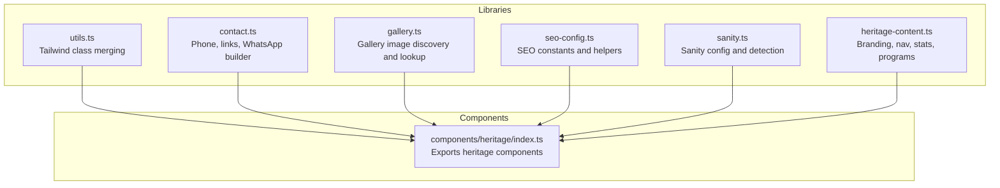
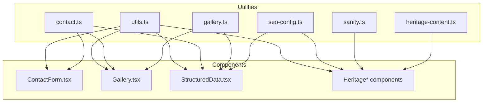
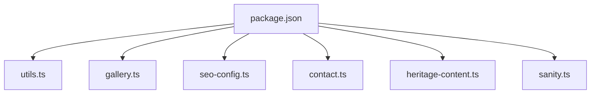

# Utility Libraries

<cite>
**Referenced Files in This Document**
- [utils.ts](file://src/lib/utils.ts)
- [contact.ts](file://src/lib/contact.ts)
- [gallery.ts](file://src/lib/gallery.ts)
- [seo-config.ts](file://src/lib/seo-config.ts)
- [sanity.ts](file://src/lib/sanity.ts)
- [heritage-content.ts](file://src/lib/heritage-content.ts)
- [index.ts](file://src/components/heritage/index.ts)
- [package.json](file://package.json)
</cite>

## Table of Contents
1. [Introduction](#introduction)
2. [Project Structure](#project-structure)
3. [Core Components](#core-components)
4. [Architecture Overview](#architecture-overview)
5. [Detailed Component Analysis](#detailed-component-analysis)
6. [Dependency Analysis](#dependency-analysis)
7. [Performance Considerations](#performance-considerations)
8. [Troubleshooting Guide](#troubleshooting-guide)
9. [Conclusion](#conclusion)

## Introduction
This document describes the utility libraries and helper functions that support common operations, contact form processing, gallery image management, SEO configuration, heritage content handling, and optional Sanity CMS integration. It explains function signatures, parameters, return values, usage patterns, error handling, data validation, and integration with external services. It also documents the library organization, import patterns, and how these utilities contribute to the overall application functionality.

## Project Structure
The utility libraries reside under src/lib and are consumed by components and pages across the Next.js application. The heritage utilities are complemented by a centralized index export that consolidates heritage components for easy consumption.

**Diagram sources**
- [utils.ts:1-7](file://src/lib/utils.ts#L1-L7)
- [contact.ts:1-29](file://src/lib/contact.ts#L1-L29)
- [gallery.ts:1-73](file://src/lib/gallery.ts#L1-L73)
- [seo-config.ts:1-205](file://src/lib/seo-config.ts#L1-L205)
- [sanity.ts:1-15](file://src/lib/sanity.ts#L1-L15)
- [heritage-content.ts:1-105](file://src/lib/heritage-content.ts#L1-L105)
- [index.ts:1-15](file://src/components/heritage/index.ts#L1-L15)

**Section sources**
- [utils.ts:1-7](file://src/lib/utils.ts#L1-L7)
- [contact.ts:1-29](file://src/lib/contact.ts#L1-L29)
- [gallery.ts:1-73](file://src/lib/gallery.ts#L1-L73)
- [seo-config.ts:1-205](file://src/lib/seo-config.ts#L1-L205)
- [sanity.ts:1-15](file://src/lib/sanity.ts#L1-L15)
- [heritage-content.ts:1-105](file://src/lib/heritage-content.ts#L1-L105)
- [index.ts:1-15](file://src/components/heritage/index.ts#L1-L15)

## Core Components
This section summarizes the responsibilities and capabilities of each utility module.

- Tailwind class merging
  - Purpose: Merge and deduplicate Tailwind CSS classes consistently.
  - Key function: cn(...inputs: ClassValue[]): string
  - Usage pattern: Combine conditional and static classes safely.
  - Dependencies: clsx, tailwind-merge
  - Section sources
    - [utils.ts:1-7](file://src/lib/utils.ts#L1-L7)
    - [package.json:42-58](file://package.json#L42-L58)

- Contact and communication helpers
  - Purpose: Provide standardized phone constants, tel: links, and WhatsApp builders for inquiries and course enrollment.
  - Key exports:
    - Constants for display phone, E164, digits, tel:, and WhatsApp links
    - Function: buildWhatsAppHref(message?: string): string
    - Function: buildCourseEnrollmentWhatsApp(courseDuration: string, courseTitle: string): string
  - Usage pattern: Construct pre-filled WhatsApp URLs for marketing and admissions.
  - Section sources
    - [contact.ts:1-29](file://src/lib/contact.ts#L1-L29)

- Gallery image management
  - Purpose: Discover, normalize, and serve gallery images from the public assets directory.
  - Key types: GalleryImage with alt, filename, index, slug, src
  - Key functions:
    - getGalleryImages(): Promise<GalleryImage[]>
    - getGalleryImage(slug: string): Promise<GalleryImage | undefined>
  - Behavior:
    - Reads directory entries, filters by supported extensions, sorts filenames, and builds slugs and public paths.
    - Uses React server caching to avoid repeated filesystem reads.
    - Handles missing directories gracefully by returning an empty array.
  - Section sources
    - [gallery.ts:1-73](file://src/lib/gallery.ts#L1-L73)

- SEO configuration
  - Purpose: Centralize SEO metadata, keywords, branding, and service definitions.
  - Key exports:
    - SEO_CONFIG: object containing site info, business info, social, images, and services
    - Function: generatePageMetadata(page): returns Open Graph and Twitter metadata
    - Function: getKeywordsForPage(pageType): returns curated keyword sets per page type
  - Usage pattern: Provide defaults and helpers for pages to generate canonical metadata.
  - Section sources
    - [seo-config.ts:1-205](file://src/lib/seo-config.ts#L1-L205)

- Heritage content
  - Purpose: Provide brand identity, navigation items, statistics, program lists, and SEO keywords for the heritage site.
  - Key exports:
    - HERITAGE: brand, tagline, founding year, location, founder, recognition, mission, heritage
    - NAV_ITEMS: top-level and nested navigation
    - STATS: key metrics
    - KALARI_PROGRAMS: martial arts training modules
    - MARMA_SERVICES: therapeutic offerings
    - WELLNESS_PACKAGES: wellness experiences
    - SEO_KEYWORDS: keyword set for heritage pages
  - Usage pattern: Feed UI components and metadata generators with consistent content.
  - Section sources
    - [heritage-content.ts:1-105](file://src/lib/heritage-content.ts#L1-L105)

- Sanity CMS integration
  - Purpose: Optional integration for dynamic content via Sanity client.
  - Key exports:
    - sanityConfig: projectId, dataset, apiVersion, useCdn
    - isSanityConfigured: boolean flag indicating configuration presence
  - Usage pattern: Conditionally enable Sanity-powered features when environment variables are present.
  - Section sources
    - [sanity.ts:1-15](file://src/lib/sanity.ts#L1-L15)

## Architecture Overview
The utilities are designed to be pure, reusable, and decoupled from UI concerns. They are consumed by components and pages to:
- Compose Tailwind classes
- Build outbound communication links
- Load and present gallery images
- Generate SEO metadata
- Provide heritage content and navigation
- Optionally integrate with Sanity for dynamic content

**Diagram sources**
- [utils.ts:1-7](file://src/lib/utils.ts#L1-L7)
- [contact.ts:1-29](file://src/lib/contact.ts#L1-L29)
- [gallery.ts:1-73](file://src/lib/gallery.ts#L1-L73)
- [seo-config.ts:1-205](file://src/lib/seo-config.ts#L1-L205)
- [sanity.ts:1-15](file://src/lib/sanity.ts#L1-L15)
- [heritage-content.ts:1-105](file://src/lib/heritage-content.ts#L1-L105)

## Detailed Component Analysis

### Tailwind Class Merging (utils.ts)
- Purpose: Provide a single utility to merge Tailwind classes with conflict resolution.
- Function signature: cn(...inputs: ClassValue[]): string
- Parameters:
  - inputs: variable-length list of class inputs compatible with clsx
- Returns: merged and deduplicated class string
- Usage pattern:
  - Combine conditional classes with static ones.
  - Use in UI components to keep class composition readable and safe.
- Error handling: None required; clsx/tailwind-merge handle invalid inputs gracefully.
- Performance: O(n) over the number of inputs; negligible overhead.
- Section sources
  - [utils.ts:1-7](file://src/lib/utils.ts#L1-L7)
  - [package.json:42-58](file://package.json#L42-L58)

### Contact and Communication Helpers (contact.ts)
- Purpose: Standardize contact constants and build outbound links, especially WhatsApp URLs.
- Exports:
  - Phone constants and formatted tel: href
  - Function: buildWhatsAppHref(message?: string): string
  - Function: buildCourseEnrollmentWhatsApp(courseDuration: string, courseTitle: string): string
- Parameters:
  - message?: string (for buildWhatsAppHref)
  - courseDuration: string, courseTitle: string (for buildCourseEnrollmentWhatsApp)
- Returns:
  - String representing a tel: or https://wa.me: URL
- Usage pattern:
  - Use buildCourseEnrollmentWhatsApp to prefill a WhatsApp inquiry for a specific course.
  - Use buildWhatsAppHref for generic messages.
- Error handling: No runtime errors; encoding ensures safe URL construction.
- Validation: Input strings are assumed to be non-empty; caller should sanitize or validate UI inputs before invoking.
- Section sources
  - [contact.ts:1-29](file://src/lib/contact.ts#L1-L29)

### Gallery Image Management (gallery.ts)
- Purpose: Discover, sort, and normalize gallery images from the public asset directory and expose typed data for rendering.
- Types:
  - GalleryImage: alt, filename, index, slug, src
- Functions:
  - getGalleryImages(): Promise<GalleryImage[]>
    - Reads directory entries, filters by supported extensions, sorts filenames, and constructs normalized slugs and public paths.
    - Uses React server caching to memoize results.
    - On missing directory, returns an empty array; rethrows other errors.
  - getGalleryImage(slug: string): Promise<GalleryImage | undefined>
    - Finds an image by slug using cached data.
- Parameters:
  - slug: string
- Returns:
  - getGalleryImages: Promise resolving to an array of GalleryImage
  - getGalleryImage: Promise resolving to a single image or undefined
- Usage pattern:
  - Use getGalleryImages to render galleries.
  - Use getGalleryImage to hydrate a modal or detail view.
- Error handling:
  - Directory not found returns [].
  - Other filesystem errors are rethrown.
- Validation:
  - Filters by known image extensions.
  - Falls back to a default alt and slug if parsing fails.
- Performance:
  - Single filesystem read per request due to caching.
  - Sorting uses locale-aware comparison for robust ordering.
- Section sources
  - [gallery.ts:1-73](file://src/lib/gallery.ts#L1-L73)

### SEO Configuration (seo-config.ts)
- Purpose: Centralize SEO metadata, branding, and keyword sets for consistent page generation.
- Exports:
  - SEO_CONFIG: object with siteName, siteUrl, defaultTitle, defaultDescription, business, social, images, services
  - Function: generatePageMetadata(page): returns Open Graph and Twitter metadata
  - Function: getKeywordsForPage(pageType): returns curated keyword sets
- Parameters:
  - page: { title, description, keywords?, image?, url? }
  - pageType: "home" | "training" | "marma" | "rejuvenation" | "about" | "contact"
- Returns:
  - generatePageMetadata: metadata object for Next.js metadata
  - getKeywordsForPage: string[]
- Usage pattern:
  - Call generatePageMetadata to produce Open Graph and Twitter configs for a given page.
  - Call getKeywordsForPage to assemble page-specific keywords.
- Error handling: None required; returns defaults when environment variables are missing.
- Validation: Consumers should validate or sanitize inputs before calling generatePageMetadata.
- Section sources
  - [seo-config.ts:1-205](file://src/lib/seo-config.ts#L1-L205)

### Heritage Content (heritage-content.ts)
- Purpose: Provide brand identity, navigation, statistics, program lists, and SEO keywords for the heritage site.
- Exports:
  - HERITAGE: brand, tagline, founded, location, founder, recognition, mission, heritage
  - NAV_ITEMS: top-level and nested navigation items
  - STATS: key metrics
  - KALARI_PROGRAMS: martial arts training modules
  - MARMA_SERVICES: therapeutic offerings
  - WELLNESS_PACKAGES: wellness experiences
  - SEO_KEYWORDS: keyword set for heritage pages
- Usage pattern:
  - Feed UI components with consistent content.
  - Use SEO_KEYWORDS alongside generatePageMetadata for heritage pages.
- Error handling: None required; constants are read-only.
- Validation: None required; consumers should validate inputs if building dynamic content.
- Section sources
  - [heritage-content.ts:1-105](file://src/lib/heritage-content.ts#L1-L105)

### Sanity CMS Integration (sanity.ts)
- Purpose: Provide configuration and detection for optional Sanity integration.
- Exports:
  - sanityConfig: { projectId, dataset, apiVersion, useCdn }
  - isSanityConfigured: boolean
- Parameters: None
- Returns:
  - sanityConfig: object with environment-driven values
  - isSanityConfigured: boolean flag
- Usage pattern:
  - Check isSanityConfigured to conditionally enable Sanity-powered features.
  - Use sanityConfig to initialize a Sanity client.
- Error handling: None required; relies on environment variables.
- Validation: Consumers should validate returned values before use.
- Section sources
  - [sanity.ts:1-15](file://src/lib/sanity.ts#L1-L15)

## Dependency Analysis
The utilities depend on standard libraries and third-party packages as follows:
- utils.ts depends on clsx and tailwind-merge
- gallery.ts depends on Node fs/promises, path, and React caching
- seo-config.ts is self-contained
- contact.ts is self-contained
- heritage-content.ts is self-contained
- sanity.ts depends on environment variables

**Diagram sources**
- [package.json:12-61](file://package.json#L12-L61)
- [utils.ts:1-7](file://src/lib/utils.ts#L1-L7)
- [gallery.ts:1-73](file://src/lib/gallery.ts#L1-L73)
- [seo-config.ts:1-205](file://src/lib/seo-config.ts#L1-L205)
- [contact.ts:1-29](file://src/lib/contact.ts#L1-L29)
- [heritage-content.ts:1-105](file://src/lib/heritage-content.ts#L1-L105)
- [sanity.ts:1-15](file://src/lib/sanity.ts#L1-L15)

**Section sources**
- [package.json:12-61](file://package.json#L12-L61)
- [utils.ts:1-7](file://src/lib/utils.ts#L1-L7)
- [gallery.ts:1-73](file://src/lib/gallery.ts#L1-L73)
- [seo-config.ts:1-205](file://src/lib/seo-config.ts#L1-L205)
- [contact.ts:1-29](file://src/lib/contact.ts#L1-L29)
- [heritage-content.ts:1-105](file://src/lib/heritage-content.ts#L1-L105)
- [sanity.ts:1-15](file://src/lib/sanity.ts#L1-L15)

## Performance Considerations
- Gallery image loading:
  - Uses React server caching to avoid repeated filesystem reads.
  - Sorting is locale-aware and optimized for numeric segments.
- Class merging:
  - Minimal overhead; suitable for frequent use in UI components.
- Metadata generation:
  - Pure functions with no I/O; fast and cacheable.
- Sanity configuration:
  - Environment-based; no runtime computation cost.

## Troubleshooting Guide
- Gallery images not appearing:
  - Verify the public asset directory exists and contains supported image files (.avif, .jpeg, .jpg, .png, .webp).
  - Confirm the directory path is correct and accessible at runtime.
  - Check for permission issues or missing environment.
- Unexpected empty gallery:
  - If the directory is missing, getGalleryImages returns an empty array; this is expected behavior.
- WhatsApp links not working:
  - Ensure message encoding is handled; the helper performs URL encoding internally.
  - Confirm phone constants and digits are set appropriately.
- SEO metadata inconsistencies:
  - Validate inputs passed to generatePageMetadata.
  - Confirm NEXT_PUBLIC_SITE_URL is set for accurate canonical URLs.
- Sanity integration disabled:
  - Ensure NEXT_PUBLIC_SANITY_PROJECT_ID is set; otherwise, isSanityConfigured will be false.

## Conclusion
These utility libraries provide a cohesive foundation for consistent UI composition, contact workflows, media management, SEO, heritage content, and optional CMS integration. Their pure, predictable APIs enable reliable reuse across components and pages, while their error handling and validation patterns ensure robust operation in production environments.